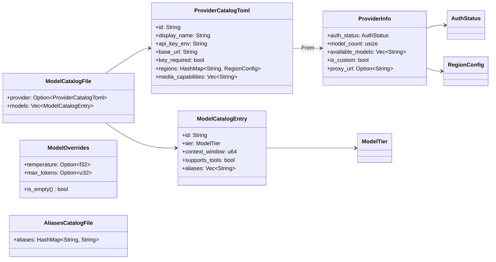

# Other — librefang-types-src

# librefang-types: Model Catalog Types

Shared data structures for the model registry — the canonical type definitions that every crate in the system imports to describe AI models, providers, authentication state, and inference parameters.

## Purpose

This module is the **single source of truth** for model catalog types. It contains no business logic — only data definitions with `Serialize`/`Deserialize` support and a few convenience methods. Every other crate (`librefang-runtime`, `librefang-api`, `librefang-kernel-metering`, the HTTP routes) depends on these types rather than defining their own, ensuring a consistent schema across TOML catalog files, JSON persistence, and in-memory state.

## Architecture



## Key Types

### Enums

#### `ModelTier`

Categorizes a model's capability tier. Used for filtering and display grouping.

| Variant | Example Models | Serde Form |
|---------|---------------|------------|
| `Frontier` | Claude Opus, GPT-4.1 | `"frontier"` |
| `Smart` | Claude Sonnet, Gemini 2.5 Flash | `"smart"` |
| `Balanced` | GPT-4o-mini, Groq Llama | `"balanced"` |
| `Fast` | Fastest/cheapest models | `"fast"` |
| `Local` | Ollama, vLLM, LM Studio | `"local"` |
| `Custom` | User-defined runtime additions | `"custom"` |

Default is `Balanced`.

#### `AuthStatus`

Represents the runtime-detected authentication state for a provider. The default is `Missing`.

| Variant | Meaning | `is_available()` |
|---------|---------|:-:|
| `ValidatedKey` | API key confirmed valid via live probe | ✅ |
| `Configured` | Key present, not yet validated | ✅ |
| `ConfiguredCli` | No key, but CLI tool available (e.g. `claude-code`) | ✅ |
| `AutoDetected` | Key found via fallback env var — may not match provider | ✅ |
| `NotRequired` | Local provider, no key needed | ✅ |
| `InvalidKey` | Key rejected (HTTP 401/403) | ❌ |
| `Missing` | No API key found | ❌ |
| `CliNotInstalled` | CLI provider but CLI not installed | ❌ |
| `LocalOffline` | Local provider probed offline | ❌ |

`AuthStatus::is_available()` is the primary gate used throughout the codebase — route handlers (`send_message`, `list_models`, `get_model`), WebSocket handlers (`handle_text_message`), and the runtime (`available_models`) all call it to decide whether a provider can service requests.

`LocalOffline` is special: unlike `Missing`, the probe that detected it owns the transition back to `NotRequired`. `detect_auth()` will not reset it — the probe must confirm the service is listening.

#### `ModelType`

Classifies what kind of inference a model performs: `Chat` (default), `Speech`, or `Embedding`.

### Structs

#### `ModelCatalogEntry`

A single model in the catalog. Maps directly to a `[[models]]` TOML entry. Key fields:

- **`id`** — Canonical identifier (e.g. `"claude-sonnet-4-20250514"`). Must be unique across the catalog.
- **`provider`** — Provider identifier. When omitted in community catalog files, it's inferred from the `[provider].id` section during the catalog merge in `librefang-runtime`.
- **`tier`** — `ModelTier` for capability classification.
- **`context_window`** / **`max_output_tokens`** — Token limits in u64.
- **`input_cost_per_m`** / **`output_cost_per_m`** — Cost per million tokens in USD. Used by `librefang-kernel-metering` for cost estimation.
- **Capability flags** — `supports_tools`, `supports_vision`, `supports_streaming`, `supports_thinking`. All default to `false`.
- **`aliases`** — Short names that resolve to this model (e.g. `["sonnet", "claude-sonnet"]`).

#### `ProviderCatalogToml` → `ProviderInfo`

Two parallel structs represent provider metadata at different stages:

- **`ProviderCatalogToml`** — What's stored in TOML files under `providers/*.toml`. Contains only persistent fields (id, display name, base URL, regions, etc.).
- **`ProviderInfo`** — The runtime version with additional fields: `auth_status`, `model_count`, `available_models`, `is_custom`, `proxy_url`.

`ProviderCatalogToml` implements `From<ProviderCatalogToml> for ProviderInfo`, initializing all runtime fields to defaults (`auth_status: Missing`, `model_count: 0`, `available_models: []`, `is_custom: false`).

The `is_custom` field is set by the runtime catalog loader, not the TOML file — it checks whether the file is also present in `registry/providers/` to distinguish built-in providers (which can only be deconfigured, not deleted) from user-added ones (which get a "Delete" control in the dashboard).

#### `RegionConfig`

Per-region endpoint overrides within a provider:

```rust
pub struct RegionConfig {
    pub base_url: String,
    pub api_key_env: Option<String>,
}
```

When a region is selected, its `base_url` overrides the provider-level default. The `api_key_env` override allows regional keys (falls back to the provider-level env var when `None`).

Region selection pattern (used by callers):

```rust
let resolved_url = provider.regions
    .get(selected_region)
    .map(|r| r.base_url.as_str())
    .unwrap_or(&provider.base_url);
```

#### `ModelOverrides`

Per-model inference parameter overrides persisted to `~/.librefang/model_overrides.json` keyed by `provider:model_id`. Every field is `Option` — `None` means "use the layer above".

The override precedence chain is:

1. **Agent-level `ModelConfig`** (highest priority)
2. **`ModelOverrides`** (this struct)
3. **System defaults** (lowest priority)

Use `ModelOverrides::is_empty()` to check if no overrides are set.

Notable fields beyond standard sampling parameters:

- **`use_max_completion_tokens`** — Send `max_completion_tokens` instead of `max_tokens` in API requests (some providers require this).
- **`no_system_role`** — The model does not support system role messages; the caller should merge system prompts into the user message.
- **`force_max_tokens`** — Always send `max_tokens` even when the provider doesn't require it.

#### `ModelCatalogFile`

The top-level TOML catalog file structure:

```toml
[provider]                          # optional — present in community catalog files
id = "anthropic"
display_name = "Anthropic"
api_key_env = "ANTHROPIC_API_KEY"
base_url = "https://api.anthropic.com"
key_required = true

[[models]]                          # required — at least one model entry
id = "claude-sonnet-4-20250514"
display_name = "Claude Sonnet 4"
provider = "anthropic"
tier = "smart"
context_window = 200000
max_output_tokens = 64000
input_cost_per_m = 3.0
output_cost_per_m = 15.0
supports_tools = true
supports_vision = true
supports_streaming = true
aliases = ["sonnet", "claude-sonnet"]
```

The `provider` section can be omitted (for catalog files that only add models to already-known providers).

#### `AliasesCatalogFile`

A separate aliases file mapping short names to canonical model IDs:

```toml
[aliases]
sonnet = "claude-sonnet-4-20250514"
haiku = "claude-haiku-4-5-20251001"
```

## Serde Conventions

- **Enum variants** serialize as `lowercase` for `ModelTier`/`ModelType` and `snake_case` for `AuthStatus` (matching the `#[serde(rename_all = "...")]` attributes).
- **Optional fields** in `ModelOverrides` use `skip_serializing_if = "Option::is_none"` to keep JSON output clean.
- **Empty vectors** in `ProviderInfo` (`available_models`) use `skip_serializing_if = "Vec::is_empty"`.
- **Default booleans** in `ModelCatalogEntry` (`supports_tools`, etc.) use `#[serde(default)]` so they're optional in TOML.

## Cross-Crate Usage

This module is consumed by:

- **`librefang-runtime`** — `merge_discovered_models` and `available_models` use `ModelCatalogEntry` and `AuthStatus::is_available()`.
- **`librefang-kernel-metering`** — `ModelCatalogFile` is used for cost estimation (reading `input_cost_per_m` / `output_cost_per_m`).
- **`librefang-api`** — `list_providers_interactive` and `handle_text_message` gate on `is_available()`.
- **HTTP routes** — `send_message` (agents), `list_models` and `get_model` (providers) all check `is_available()` before proceeding.