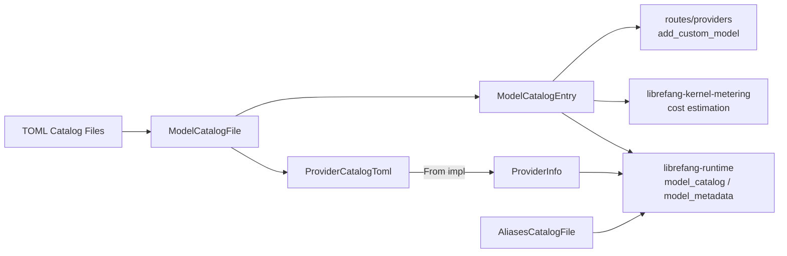

# Other — librefang-types-src

# librefang-types — Model Catalog Types

Shared data structures for the librefang model registry. This module defines the schema that flows through every layer: TOML catalog files on disk, the runtime model catalog, metering/cost estimation, and the dashboard API.

## Architecture



## Core Enums

### `ModelTier`

Capability classification for models. Serde lowercases (`"frontier"`, `"smart"`, etc.). Default is `Balanced`.

| Variant | Typical examples |
|---|---|
| `Frontier` | Claude Opus, GPT-4.1 |
| `Smart` | Claude Sonnet, Gemini 2.5 Flash |
| `Balanced` | GPT-4o-mini, Groq Llama |
| `Fast` | Fastest/cheapest for simple tasks |
| `Local` | Ollama, vLLM, LM Studio |
| `Custom` | User-defined models added at runtime |

Marked `#[non_exhaustive]` — new tiers may be added without a semver bump.

### `AuthStatus`

Provider authentication state, detected at runtime. Default is `Missing`.

Key method: **`is_available()`** — returns `true` for `ValidatedKey`, `Configured`, `AutoDetected`, `ConfiguredCli`, and `NotRequired`. Returns `false` for `InvalidKey` (key exists but rejected), `Missing`, `CliNotInstalled`, and `LocalOffline`.

Notable variants:
- **`AutoDetected`** — key found via a fallback env var; functionally usable but may not match the actual provider.
- **`LocalOffline`** — local provider probed and found offline. Unlike `Missing`, `detect_auth()` will not reset this; the probe loop owns the transition back to `NotRequired`.

### `Modality`

What kind of output the model produces. Controls which fields in `ModelCatalogEntry` are required. Default is `Text`.

- **`Text`** — chat/completion/reasoning models. `context_window` and `max_output_tokens` are required (enforced by `validate()`).
- **`Image`**, **`Audio`**, **`Video`**, **`Music`** — asset-generation models. Token context fields may be zero/absent; `validate()` skips the nonzero check.

### `ModelType`

Classification used in `ModelOverrides`: `Chat` (default), `Speech`, `Embedding`.

## Core Structs

### `ModelCatalogEntry`

A single model in the catalog. Deserialized from the `[[models]]` TOML array sections.

**Fields of note:**

| Field | Notes |
|---|---|
| `context_window` / `max_output_tokens` | `#[serde(default)]` — absent means `0`. Consumers **must not** feed `0` into compaction thresholds or budget math; treat it as unknown. |
| `image_input_cost_per_m` / `image_output_cost_per_m` | `Option<f64>`, only set for image/multimodal models with separate image token pricing. |
| `supports_tools`, `supports_vision`, `supports_streaming`, `supports_thinking` | Capability flags, all default `false`. |
| `aliases` | Short names resolved at lookup time (e.g. `"sonnet"` → canonical ID). |

**Methods:**

- **`is_image_generation()`** — convenience check for `modality == Modality::Image`.
- **`validate()`** — modality-aware schema check. For `Text` models, rejects entries where `context_window` or `max_output_tokens` is zero. Non-text modalities pass unconditionally. Catalog loaders **must** call this and reject failing entries.

### `ModelOverrides`

Per-model inference parameter overrides, persisted to `~/.librefang/model_overrides.json` keyed by `provider:model_id`. Every field is `Option` — `None` means "use the agent's or system default."

Override precedence (highest to lowest): agent-level `ModelConfig` → `ModelOverrides` → system defaults.

**`is_empty()`** returns `true` when all fields are `None`.

### `ProviderInfo`

Runtime provider metadata. Includes fields not present in TOML (auth status, model count, available models list, custom flag, proxy URL). This is what the rest of the codebase works with.

### `ProviderCatalogToml`

Provider metadata as stored in TOML files. A clean 1:1 mapping to `[provider]` sections — no runtime fields.

**Conversion:** `From<ProviderCatalogToml> for ProviderInfo` populates runtime fields with safe defaults (`auth_status: Missing`, `model_count: 0`, empty `available_models`, `is_custom: false`).

### `RegionConfig`

Per-region endpoint override within a provider. Contains a `base_url` and optional `api_key_env`. When a region is selected, its `base_url` replaces the provider-level default; if `api_key_env` is set, it overrides the provider-level key env var.

### `ModelCatalogFile`

Top-level catalog file structure: an optional `[provider]` section plus a `[[models]]` array. Used for both the main registry catalog and community catalog files.

### `AliasesCatalogFile`

Separate alias mapping file (`[aliases]` section) mapping short names to canonical model IDs.

## TOML Format

A complete catalog file:

```toml
[provider]
id = "anthropic"
display_name = "Anthropic"
api_key_env = "ANTHROPIC_API_KEY"
base_url = "https://api.anthropic.com"
key_required = true
signup_url = "https://console.anthropic.com/settings/keys"

[provider.regions.us]
base_url = "https://dashscope-us.aliyuncs.com/compatible-mode/v1"

[[models]]
id = "claude-sonnet-4-20250514"
display_name = "Claude Sonnet 4"
provider = "anthropic"
tier = "smart"
modality = "text"           # optional, defaults to "text"
context_window = 200000
max_output_tokens = 64000
input_cost_per_m = 3.0
output_cost_per_m = 15.0
supports_tools = true
supports_vision = true
supports_streaming = true
supports_thinking = false
aliases = ["sonnet", "claude-sonnet"]
```

Image-generation models omit the token fields and include image cost fields:

```toml
[[models]]
id = "gpt-image-2"
display_name = "GPT Image 2"
tier = "frontier"
modality = "image"
input_cost_per_m = 5.00
output_cost_per_m = 10.00
image_input_cost_per_m = 8.00
image_output_cost_per_m = 30.00
```

## Validation Contract

`ModelCatalogEntry::validate()` enforces a critical invariant: **text models must have nonzero `context_window` and `max_output_tokens`**. This prevents silent propagation of `0` into downstream compaction thresholds and budget calculations.

Catalog loaders (`librefang-runtime::model_catalog::from_sources`, `routes::providers::add_custom_model`) call `validate()` after deserialization and reject entries that fail. Non-text modalities (image, audio, video, music) skip this check because they legitimately lack a token context.

## Downstream Consumers

| Consumer | Usage |
|---|---|
| `librefang-runtime::model_catalog` | Loads and merges catalog files; calls `validate()` on entries |
| `librefang-runtime::model_metadata` | Looks up `ModelCatalogEntry` for inference parameter resolution |
| `librefang-kernel-metering` | Reads `input_cost_per_m` / `output_cost_per_m` for cost estimation |
| `routes::providers` | Dashboard "Add provider" / "Add custom model" flows; calls `validate()` on user-submitted entries |

## Design Notes

- All enums are `#[non_exhaustive]` to allow future expansion without breaking changes.
- Serde uses `rename_all = "lowercase"` for enums and `rename_all = "snake_case"` for `AuthStatus`, matching their TOML/JSON representations.
- Optional cost fields use `skip_serializing_if = "Option::is_none"` to keep serialized output clean.
- `ProviderCatalogToml` and `ProviderInfo` are separate structs to maintain a clear boundary between on-disk schema and runtime state — the `From` impl handles the conversion with safe defaults.