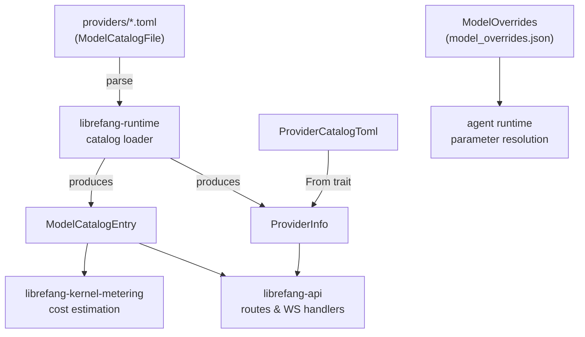

# Other — librefang-types-src

# Model Catalog Types (`librefang-types/src/model_catalog.rs`)

Shared data structures that define how LLM providers, models, and their capabilities are represented throughout the codebase. Every other crate — the runtime catalog loader, the API layer, the metering kernel — consumes these types.

## Purpose

The model catalog is a registry of every LLM provider and model Librefang knows about. This module provides the **schema**: enums for classification, structs for serialization (TOML and JSON), and a few utility methods. It deliberately contains no I/O or business logic — only data definitions and trivial queries like `AuthStatus::is_available()`.

## Architecture



## Key Types

### `ModelTier`

Classifies a model's capability level. Serialized as lowercase strings (`"frontier"`, `"smart"`, etc.). Default is `Balanced`.

| Variant | Typical examples |
|---|---|
| `Frontier` | Claude Opus, GPT-4.1 |
| `Smart` | Claude Sonnet, Gemini 2.5 Flash |
| `Balanced` | GPT-4o-mini, Groq Llama |
| `Fast` | Fastest/cheapest models |
| `Local` | Ollama, vLLM, LM Studio |
| `Custom` | User-defined runtime additions |

### `AuthStatus`

Tracks whether a provider's authentication is usable. The important method is `is_available()` — called from API routes (`src/routes/providers.rs`, `src/routes/agents.rs`), the WebSocket handler (`librefang-api/src/ws.rs`), and the interactive channel bridge (`librefang-api/src/channel_bridge.rs`).

```rust
// Available states — provider can be used
ValidatedKey | Configured | AutoDetected | ConfiguredCli | NotRequired

// Unavailable states — provider cannot be used
InvalidKey | Missing | CliNotInstalled | LocalOffline
```

Notable edge cases:

- **`AutoDetected`**: A key was found via a fallback environment variable. Usable, but may not match the intended provider — the UI should prompt verification.
- **`InvalidKey`**: Key is present but was rejected (HTTP 401/403). Returns `false` from `is_available()` even though a key exists.
- **`LocalOffline`**: A local provider was probed and found offline. Unlike `Missing`, `detect_auth()` does not reset this; the probe itself owns the transition back to `NotRequired` when the service comes back up.

Default is `Missing`. Serialized as `snake_case`.

### `ModelCatalogEntry`

The core record for a single model. Fields cover identity (`id`, `display_name`, `provider`), capability flags (`supports_tools`, `supports_vision`, `supports_streaming`, `supports_thinking`), cost (`input_cost_per_m`, `output_cost_per_m` in USD per million tokens), and `aliases` for short-name lookup.

The `provider` field defaults to an empty string — when omitted in community catalog TOML, the runtime loader infers it from the `[provider].id` section during merge.

### `ModelOverrides`

Per-model inference parameter overrides persisted to `~/.librefang/model_overrides.json`, keyed by `provider:model_id`. Every field is `Option` — `None` means "inherit from the agent or system default." The resolution order is:

1. Agent-level `ModelConfig` (highest precedence)
2. `ModelOverrides` from disk
3. System defaults

Notable fields beyond standard sampling parameters:

- `use_max_completion_tokens` — some providers require `max_completion_tokens` instead of `max_tokens` in API requests.
- `no_system_role` — models that cannot handle a `system` role message.
- `force_max_tokens` — send `max_tokens` even when the provider doesn't require it.

Use `is_empty()` to check whether any overrides are set. This method is called by `src/config/serde_helpers.rs` during serialization.

### `ProviderInfo` vs `ProviderCatalogToml`

Two structs represent the same provider at different stages:

| | `ProviderCatalogToml` | `ProviderInfo` |
|---|---|---|
| **Source** | Parsed from `providers/*.toml` | Produced at runtime |
| **Runtime fields** | None | `auth_status`, `model_count`, `available_models`, `is_custom`, `proxy_url` |
| **Use case** | 1:1 TOML mapping, safe to round-trip | API responses, internal lookups |

`ProviderCatalogToml` converts to `ProviderInfo` via `From<ProviderCatalogToml> for ProviderInfo`. The conversion initializes all runtime fields to safe defaults (`auth_status: Missing`, `model_count: 0`, `available_models: []`, `is_custom: false`).

The `is_custom` field drives UI behavior: built-in providers (from the registry) can only be deconfigured, not deleted, because the registry sync would re-create their TOML on next boot. Custom providers added via the dashboard "Add provider" flow get a real "Delete" control.

### `RegionConfig`

Per-region endpoint overrides within a provider. A `RegionConfig` specifies a region-specific `base_url` and an optional `api_key_env` override. When `api_key_env` is absent, the provider-level key is used.

Region selection is resolved at runtime by looking up the chosen region name in `ProviderInfo::regions`, falling back to `ProviderInfo::base_url` if no region is selected.

### `ModelCatalogFile`

The unified TOML format shared between the main repository (`catalog/providers/*.toml`) and the community model-catalog repository. Contains an optional `[provider]` section (`ProviderCatalogToml`) and a `[[models]]` array of `ModelCatalogEntry` values. The provider section is optional — some catalog files only contribute models and rely on the loader to match them to an existing provider.

### `AliasesCatalogFile`

A simple `[aliases]` TOML section mapping short names to canonical model IDs (e.g., `"sonnet" → "claude-sonnet-4-20250514"`).

## TOML Format Reference

A complete catalog file looks like:

```toml
[provider]
id = "anthropic"
display_name = "Anthropic"
api_key_env = "ANTHROPIC_API_KEY"
base_url = "https://api.anthropic.com"
key_required = true
signup_url = "https://console.anthropic.com/settings/keys"

[provider.regions.us]
base_url = "https://dashscope-us.aliyuncs.com/compatible-mode/v1"

[[models]]
id = "claude-sonnet-4-20250514"
display_name = "Claude Sonnet 4"
provider = "anthropic"
tier = "smart"
context_window = 200000
max_output_tokens = 64000
input_cost_per_m = 3.0
output_cost_per_m = 15.0
supports_tools = true
supports_vision = true
supports_streaming = true
aliases = ["sonnet", "claude-sonnet"]
```

## Serde Behavior

All enums use `#[serde(rename_all = ...)]` for consistent serialization:
- `ModelTier`: `lowercase` → `"frontier"`, `"smart"`, etc.
- `AuthStatus`: `snake_case` → `"validated_key"`, `"auto_detected"`, etc.
- `ModelType`: `lowercase` → `"chat"`, `"speech"`, `"embedding"`

`ModelOverrides` uses `#[serde(skip_serializing_if = "Option::is_none")]` on every field to keep the persisted JSON minimal. `ProviderInfo` skips serializing empty `available_models` and `None` `proxy_url` values.

## Consumers

| Crate | What it uses |
|---|---|
| `librefang-runtime` | Loads TOML into `ModelCatalogFile`, merges discovered models into `ModelCatalogEntry`, populates `ProviderInfo` |
| `librefang-api` | Reads `AuthStatus::is_available()` in routes (`/providers`, `/agents`) and WebSocket message handling |
| `librefang-kernel-metering` | Reads `ModelCatalogFile` for cost estimation when per-token prices are available |