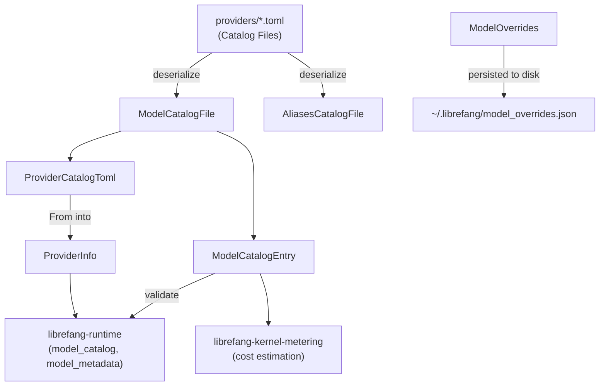

# Other — librefang-types-src

# librefang-types — Model Catalog Types

Shared data structures for the model registry. This crate is the single source of truth for types that represent AI models, providers, authentication state, and catalog file formats. It contains no business logic — only serialization-ready types consumed by the runtime, metering kernel, and API routes.

## Architecture



## Enums

### `ModelTier`

A model's capability bracket. Serialized as lowercase strings (`"frontier"`, `"smart"`, etc.). Defaults to `Balanced`.

| Variant | Semantics | Examples |
|---------|-----------|---------|
| `Frontier` | Cutting-edge, most capable | Claude Opus, GPT-4.1 |
| `Smart` | Capable and cost-effective | Claude Sonnet, Gemini 2.5 Flash |
| `Balanced` | Speed/cost tradeoff (default) | GPT-4o-mini, Groq Llama |
| `Fast` | Cheapest, fastest | — |
| `Local` | Self-hosted via Ollama, vLLM, LM Studio | — |
| `Custom` | User-defined at runtime | — |

### `AuthStatus`

Provider authentication state, detected at runtime. This is the field that drives UI visibility of provider setup prompts and API call routing decisions.

Key behaviors:

- **`is_available()`** — returns `true` for `ValidatedKey`, `Configured`, `AutoDetected`, `ConfiguredCli`, and `NotRequired`. Returns `false` for `InvalidKey`, `Missing`, `CliNotInstalled`, and `LocalOffline`. The key distinction: `InvalidKey` means credentials exist but are rejected (HTTP 401/403), so the provider is not usable.
- **`LocalOffline`** is special — it's set when a local provider's port isn't listening, and only the probe logic can transition it back to `NotRequired`. Calling `detect_auth()` won't reset it.
- Defaults to `Missing`.

### `Modality`

What kind of output a model produces. This determines which fields in `ModelCatalogEntry` are required.

- `Text` (default) — chat/completion models. **Must** have non-zero `context_window` and `max_output_tokens` (enforced by `validate()`).
- `Image` — image-generation models (e.g. gpt-image-2). Context fields default to 0 and are not validated.
- `Audio` — TTS/STT models. Same relaxed validation as `Image`.
- `Video` — video-generation models.
- `Music` — music/lyrics generation.

### `ModelType`

Model classification for inference routing: `Chat` (default), `Speech`, or `Embedding`. Used in `ModelOverrides` to override how a model is treated regardless of what the catalog says.

## Structs

### `ModelCatalogEntry`

A single model in the catalog. This is the core record that flows through the entire system — from TOML deserialization through cost estimation to the API layer.

#### Critical: zero-value semantics for `context_window` and `max_output_tokens`

Both fields use `#[serde(default)]`, meaning absent TOML keys deserialize to `0`. For non-text modalities this is expected and correct. For `Text` models, a `0` would silently corrupt downstream compaction thresholds and budget calculations.

**Callers must run `validate()` after deserialization.** The runtime's `from_sources()` does this, and the API route `add_custom_model()` does this. Any new code path that creates `ModelCatalogEntry` from external input must call `validate()` and reject entries that fail.

#### Cost fields

- `input_cost_per_m` / `output_cost_per_m` — cost per million tokens in USD. Always present (defaults to `0.0`).
- `image_input_cost_per_m` / `image_output_cost_per_m` — `Option<f64>`, only set for multimodal/image models where pixel tokens are priced separately. Serialized only when `Some`.

#### Capability flags

All default to `false`: `supports_tools`, `supports_vision`, `supports_streaming`, `supports_thinking`.

### `ModelOverrides`

Per-model inference parameter overrides persisted to `~/.librefang/model_overrides.json`, keyed by `provider:model_id`. Every field is `Option` — `None` means "use the layer above."

The resolution order is: **agent-level `ModelConfig` → `ModelOverrides` → system defaults.**

Use `is_empty()` to check whether any overrides are set (all fields `None`).

| Field | Type | Purpose |
|-------|------|---------|
| `model_type` | `Option<ModelType>` | Override model classification |
| `temperature` | `Option<f32>` | Sampling temperature (0.0–2.0) |
| `top_p` | `Option<f32>` | Nucleus sampling (0.0–1.0) |
| `max_tokens` | `Option<u32>` | Max completion tokens |
| `frequency_penalty` | `Option<f32>` | Frequency penalty (-2.0–2.0) |
| `presence_penalty` | `Option<f32>` | Presence penalty (-2.0–2.0) |
| `reasoning_effort` | `Option<String>` | "low", "medium", or "high" |
| `use_max_completion_tokens` | `Option<bool>` | Use `max_completion_tokens` param |
| `no_system_role` | `Option<bool>` | Model doesn't support system role |
| `force_max_tokens` | `Option<bool>` | Send `max_tokens` even if provider doesn't require it |

Fields serialize only when present (`skip_serializing_if = "Option::is_none"`), keeping the JSON file clean.

### `ProviderInfo` vs `ProviderCatalogToml`

Two structs represent the same conceptual provider, for different stages:

- **`ProviderCatalogToml`** — maps 1:1 to the `[provider]` section in a TOML catalog file. No runtime state.
- **`ProviderInfo`** — the runtime representation, with additional fields: `auth_status`, `model_count`, `available_models`, `is_custom`, `proxy_url`.

`ProviderCatalogToml` converts to `ProviderInfo` via `From` impl. The converter initializes runtime fields to their defaults (`Missing`, `0`, empty vecs). The runtime then populates `auth_status` via probing, `model_count` from the catalog, and `is_custom` based on whether the provider file came from the registry or was user-created.

#### `RegionConfig`

Per-region endpoint override within a provider. Contains `base_url` and an optional `api_key_env` override. When `api_key_env` is `None`, the provider-level key is used.

Region selection pattern — consumers resolve the effective base URL by checking if a region key exists in the map:

```rust
let url = provider.regions.get(region_name)
    .map(|r| &r.base_url)
    .unwrap_or(&provider.base_url);
```

#### `is_custom` field on `ProviderInfo`

Drives the dashboard's delete behavior. Built-in providers (from the registry) can only be deconfigured — their TOML would be re-created on the next registry sync. Custom providers (added via the dashboard "Add provider" flow) get a real delete control.

### `ModelCatalogFile`

The unified top-level catalog file format. Contains an optional `[provider]` section and a `[[models]]` array. Used by both the main repository catalog (`catalog/providers/*.toml`) and the community model catalog repository.

The `provider` field is `Option<ProviderCatalogToml>` because some catalog files only contain models (with the provider already known from context).

### `AliasesCatalogFile`

A simple `[aliases]` table mapping short names to canonical model IDs. Stored separately from the main catalog to allow community alias packs without modifying model entries.

## Downstream consumers

| Consumer | What it uses |
|----------|-------------|
| `librefang-runtime::model_catalog` | `ModelCatalogFile`, `ModelCatalogEntry::validate()` |
| `librefang-runtime::model_metadata` | `ModelCatalogEntry` for lookup and synthesis |
| `librefang-kernel-metering` | `ModelCatalogFile` for cost estimation |
| `src/routes/providers` | `validate()` when adding custom models via the API |

## Serialization conventions

All enums use `#[serde(rename_all = "lowercase")]` (for `ModelTier`, `Modality`, `ModelType`) or `#[serde(rename_all = "snake_case")` (for `AuthStatus`). The TOML and JSON representations match the Rust `Display` impl for each enum variant.

Optional cost fields on `ModelCatalogEntry` use `skip_serializing_if = "Option::is_none"` to keep serialized output clean. All `ModelOverrides` fields follow the same pattern. `ProviderInfo::available_models` skips serialization when empty to avoid writing `[]` for unprobed providers.