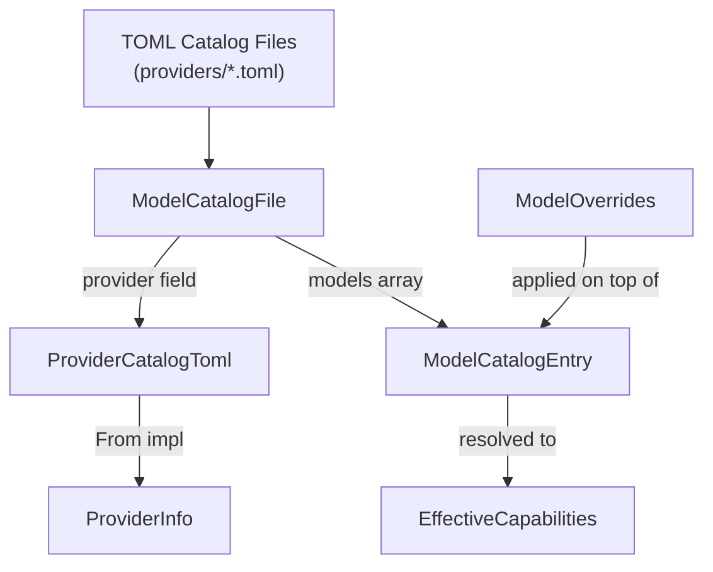

# Other — librefang-types-src

# `model_catalog` — Shared Types for the Model Registry

## Purpose

This module defines the data structures that flow between the TOML-based model catalog files on disk, the runtime catalog loader, the metering kernel, the API layer, and the OpenAI-compatible driver. Everything is serializable (`serde` + `Deserialize`) and lives in `librefang-types` so it can be imported without pulling in heavy runtime dependencies.

## Architecture Overview



Consumers include `librefang-runtime` (catalog loading, model metadata synthesis), `librefang-api` (provider routes, custom model endpoints), `librefang-kernel-metering` (cost estimation from catalog pricing), and the OpenAI-compatible driver (reasoning echo policy dispatch).

---

## Key Types

### Enums

| Type | Purpose | Serde format |
|---|---|---|
| `ModelTier` | Capability classification (frontier → fast, local, custom) | `lowercase` |
| `AuthStatus` | Provider authentication state | `snake_case` |
| `Modality` | Output kind (text, image, audio, video, music) | `lowercase` |
| `ModelType` | Inference type (chat, speech, embedding) | `lowercase` |
| `ReasoningEchoPolicy` | How the OpenAI-compat driver handles `reasoning_content` on history turns | `snake_case` |

All enums are `#[non_exhaustive]` — new variants may be added without a semver break. Consumers must handle unknown variants gracefully (or wildcard-match with `_`).

#### `AuthStatus` availability check

`AuthStatus::is_available()` returns `true` for states where the provider is functionally usable:

- `ValidatedKey`, `Configured`, `AutoDetected`, `ConfiguredCli`, `NotRequired`

It returns `false` for `InvalidKey`, `Missing`, `CliNotInstalled`, and `LocalOffline`. Note that `InvalidKey` is explicitly excluded — a key exists but the provider rejected it.

#### `ReasoningEchoPolicy` and provider quirks

The OpenAI-compatible ecosystem has incompatible conventions for `reasoning_content` on multi-turn history. The catalog encodes the correct behavior per model so the driver doesn't need to substring-match model names:

| Variant | Behavior | Canonical provider |
|---|---|---|
| `None` | Omit field on history turns (default) | Most providers |
| `Strip` | Strip `reasoning_content` from history; force non-null `content` on empty assistant turns | DeepSeek R1 / reasoner |
| `Echo` | Echo original thinking text on `tool_calls` turns | DeepSeek V4 Flash (thinking mode on) |
| `EmptyString` | Send empty-string `reasoning_content` on `tool_calls` turns, disable thinking wire-side | Moonshot / Kimi K2 |

Drivers for non-OpenAI-compat providers (Anthropic, Gemini) ignore this field entirely.

---

### Core Structs

#### `ModelCatalogEntry`

A single model in the catalog. Key design decisions:

- **`context_window` and `max_output_tokens`** use `#[serde(default)]` so image/audio/video/music models (which have no token context) can omit these fields in TOML. The value `0` means "unknown or not applicable."
- **`validate()` must be called after deserialization** for `Modality::Text` entries — it rejects text models missing either field, preventing `0` from leaking into compaction thresholds or budget math. Catalog loaders call this at load time and reject malformed entries.
- **`image_input_cost_per_m` / `image_output_cost_per_m`** are `Option<f64>` and only present for multimodal/image-generation models where pixel tokens are priced separately from text.

#### `ProviderCatalogToml` vs `ProviderInfo`

Two structs represent providers at different stages:

- **`ProviderCatalogToml`** — maps 1:1 to the `[provider]` TOML section. No runtime fields.
- **`ProviderInfo`** — the runtime representation, adding `auth_status`, `model_count`, `available_models`, `is_custom`, and `proxy_url`.

`ProviderCatalogToml` converts to `ProviderInfo` via `From` impl, which initializes runtime fields to their defaults (`AuthStatus::Missing`, zero models, empty available list).

#### `ModelCatalogFile`

The top-level TOML structure containing an optional `[provider]` section and a `[[models]]` array. This is the unified format used by both the main registry and community catalog repositories.

#### `AliasesCatalogFile`

A separate alias file mapping short names to canonical model IDs. Loaded alongside the main catalog to support shorthand references like `sonnet` → `claude-sonnet-4-20250514`.

#### `RegionConfig`

Per-region endpoint overrides within a provider. When a region is selected at runtime, its `base_url` replaces the provider-level default. Optionally overrides `api_key_env` per region (e.g., a different key for an international endpoint).

#### `ModelOverrides`

Per-model inference parameter overrides persisted to `~/.librefang/model_overrides.json`. Every field is `Option` — `None` means "use the agent or system default." The override layering order is:

1. Agent-level `ModelConfig` (highest precedence)
2. `ModelOverrides` (this struct)
3. System defaults

The capability overrides (`supports_tools`, `supports_vision`, `supports_streaming`, `supports_thinking`) exist so users can force a capability on/off when the provider's catalog declaration is wrong or missing. Use `is_empty()` to check whether any overrides are set.

#### `EffectiveCapabilities`

The resolved capability set after applying user overrides on top of the catalog entry's declared capabilities. Produced by `ModelCatalog::effective_capabilities` and consumed by callers that gate runtime behavior (tool gating, vision input validation).

---

## TOML Catalog Format

A typical catalog file at `providers/<name>.toml`:

```toml
[provider]
id = "anthropic"
display_name = "Anthropic"
api_key_env = "ANTHROPIC_API_KEY"
base_url = "https://api.anthropic.com"
key_required = true

[[models]]
id = "claude-sonnet-4-20250514"
display_name = "Claude Sonnet 4"
provider = "anthropic"
tier = "smart"
context_window = 200000
max_output_tokens = 64000
input_cost_per_m = 3.0
output_cost_per_m = 15.0
supports_tools = true
supports_vision = true
supports_streaming = true
aliases = ["sonnet", "claude-sonnet"]
```

The `[provider]` section is optional — models-only files are valid and the provider is inferred during merge.

Regional endpoints are expressed as:

```toml
[provider.regions.us]
base_url = "https://dashscope-us.aliyuncs.com/compatible-mode/v1"

[provider.regions.intl]
base_url = "https://dashscope-intl.aliyuncs.com/compatible-mode/v1"
api_key_env = "DASHSCOPE_INTL_API_KEY"
```

Image-generation models omit `context_window` and `max_output_tokens`:

```toml
[[models]]
id = "gpt-image-2"
display_name = "GPT Image 2"
tier = "frontier"
modality = "image"
input_cost_per_m = 5.00
output_cost_per_m = 10.00
image_input_cost_per_m = 8.00
image_output_cost_per_m = 30.00
supports_tools = false
supports_vision = true
```

---

## Integration Points

### Where the types are consumed

- **`librefang-runtime`** (`model_metadata.rs`) — constructs `ModelCatalogEntry` instances from catalog data and synthesizes entries for unknown models.
- **`librefang-api`** (`routes/providers.rs`) — calls `ModelCatalogEntry::validate()` when adding custom models via the dashboard.
- **`librefang-api`** (`model_catalog/tests.rs`) — exercises `ModelOverrides` for capability override resolution and alias-based lookups.
- **`librefang-kernel-metering`** (`lib.rs`) — uses `ModelCatalogFile` for cost estimation, falling back to legacy budget rates when catalog pricing is zero.

### Adding a new provider

1. Create a `providers/<name>.toml` with a `[provider]` section and `[[models]]` entries.
2. Ensure all `Modality::Text` models have non-zero `context_window` and `max_output_tokens`.
3. If the provider uses the OpenAI-compat wire format with non-standard `reasoning_content` handling, set `reasoning_echo_policy` on affected models.
4. If the provider has regional endpoints, add `[provider.regions.<name>]` subsections.