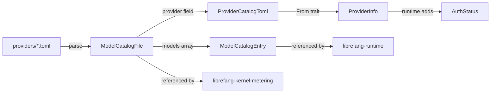

# Other — librefang-types-src

# Model Catalog Types (`model_catalog`)

Shared data structures for librefang's model registry — the system that tracks available LLM providers, their models, authentication state, and inference parameters.

This module is purely data definitions with serde support. It contains no I/O, no network calls, and no mutation logic. Downstream crates (`librefang-runtime`, `librefang-kernel-metering`) consume these types to load catalog TOML files, merge discovered models, and estimate costs.

## Data Flow



## Core Types

### ModelTier

Classification of a model's capability level. Serialized as lowercase strings (`"frontier"`, `"smart"`, etc.).

| Variant | Meaning | Examples |
|---------|---------|---------|
| `Frontier` | Most capable, highest cost | Claude Opus, GPT-4.1 |
| `Smart` | Capable but cost-effective | Claude Sonnet, Gemini 2.5 Flash |
| `Balanced` | Speed/cost tradeoff (default) | GPT-4o-mini, Groq Llama |
| `Fast` | Cheapest, simplest tasks | — |
| `Local` | Self-hosted models | Ollama, vLLM, LM Studio |
| `Custom` | User-defined at runtime | — |

The default is `Balanced`. Tier is used by the model router to select models based on task complexity and budget constraints.

### AuthStatus

Provider authentication state, detected at runtime. This enum is **not** stored in TOML — it's populated by the runtime's `detect_auth()` probe and lives only in `ProviderInfo`.

```
ValidatedKey   ─ key present, confirmed valid via live API call
Configured     ─ key present, not yet validated
AutoDetected   ─ key found via fallback env var
ConfiguredCli  ─ no key, but CLI tool available (e.g. claude-code)
NotRequired    ─ local provider, no key needed
InvalidKey     ─ key rejected (HTTP 401/403)
Missing        ─ no key found (default)
CliNotInstalled─ CLI-based provider, CLI missing
LocalOffline   ─ local provider probed and offline
```

Use `is_available()` to check if a provider can be used. It returns `true` for `ValidatedKey`, `Configured`, `AutoDetected`, `ConfiguredCli`, and `NotRequired`. Notably, `InvalidKey` returns `false` — the key exists but the provider will reject requests.

`LocalOffline` is special: unlike `Missing`, the probe owns the transition back to `NotRequired` when the service comes back up. The auth detection system will not reset it.

### ModelType

Distinguishes model categories: `Chat` (default), `Speech` (TTS/STT), `Embedding` (vector models).

### ModelCatalogEntry

A single model's metadata — the primary unit of the catalog:

- **Identity**: `id` (canonical), `display_name`, `provider`, `aliases`
- **Capabilities**: `tier`, `context_window`, `max_output_tokens`
- **Cost**: `input_cost_per_m`, `output_cost_per_m` (USD per million tokens)
- **Feature flags**: `supports_tools`, `supports_vision`, `supports_streaming`, `supports_thinking`

All boolean feature flags default to `false` via `#[serde(default)]`.

### ModelOverrides

Per-model inference parameter overrides persisted to `~/.librefang/model_overrides.json`, keyed by `provider:model_id`. Every field is `Option` — `None` means "use the layer above."

**Override resolution order** (highest priority first):
1. Agent-level `ModelConfig`
2. `ModelOverrides` (this type)
3. System defaults

Key fields:

| Field | Type | Purpose |
|-------|------|---------|
| `temperature` | `Option<f32>` | Sampling temperature (0.0–2.0) |
| `top_p` | `Option<f32>` | Nucleus sampling threshold |
| `max_tokens` | `Option<u32>` | Completion token limit |
| `reasoning_effort` | `Option<String>` | `"low"`, `"medium"`, `"high"` |
| `use_max_completion_tokens` | `Option<bool>` | Use OpenAI-style `max_completion_tokens` |
| `no_system_role` | `Option<bool>` | Model doesn't support system messages |
| `force_max_tokens` | `Option<bool>` | Send `max_tokens` even when provider doesn't require it |

Call `is_empty()` to check if no overrides are set (all fields `None`).

## Provider Types

Three types represent providers at different stages:

### ProviderCatalogToml — Static (TOML-level)

Maps 1:1 to the `[provider]` section in catalog files. No runtime state. Fields: `id`, `display_name`, `api_key_env`, `base_url`, `key_required`, `signup_url`, `regions`, `media_capabilities`.

`key_required` defaults to `true` via a helper function (`default_key_required`) rather than `#[serde(default)]` because serde's `Default` for `bool` is `false`, but most providers do require keys.

### ProviderInfo — Runtime

Enriched version with runtime-only fields added during catalog loading:

- `auth_status: AuthStatus` — populated by the auth probe
- `model_count: usize` — number of catalog models for this provider
- `available_models: Vec<String>` — model IDs confirmed via live API probe
- `is_custom: bool` — `true` for user-added providers; drives dashboard UI (built-in providers show "Remove key", custom ones show "Delete")
- `proxy_url: Option<String>` — per-provider proxy override

Conversion from `ProviderCatalogToml` uses the `From` trait — runtime fields get safe defaults (`AuthStatus::Missing`, empty vectors, `is_custom: false`).

### RegionConfig

Per-region endpoint overrides within a provider. Used for providers with geographic endpoints (e.g., DashScope with separate US and international URLs).

```toml
[provider.regions.us]
base_url = "https://dashscope-us.aliyuncs.com/compatible-mode/v1"
api_key_env = "DASHSCOPE_US_API_KEY"  # optional; falls back to provider-level
```

At runtime, if a region is selected, its `base_url` replaces the provider's default. If the region also specifies `api_key_env`, that overrides the provider-level key source.

## File Formats

### ModelCatalogFile

The unified TOML format for both the main repository and community model catalogs:

```toml
[provider]
id = "anthropic"
display_name = "Anthropic"
api_key_env = "ANTHROPIC_API_KEY"
base_url = "https://api.anthropic.com"
key_required = true

[[models]]
id = "claude-sonnet-4-20250514"
display_name = "Claude Sonnet 4"
provider = "anthropic"
tier = "smart"
context_window = 200000
max_output_tokens = 64000
input_cost_per_m = 3.0
output_cost_per_m = 15.0
supports_tools = true
supports_vision = true
supports_streaming = true
aliases = ["sonnet", "claude-sonnet"]
```

The `[provider]` section is optional — community catalog files may omit it if the provider is already known. When present, it's parsed into `ProviderCatalogToml`.

### AliasesCatalogFile

A separate file mapping short names to canonical model IDs:

```toml
[aliases]
sonnet = "claude-sonnet-4-20250514"
haiku = "claude-haiku-4-5-20251001"
```

## Serde Behavior

All types use `#[serde(rename_all = "snake_case")]` for enum variants and `#[serde(rename_all = "lowercase")]` for `ModelTier`, `ModelType`. Booleans in `ModelCatalogEntry` and optional fields in `ModelOverrides` use `#[serde(default)]` to allow partial TOML files. `ModelOverrides` additionally uses `#[serde(skip_serializing_if = "Option::is_none")]` to keep serialized output clean. `ProviderInfo.available_models` skips serialization when empty.

## Cross-Module Integration

- **`librefang-runtime`**: Calls `merge_discovered_models()` which operates on `ModelCatalogEntry` instances to merge API-probed model lists into the catalog. Uses `ProviderInfo` for auth detection and region resolution.
- **`librefang-kernel-metering`**: References `ModelCatalogFile` for cost estimation — reads `input_cost_per_m` / `output_cost_per_m` from catalog entries to calculate token costs. Falls back to legacy budget rates when catalog prices are zero.