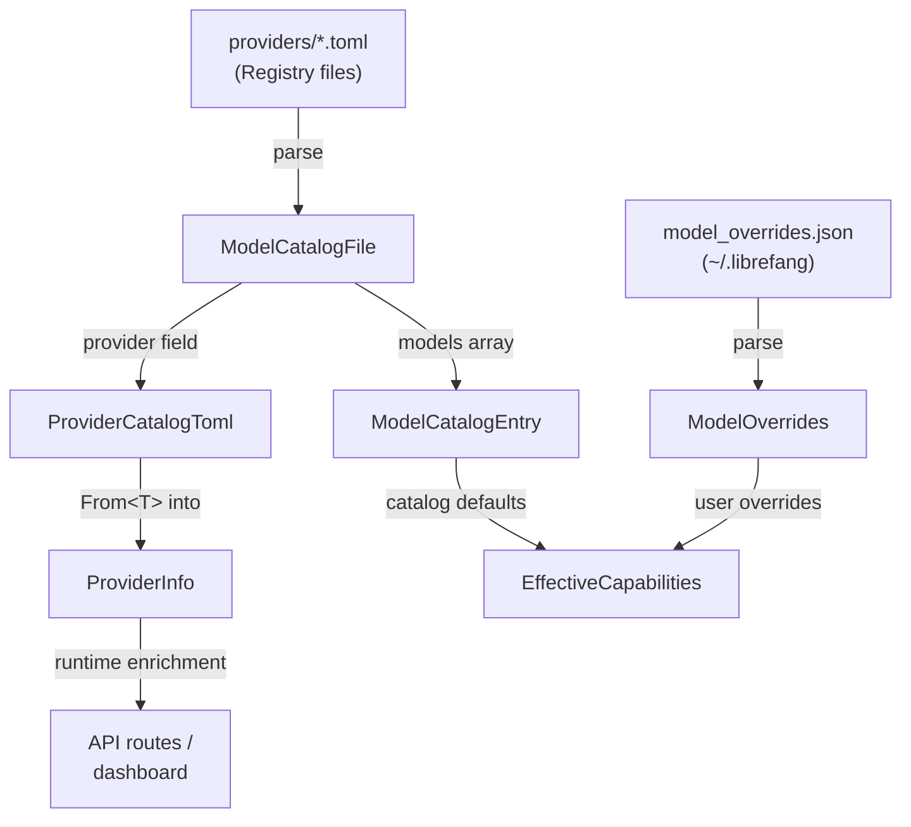

# Other — librefang-types-src

# librefang-types: Model Catalog

Shared data structures for the model registry — the canonical source of truth for provider metadata, model definitions, pricing, capabilities, and per-user overrides. Every crate that needs to reason about "what models exist, what can they do, and what do they cost" depends on these types.

## Architecture


```mermaid
graph TD
    TOML["providers/*.toml<br/>(Registry files)"] -->|parse| MCF[ModelCatalogFile]
    MCF -->|provider field| PCT[ProviderCatalogToml]
    MCF -->|models array| MCE[ModelCatalogEntry]
    PCT -->|From&lt;T&gt; into| PI[ProviderInfo]
    PI -->|runtime enrichment| API["API routes /<br/>dashboard"]

    JSON["model_overrides.json<br/>(~/.librefang)"] -->|parse| MO[ModelOverrides]
    MCE -->|catalog defaults| EC[EffectiveCapabilities]
    MO -->|user overrides| EC
```

## Enums

### `ModelTier`

Capability classification for models. Serialized as lowercase strings (`"frontier"`, `"smart"`, etc.). Default is `Balanced`.

| Variant | Typical examples |
|---|---|
| `Frontier` | Claude Opus, GPT-4.1 |
| `Smart` | Claude Sonnet, Gemini 2.5 Flash |
| `Balanced` | GPT-4o-mini, Groq Llama |
| `Fast` | Lightest/cheapest models |
| `Local` | Ollama, vLLM, LM Studio |
| `Custom` | User-added at runtime |

### `AuthStatus`

Provider authentication state. Default is `Missing`. Call `is_available()` to check usability — returns `true` for `ValidatedKey`, `Configured`, `AutoDetected`, `ConfiguredCli`, and `NotRequired`. Returns `false` for `InvalidKey` (key present but rejected) and all other states.

Notable variants:
- **`AutoDetected`** — key found via a fallback env var; usable but may not match the actual provider.
- **`LocalOffline`** — local provider probed and found offline. Unlike `Missing`, `detect_auth()` will not reset this; the probe owns the transition back to `NotRequired`.

### `Modality`

What kind of output a model produces. Critical for validation: `Text` models **must** have non-zero `context_window` and `max_output_tokens`, while all other modalities may legitimately omit those fields.

| Variant | Token fields required? |
|---|---|
| `Text` (default) | Yes — both must be > 0 |
| `Image` | No |
| `Audio` | No |
| `Video` | No |
| `Music` | No |

### `ReasoningEchoPolicy`

Controls how the OpenAI-compatible driver handles `reasoning_content` on historical assistant turns. The ecosystem has multiple incompatible conventions, so this is encoded as per-model metadata to avoid substring-matching model names.

| Variant | Behavior |
|---|---|
| `None` (default) | Omit `reasoning_content` on history |
| `Strip` | Strip historical `reasoning_content`; also force non-null `content` on empty-text assistant turns (DeepSeek R1) |
| `Echo` | Echo original thinking text on `tool_calls` turns (DeepSeek V4 Flash thinking-mode) |
| `EmptyString` | Send empty-string `reasoning_content` on `tool_calls` turns, disable thinking wire-side (Moonshot / Kimi K2) |

Drivers that use native SDKs (Anthropic, Gemini) ignore this field entirely.

## Core Structs

### `ModelCatalogEntry`

A single model in the catalog. Key fields:

- **`id`** — canonical identifier (e.g. `"claude-sonnet-4-20250514"`)
- **`provider`** — provider identifier (e.g. `"anthropic"`)
- **`tier`** / **`modality`** — classification enums
- **`context_window`** / **`max_output_tokens`** — token limits; `0` means unknown or not applicable
- **`input_cost_per_m`** / **`output_cost_per_m`** — cost per million tokens in USD
- **`image_input_cost_per_m`** / **`image_output_cost_per_m`** — optional separate image pricing
- **Capability flags**: `supports_tools`, `supports_vision`, `supports_streaming`, `supports_thinking`
- **`reasoning_echo_policy`** — provider-specific reasoning wire-format handling
- **`aliases`** — short names for lookup (e.g. `["sonnet", "claude-sonnet"]`)

#### Validation

Call `validate()` after deserialization. It enforces that `Text` models have non-zero `context_window` and `max_output_tokens`. Non-text modalities skip this check. Catalog loaders **must** call this and reject entries that fail — a `0` value propagated downstream into compaction thresholds or budget math will produce incorrect behavior.

```rust
let entry: ModelCatalogEntry = toml::from_str(raw)?;
entry.validate()?; // reject malformed text entries
```

### `ProviderInfo` vs `ProviderCatalogToml`

Two parallel structs for provider metadata:

- **`ProviderCatalogToml`** — maps 1:1 to the `[provider]` TOML section. Omits runtime-only fields. Used during parsing.
- **`ProviderInfo`** — the runtime representation, adding `auth_status`, `model_count`, `available_models`, `is_custom`, and `proxy_url`.

`ProviderCatalogToml` implements `From<ProviderCatalogToml> for ProviderInfo`, initializing runtime fields to their defaults (`Missing` auth, 0 models, etc.).

### `RegionConfig`

Per-region endpoint override with a `base_url` and optional `api_key_env`. Stored in `ProviderInfo::regions` as a `HashMap<String, RegionConfig>`. When a region is selected at runtime, the driver resolves the base URL from the region config, falling back to the provider-level default.

### `ModelOverrides`

Per-model inference parameter overrides persisted to `~/.librefang/model_overrides.json`, keyed by `provider:model_id`. Every field is `Option` — `None` means "use the agent's or system default."

Override precedence: **agent-level config > model overrides > system defaults**.

The capability fields (`supports_tools`, `supports_vision`, `supports_streaming`, `supports_thinking`) allow forcing a capability on or off regardless of what the catalog declares — useful when a provider's metadata is wrong or incomplete (ref #4745).

### `EffectiveCapabilities`

Resolved capability flags after applying `ModelOverrides` on top of the catalog entry's declared capabilities. Produced by `ModelCatalog::effective_capabilities` and consumed anywhere that gates runtime behavior on capability truth (tool use, vision input validation, etc.).

### `ModelCatalogFile` and `AliasesCatalogFile`

Top-level TOML file structures:

- **`ModelCatalogFile`** — optional `[provider]` section + `[[models]]` array. Used by both the main repository and community catalog repos.
- **`AliasesCatalogFile`** — maps short names to canonical model IDs via `[aliases]`.

## TOML Format Reference

A complete provider catalog file:

```toml
[provider]
id = "anthropic"
display_name = "Anthropic"
api_key_env = "ANTHROPIC_API_KEY"
base_url = "https://api.anthropic.com"
key_required = true

[provider.regions.us]
base_url = "https://us.anthropic.com"
api_key_env = "ANTHROPIC_US_API_KEY"   # optional per-region key override

[[models]]
id = "claude-sonnet-4-20250514"
display_name = "Claude Sonnet 4"
provider = "anthropic"
tier = "smart"
context_window = 200000
max_output_tokens = 64000
input_cost_per_m = 3.0
output_cost_per_m = 15.0
supports_tools = true
supports_vision = true
supports_streaming = true
aliases = ["sonnet", "claude-sonnet"]

[[models]]
id = "gpt-image-2"
display_name = "GPT Image 2"
tier = "frontier"
modality = "image"
input_cost_per_m = 5.0
output_cost_per_m = 10.0
image_input_cost_per_m = 8.0
image_output_cost_per_m = 30.0
supports_vision = true
# context_window / max_output_tokens omitted — not applicable to image models
```

## Serde Conventions

- All enums use `#[serde(rename_all = "lowercase")]` or `snake_case` for wire compatibility.
- Optional fields use `#[serde(default)]` so catalog TOML files can omit them.
- `Option<f64>` cost fields use `#[serde(skip_serializing_if = "Option::is_none")]` to keep output clean.
- All enums are `#[non_exhaustive]` — new variants can be added without a semver break.

## Integration Points

| Consumer | What it uses |
|---|---|
| **`librefang-runtime`** (`model_metadata`) | `ModelCatalogEntry` for constructing runtime model metadata |
| **`librefang-kernel-metering`** | `ModelCatalogFile` for pricing/cost estimation |
| **`librefang-api`** (`routes/providers`) | `ModelCatalogEntry::validate()` when adding custom models via the dashboard |
| **Model catalog subsystem** | `ModelOverrides` and `EffectiveCapabilities` for resolving user preferences |
| **Kernel tests** | `ModelCatalogEntry` fields (especially `context_window`) for budget/compaction behavior |

## Adding a New Model

1. Add a `[[models]]` entry to the appropriate `providers/*.toml` file.
2. For text models, `context_window` and `max_output_tokens` are **required** — `validate()` will reject the entry if either is zero.
3. For non-text models, set `modality` explicitly and omit the token fields.
4. If the model has provider-specific reasoning wire-format quirks, set `reasoning_echo_policy`.
5. Add aliases for convenient lookup.