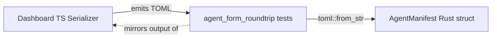

# Other — librefang-types-tests

# librefang-types-tests: Agent Form Round-Trip Tests

## Purpose

This test module verifies that the TOML emitted by the **dashboard's visual agent editor** (TypeScript) can be correctly deserialized by the **kernel's Rust parser** into an `AgentManifest`. Its primary job is to catch **schema drift** between the two implementations before it reaches production.

The dashboard lives at `crates/librefang-api/dashboard/src/lib/agentManifest.ts`. Any time that serializer's output format changes, one of these tests should fail — signaling that the Rust types in `librefang_types::agent` need to be updated to match, or vice versa.

## Architecture

The tests do **not** import or call the TypeScript serializer directly. Instead, each test hard-codes the exact TOML string that the serializer would produce for a given form state. This keeps the test hermetic while still catching drift.

## Test Coverage

### `parses_form_minimum_viable_output`

Validates the smallest valid manifest a user can create — the four required fields plus a model block. If this fails, something fundamental in `AgentManifest`'s required fields has changed.

Asserts on:
- `name` and `model.provider`, `model.model`

### `parses_form_full_output_with_capabilities_and_resources`

Covers the complete "basic" form with all non-advanced sections populated:
- `tags`, `skills` arrays
- `model.temperature`, `model.max_tokens`
- `resources.max_tool_calls_per_minute`, `resources.max_cost_per_hour_usd`
- `capabilities.network`, `capabilities.shell`, `capabilities.agent_spawn`

This is the most common real-world manifest shape.

### `parses_form_with_advanced_sections`

Exercises every advanced section the form can emit. This is the broadest single test and the most likely to break on schema changes. Fields covered:

| Section | Fields |
|---|---|
| Top-level | `priority`, `session_mode`, `web_search_augmentation`, `schedule`, `exec_policy` |
| `thinking` | `budget_tokens`, `stream_thinking` |
| `autonomous` | `max_iterations`, `heartbeat_channel` |
| `routing` | `simple_model`, `medium_model`, `complex_model`, `simple_threshold`, `complex_threshold` |
| `[[fallback_models]]` | `provider`, `model` (array-of-tables) |
| `[[context_injection]]` | `name`, `content`, `position` (array-of-tables) |
| `capabilities` | `memory_read`, `memory_write`, `agent_message`, `ofp_connect` |

Key assertions:
- Enum variants (`Priority::High`, `SessionMode::New`) resolve correctly from their string representations.
- Optional sections (`thinking`, `autonomous`, `routing`) deserialize as `Some(...)`.
- Array-of-tables (`fallback_models`, `context_injection`) parse with correct length and field values.

### `parses_form_response_format_json_schema`

Validates that the `response_format` inline table deserializes into `ResponseFormat::JsonSchema` with the `name` and `strict` fields intact. This is a common pain point because the schema itself is an arbitrary JSON object embedded in TOML.

### `omitting_optional_sections_uses_defaults`

Ensures that a minimal manifest (no `resources`, no `capabilities` blocks) falls back to sane defaults:
- `capabilities.network` is empty
- `capabilities.agent_spawn` is `false`
- `resources.max_llm_tokens_per_hour` is `None` (inherits global default)

If optional fields stop defaulting correctly, this test catches it.

## Key Types Referenced

All types come from `librefang_types`:

- **`agent::AgentManifest`** — the top-level struct being deserialized in every test
- **`agent::Priority`** — enum (`High`, etc.)
- **`agent::SessionMode`** — enum (`New`, etc.)
- **`config::ResponseFormat`** — enum with `JsonSchema` variant

## When Tests Fail

A failure here almost always means one of two things:

1. **The Rust types changed** (e.g., a field was renamed or an enum variant was reworded) but the dashboard serializer was not updated. Fix the TypeScript serializer to match.
2. **The dashboard serializer changed** (e.g., the form now emits a differently-named key) but the Rust types were not updated. Fix the `AgentManifest` struct or its `Deserialize` impl to match.

In either case, the fix is on one side or the other — the test itself rarely needs to change unless the form gains an entirely new section, in which case add a new test or extend the advanced-sections test.

## Adding a New Test

When the dashboard form gains a new field or section:

1. Generate the TOML output from the dashboard for that form state.
2. Paste it into a new `#[test]` function as a raw string literal.
3. Parse with `toml::from_str::<AgentManifest>` and assert on the new fields.
4. Confirm the test passes on the current code, then commit. Future drift will be caught automatically.