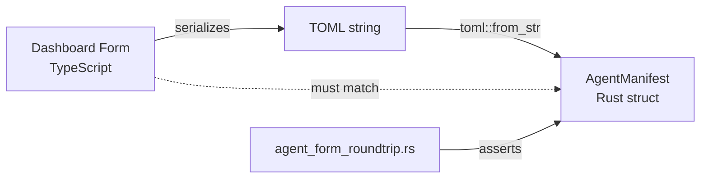

# Other — librefang-types-tests

# librefang-types: Agent Manifest Round-Trip Tests

## Purpose

This test module (`agent_form_roundtrip.rs`) validates that the Rust `AgentManifest` deserializer can correctly parse the exact TOML output produced by the dashboard's visual editor. Its primary goal is **drift detection**: if the TypeScript serializer in `crates/librefang-api/dashboard/src/lib/agentManifest.ts` changes its output format and the Rust types in `librefang_types::agent` aren't updated accordingly, these tests will fail at build time.

This is not a general fuzzing or property-test suite. Each test case mirrors a specific code path in the dashboard's form serializer.

## Architecture

The contract being tested is: **for any TOML the dashboard emits, `toml::from_str::<AgentManifest>` must succeed and produce the expected struct values.**

## Test Cases

### `parses_form_minimum_viable_output`

Tests the smallest valid manifest the form can emit. Contains only the required fields:

- `name`, `version`, `module`
- A `[model]` section with `provider` and `model`

Verifies that optional sections (`resources`, `capabilities`, `tags`, etc.) are not required for parsing to succeed.

### `parses_form_full_output_with_capabilities_and_resources`

Tests a manifest with all "standard" (non-advanced) sections filled in:

- `tags`, `skills`, `description`
- `[model]` with `system_prompt`, `temperature`, `max_tokens`
- `[resources]` with rate and cost limits
- `[capabilities]` with `network`, `shell`, and `agent_spawn`

### `parses_form_with_advanced_sections`

The most comprehensive test. Covers every advanced section the form's serializer emits:

| Section | Fields tested |
|---|---|
| Top-level | `priority`, `session_mode`, `web_search_augmentation`, `schedule`, `exec_policy` |
| `[thinking]` | `budget_tokens`, `stream_thinking` |
| `[autonomous]` | `max_iterations`, `heartbeat_channel` |
| `[routing]` | `simple_model`, `medium_model`, `complex_model`, thresholds |
| `[[fallback_models]]` | Array-of-tables with `provider`/`model` |
| `[[context_injection]]` | Array-of-tables with `name`/`content`/`position` |
| `[capabilities]` | `memory_read`, `memory_write`, `agent_message`, `ofp_connect` |

This test is the most sensitive to field renames or enum variant changes.

### `parses_form_response_format_json_schema`

Tests the `response_format` field when the form emits a `json_schema` type. The form serializes the JSON schema as an inline TOML table, and this test confirms the kernel deserializes it into `ResponseFormat::JsonSchema` with correct `name` and `strict` values.

### `omitting_optional_sections_uses_defaults`

Tests the behavior when the form emits no `[resources]` or `[capabilities]` sections at all. Verifies that:

- `capabilities.network` defaults to an empty vec
- `capabilities.agent_spawn` defaults to `false`
- `resources.max_llm_tokens_per_hour` is `None` (inherits global default)

## Maintenance Guidelines

**When adding a new field to `AgentManifest` or changing an existing field name/type**, you must:

1. Update the Rust struct in `librefang_types::agent`.
2. Update the TypeScript serializer in `agentManifest.ts`.
3. Add or update the relevant test case here to cover the new/changed field.

**When adding a new advanced section to the form**, add a corresponding test case that includes every field in that section. Mirror the exact TOML structure the TypeScript serializer produces — do not hand-write "representative" TOML.

**If a test fails after a TypeScript change but the Rust types are correct**, the test TOML string needs to be updated to match the new serializer output. Copy the actual TOML output from the dashboard rather than guessing.