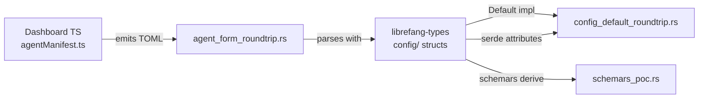

# Other — librefang-types-tests

# librefang-types Tests

Integration tests that guard the TOML serialization contract between the dashboard frontend and the kernel, and ensure config struct defaults remain consistent across `Default` impls and serde deserialization.

## Overview

The `librefang-types` crate defines the canonical Rust representations for every configuration and manifest type in the system. These types are serialized to/from TOML on disk and consumed by both the kernel and the dashboard's visual editor (TypeScript). The three test files in this module serve distinct but complementary purposes:

| Test file | Purpose |
|---|---|
| `agent_form_roundtrip.rs` | Catches drift between the dashboard's TOML serializer and the kernel's deserializer |
| `config_default_roundtrip.rs` | Catches divergence between manual `Default` impls and `#[serde(default)]` attributes |
| `schemars_poc.rs` | Ad-hoc JSON Schema generation for manual inspection |

---

## agent_form_roundtrip.rs

### Problem it solves

The dashboard (`crates/librefang-api/dashboard/src/lib/agentManifest.ts`) emits TOML from a visual form. The kernel's Rust deserializer must parse that exact TOML. If either side renames a field, changes an enum variant, or alters a nested structure, the mismatch only appears at runtime. These tests catch it at build time by parsing representative TOML strings that mirror what the form serializer actually produces.

### Test cases

**`parses_form_minimum_viable_output`** — The smallest valid manifest the form can emit: `name`, `version`, `module`, and a `[model]` section with `provider` and `model`. Verifies the core fields parse correctly.

**`parses_form_full_output_with_capabilities_and_resources`** — A fully-populated standard form including `tags`, `skills`, `model.temperature`, `model.max_tokens`, `[resources]`, and `[capabilities]`. Validates collections, floats, and boolean fields.

**`parses_form_with_advanced_sections`** — Exercises every advanced section the form offers: `priority`, `session_mode`, `web_search_augmentation`, `schedule`, `exec_policy`, `[thinking]`, `[autonomous]`, `[routing]`, `[[fallback_models]]`, and `[[context_injection]]`. This is the primary drift-detection test—if a field is renamed in either the TypeScript serializer or the Rust struct, this test fails.

**`parses_form_response_format_json_schema`** — Tests the `ResponseFormat::JsonSchema` variant, which carries an inline JSON schema as a TOML table. This is a high-risk area because the `schema` field maps to `serde_json::Value`.

**`omitting_optional_sections_uses_defaults`** — Confirms that when the form leaves `resources` and `capabilities` empty, the kernel falls back to `ResourceQuota` and `ManifestCapabilities` defaults rather than erroring.

### When updating

If you add a new field to `AgentManifest` or any nested struct, add a corresponding assertion in `parses_form_with_advanced_sections` (or a new test if it's a new section). If you change the TypeScript serializer in `agentManifest.ts`, run these tests to confirm the kernel still accepts the output.

---

## config_default_roundtrip.rs

### The bug class (issue #3404)

Many config structs have both a manual `impl Default` and fields annotated with `#[serde(default)]` or `#[serde(default = "path::to::fn")]`. A common mistake is:

1. A developer adds a new field with `#[serde(default)]` and a custom default function.
2. They forget to update the manual `Default` impl.
3. Serde deserialization fills the field with `Field::default()` or the custom function, while `T::default()` produces a different value.
4. Empty TOML round-trips appear to work, but in-memory defaults diverge silently.

The schemars golden schema test doesn't catch this because schemars reads the `#[serde(default)]` attribute, not the `Default` impl body.

### How the tests work

Each test calls one of two helper functions:

- **`assert_default_roundtrip::<T>(label)`** — For types where `Default` and serde-empty should agree on every field.
- **`assert_default_roundtrip_with::<T>(label, normalize)`** — For types with a known legitimate divergence (e.g., `KernelConfig::config_version`).

Each helper performs two assertions:

1. **Empty-TOML equivalence**: `T::default()` must serialize to the same TOML string as what you get by deserializing an empty TOML document and re-serializing. If a `#[serde(default)]` field disagrees with the manual `Default` impl, the serialized strings will differ.
2. **Round-trip idempotency**: `T::default()` → serialize → deserialize → serialize must produce the same string both times.

Comparison is done via TOML string equality rather than `PartialEq` to avoid requiring `#[derive(PartialEq)]` across the entire nested config tree (see issue #3404 caveat 1).

### The KernelConfig normalization

`KernelConfig` has one field where divergence is intentional: `config_version`.

- `KernelConfig::default()` sets `config_version` to `CONFIG_VERSION` (currently `2`) — fresh in-memory configs need no migration.
- The serde default function `default_config_version()` returns `1` — a legacy on-disk TOML that omits `config_version` is pre-versioning, and `run_migrations` lifts it forward.

The test normalizes both sides to `KernelConfig::default().config_version` before comparison, so the deliberate v1 sentinel doesn't mask mismatches on every other field.

### The ChannelsConfig regression (issue #4436)

`ChannelsConfig` previously derived `Default`, causing `file_download_max_bytes` to default to `0`. The `#[serde(default = "default_file_download_max_bytes")]` attribute set it to 50 MiB. This meant any programmatically-constructed config (e.g., `KernelConfig::default()`) silently rejected all file attachments as oversized. The fix was a manual `Default` impl. Two tests guard this:

- `channels_config_default_roundtrips_through_toml` — the standard round-trip check.
- `channels_config_default_has_50mb_max` — a pinned-value assertion that trips CI even if someone zero-bins both the `Default` impl and the serde helper simultaneously.

### Adding a new type

For most config structs, add a single test:

```rust
#[test]
fn my_config_default_roundtrips_through_toml() {
    assert_default_roundtrip::<MyConfig>("MyConfig");
}
```

If the type has a known legitimate divergence, use `assert_default_roundtrip_with` and pass a closure that normalizes the divergent field.

### Covered types

The test suite covers 40+ config types including: `QueueConfig`, `BudgetConfig`, `SessionConfig`, `CompactionTomlConfig`, `TaskBoardConfig`, `TriggersConfig`, `WebhookTriggerConfig`, `WebConfig`, `WebFetchConfig`, `BrowserConfig`, `BraveSearchConfig`, `TavilySearchConfig`, `PerplexitySearchConfig`, `JinaSearchConfig`, `ReloadConfig`, `RateLimitConfig`, `SkillsConfig`, `ExtensionsConfig`, `VaultConfig`, `AutoReplyConfig`, `InboxConfig`, `TelemetryConfig`, `PromptIntelligenceConfig`, `CanvasConfig`, `ThinkingConfig`, `ContextEngineTomlConfig`, `ExternalAuthConfig`, `AuditConfig`, `PrivacyConfig`, `HealthCheckConfig`, `HeartbeatTomlConfig`, `AutoDreamConfig`, `RegistryConfig`, `MemoryConfig`, `MemoryDecayConfig`, `ChunkConfig`, `NetworkConfig`, `TtsConfig`, `DockerSandboxConfig`, `PairingConfig`, `SanitizeConfig`, `ParallelToolsConfig`, `TerminalConfig`, `VoiceConfig`, `LinkedInConfig`, `AgentManifest`, `ChannelsConfig`, `BroadcastConfig`, and `KernelConfig`.

---

## schemars_poc.rs

Development-time utility tests that generate and print JSON Schema (draft-07) for representative types. Not a correctness gate—these are for manual inspection during schema evolution.

Run with stdout visible:

```
cargo test -p librefang-types --test schemars_poc -- --nocapture
```

### Test cases

- **`dump_budget_config_schema`** — Representative simple config struct.
- **`dump_vault_config_schema`** — Contains `Option<PathBuf>`, useful for checking how schemars renders filesystem paths.
- **`full_kernel_config_schema_generates`** — End-to-end sanity check that the full `KernelConfig` schema generates valid JSON. Asserts >50 top-level properties and >50 nested definitions, giving a rough measure of the schema surface area.
- **`dump_response_format_schema`** — Tagged enum with a variant carrying `serde_json::Value`; a major risk point for schema correctness.

---

## Relationship to the rest of the codebase



- **`librefang-types/src/config/`** — Defines every config struct with `#[serde(default)]` attributes and manual `Default` impls. The round-trip tests are the primary guard against drift between these two mechanisms.
- **`librefang-api/dashboard/src/lib/agentManifest.ts`** — The TypeScript serializer. The agent form round-trip tests mirror its output; if you change it, run the Rust tests.
- **`librefang-types/src/config/version.rs`** — Defines `default_config_version()` (returns `1`) and `CONFIG_VERSION` (currently `2`). The `KernelConfig` test normalizes around this.
- **`librefang-types/src/agent.rs`** — Defines `AgentManifest`, `Priority`, `SessionMode`, and related types exercised by the form round-trip tests.