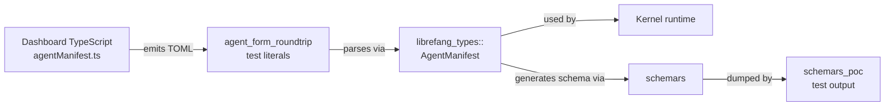

# Other — librefang-types-tests

# librefang-types — Integration Tests

## Purpose

This module contains cross-boundary integration tests that guard against drift between two independent implementations of the same serialization contract:

1. **The dashboard's TypeScript serializer** (`crates/librefang-api/dashboard/src/lib/agentManifest.ts`) — produces TOML from a visual form editor in the browser.
2. **The kernel's Rust deserializer** (`librefang_types::agent::AgentManifest`) — consumes that TOML on the server side.

Because these two code paths live in different languages and crates, there is no compile-time guarantee they stay in sync. The tests here encode the exact TOML the dashboard emits and assert the Rust side parses it correctly. Any field rename, type change, or structural shift will cause a build failure.

A secondary set of tests exercises the `schemars`-generated JSON Schema output for key configuration types, serving as a live reference and sanity check for schema completeness.

---

## Test Files

### `agent_form_roundtrip.rs`

All tests in this file follow the same pattern: embed a TOML literal matching dashboard output, deserialize it into an `AgentManifest`, and assert specific field values.

#### Test coverage by complexity tier

| Test | What it covers |
|------|---------------|
| `parses_form_minimum_viable_output` | Bare-minimum manifest: `name`, `version`, `module`, and a `[model]` table with `provider` and `model`. Everything else omitted. |
| `parses_form_full_output_with_capabilities_and_resources` | Mid-complexity manifest adding `description`, `tags`, `skills`, model tuning (`temperature`, `max_tokens`, `system_prompt`), `resources` quotas, and `capabilities` (network allowlist, shell commands, `agent_spawn`). |
| `parses_form_with_advanced_sections` | Full-complexity manifest exercising every optional section: `priority`, `session_mode`, `web_search_augmentation`, `schedule`, `exec_policy`, `thinking`, `autonomous`, `routing`, `fallback_models`, and `context_injection`. |
| `parses_form_response_format_json_schema` | The `response_format` field with the `JsonSchema` variant, including inline schema and `strict` flag. Validates tagged-enum deserialization. |
| `omitting_optional_sections_uses_defaults` | Confirms that omitting `[resources]` and `[capabilities]` tables entirely produces sensible defaults (empty vectors, `false` booleans, `None` for optional quotas). |

#### How to extend

When the dashboard form gains a new field or section:

1. Update the TypeScript serializer in `agentManifest.ts`.
2. Add or modify a TOML literal in the appropriate test here to mirror the new output.
3. Assert the new field on the parsed `AgentManifest` struct.
4. Run `cargo test -p librefang-types --test agent_form_roundtrip`.

If the Rust struct hasn't been updated yet, the test will fail to compile or panic on a missing/wrong field — which is exactly the signal you want.

---

### `schemars_poc.rs`

Diagnostic tests that print `schemars`-generated JSON Schema (Draft 7) to stdout. These are **not** assertion-heavy — they exist for developer inspection during schema migration.

Run with visible output:

```bash
cargo test -p librefang-types --test schemars_poc -- --nocapture
```

#### Tests

| Test | Type under schema | Notes |
|------|-------------------|-------|
| `dump_budget_config_schema` | `BudgetConfig` | Baseline struct. |
| `dump_vault_config_schema` | `VaultConfig` | Contains `Option<PathBuf>` — verifies filesystem path rendering. |
| `full_kernel_config_schema_generates` | `KernelConfig` | End-to-end sanity: asserts >50 top-level properties and >50 definitions. Catches regressions where the schema generation silently drops fields. |
| `dump_response_format_schema` | `ResponseFormat` | Tagged enum carrying `serde_json::Value` — a known risk point for schema correctness. |

These tests serve as a bridge between the hand-written JSON Schema currently used by the dashboard and the eventual goal of deriving schemas entirely from Rust types via `schemars`.

---

## Relationship to the Rest of the Codebase



- **Upstream dependency**: `librefang_types` — the tests import `AgentManifest`, `Priority`, `SessionMode`, `ResponseFormat`, and config structs from this crate.
- **Contract counterpart**: The TypeScript file `agentManifest.ts` is the other party in the serialization contract. Changes there must be mirrored here.
- **No outgoing calls**: These tests are self-contained; they deserialize in-memory strings and assert on the resulting structs. No filesystem, network, or database interaction.

---

## Running

```bash
# All integration tests in this crate
cargo test -p librefang-types

# Only the round-trip tests
cargo test -p librefang-types --test agent_form_roundtrip

# Schema dumps with visible output
cargo test -p librefang-types --test schemars_poc -- --nocapture
```