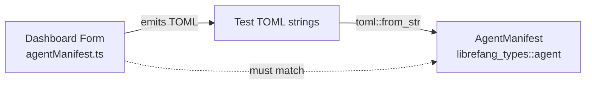

# Other — librefang-types-tests

# librefang-types-tests: Agent Form Round-Trip Tests

## Purpose

This test module validates that the TOML emitted by the dashboard's visual editor (`agentManifest.ts`) can be faithfully deserialized by the kernel's `AgentManifest` parser. It acts as a **contract test** — any drift between the TypeScript serializer on the frontend and the Rust deserializer in `librefang_types::agent` will cause a build failure here.

## When to Update These Tests

Add or modify a test whenever:

- The dashboard form gains a new field or section (e.g. a new advanced toggle).
- A field is renamed, an enum variant changes, or a section is restructured in `AgentManifest`.
- Default values for optional sections (`resources`, `capabilities`, `thinking`, etc.) change.

## Test Coverage

Each test constructs a raw TOML string that mirrors the exact output of the dashboard serializer and asserts that `toml::from_str` produces the expected `AgentManifest` struct.

### `parses_form_minimum_viable_output`

The smallest valid manifest the form can emit: `name`, `version`, `module`, and the `[model]` table with `provider` and `model`. Verifies the critical path works before anything else.

### `parses_form_full_output_with_capabilities_and_resources`

Covers the form when the user fills in description, tags, skills, model tuning (`temperature`, `max_tokens`), resource quotas, and capabilities (`network`, `shell`, `agent_spawn`). This is the "standard" non-advanced manifest.

### `parses_form_with_advanced_sections`

The most comprehensive test. Covers every advanced section the form exposes:

| Section | Key fields asserted |
|---|---|
| Top-level | `priority`, `session_mode`, `web_search_augmentation`, `schedule`, `exec_policy` |
| `[thinking]` | `budget_tokens`, `stream_thinking` |
| `[autonomous]` | `max_iterations`, `heartbeat_channel` |
| `[routing]` | `simple_model`, `medium_model`, `complex_model`, thresholds |
| `[[fallback_models]]` | array of alternative model entries |
| `[[context_injection]]` | name, content, position |
| `[capabilities]` | `memory_read`, `memory_write`, `agent_message`, `ofp_connect` |

This test is the most sensitive to schema changes. If a field is renamed or an enum variant is reworded, this test will fail.

### `parses_form_response_format_json_schema`

Validates the `response_format` field when the form emits a `json_schema` variant. The dashboard serializes the JSON schema as an inline TOML table; this test confirms the kernel reconstructs it as `ResponseFormat::JsonSchema` with the correct `name` and `strict` flag.

### `omitting_optional_sections_uses_defaults`

Ensures that when the form leaves `[resources]` and `[capabilities]` entirely absent, the kernel falls back to struct defaults (empty vecs, `false` for booleans, `None` for optional scalars). This guards against accidental `#[serde(default)]` removal or required-field regressions.

## Architecture



The tests have no runtime dependencies beyond `librefang_types` and the `toml` crate. They are pure deserialization checks — no database, no network, no filesystem.

## Running

```sh
cargo test -p librefang-types --test agent_form_roundtrip
```

All five tests should pass. A failure here means the dashboard serializer and kernel deserializer have diverged — check recent changes to `AgentManifest` or `agentManifest.ts` to identify the mismatch.