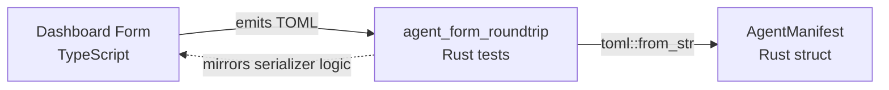

# Other — librefang-types-tests

# librefang-types-tests — Agent Form Round-Trip Tests

## Purpose

This module validates that the TOML emitted by the **dashboard's visual agent editor** can be faithfully parsed by the **kernel's Rust deserializer**. It acts as a contract test between two independently maintained code paths:

- **Producer:** `crates/librefang-api/dashboard/src/lib/agentManifest.ts` — a TypeScript serializer that converts form state into TOML.
- **Consumer:** `librefang_types::agent::AgentManifest` — the Rust struct that deserializes that TOML via the `toml` crate.

If either side renames a field, changes an enum variant, or restructures a section, these tests fail at build time, catching the drift before it reaches production.

## Architecture



The tests contain **hardcoded TOML strings** that replicate what the dashboard serializer would produce for various form states. Each string is fed through `toml::from_str::<AgentManifest>()` and then the resulting struct is asserted against field by field.

## Test Cases

### `parses_form_minimum_viable_output`

Validates the smallest valid manifest the form can emit — only the required fields (`name`, `version`, `module`, and the `[model]` section). This ensures backward compatibility: old agents saved with minimal forms continue to parse.

### `parses_form_full_output_with_capabilities_and_resources`

Covers a fully populated form with all standard sections:

| Section | Fields Verified |
|---|---|
| Top-level | `tags`, `skills`, `description` |
| `[model]` | `temperature`, `max_tokens`, `system_prompt` |
| `[resources]` | `max_tool_calls_per_minute`, `max_cost_per_hour_usd` |
| `[capabilities]` | `network`, `shell`, `agent_spawn` |

This test catches field-level drift such as a renamed capability or a changed default type.

### `parses_form_with_advanced_sections`

Exercises every advanced section the form can expose. This is the most comprehensive drift-detection test and covers:

- **Enum variants:** `priority = "High"` → `Priority::High`, `session_mode = "new"` → `SessionMode::New`
- **Inline tables:** `schedule = { periodic = { cron = "0 9 * * *" } }`
- **Optional sections:** `[thinking]`, `[autonomous]`, `[routing]` — each wrapped in `Option<T>` on the Rust side, verified with `.is_some()` and `.as_ref().unwrap()`
- **Array-of-tables:** `[[fallback_models]]` and `[[context_injection]]` — these use TOML's double-bracket syntax and map to `Vec<FallbackModel>` and `Vec<ContextInjection>` respectively
- **Capability ACLs:** `memory_read`, `memory_write`, `agent_message`, `ofp_connect` — glob-style permission strings

### `parses_form_response_format_json_schema`

Validates that the dashboard's inline JSON-schema serializer output deserializes into `ResponseFormat::JsonSchema`. The form emits the schema as an inline TOML table (`{ type = "json_schema", name = "user", schema = { type = "object" }, strict = true }`), and this test confirms the kernel correctly picks the `JsonSchema` variant and extracts the `name` and `strict` fields.

### `omitting_optional_sections_uses_defaults`

Verifies that when the form leaves `[resources]` and `[capabilities]` entirely absent, the kernel falls back to struct defaults. Assertions check that `capabilities.network` is empty, `capabilities.agent_spawn` is `false`, and `resources.max_llm_tokens_per_hour` is `None` (meaning "inherit global default").

## When These Tests Fail

A failure in this module almost always means one of two things:

1. **The Rust `AgentManifest` struct changed** (field renamed, type changed, section removed) without updating the dashboard serializer. Fix the serializer in `agentManifest.ts`, or update the test TOML to match the new schema.
2. **The dashboard serializer changed** (new field, renamed key, different TOML structure) without updating the Rust struct. Add or update the corresponding field in `AgentManifest` and its `Deserialize` implementation.

In both cases, the fix requires coordinating both sides of the contract — these tests exist to flag exactly this kind of cross-crate divergence.

## Running

```bash
# From the workspace root
cargo test -p librefang-types --test agent_form_roundtrip

# Run a specific case
cargo test -p librefang-types --test agent_form_roundtrip parses_form_with_advanced_sections
```