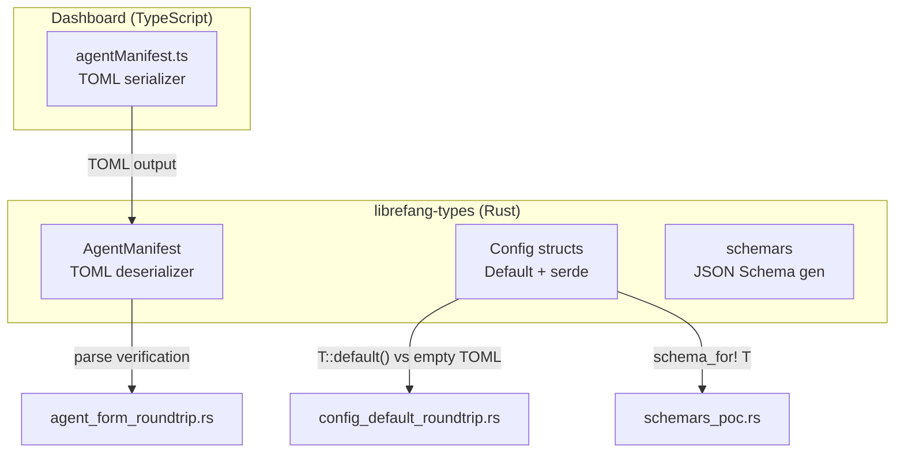

# Other — librefang-types-tests

# librefang-types — Integration Tests

## Overview

This directory contains three integration test suites that guard against serialization and configuration drift across the system. Together they form a continuous-intigration safety net that catches three specific bug classes:

1. **Dashboard ↔ kernel TOML drift** — the visual editor in the dashboard emits TOML that the kernel must parse without error.
2. **`Default` impl vs. `#[serde(default)]` drift** — a manual `Default` implementation that omits a field will silently disagree with serde's per-field defaulting (issue #3404).
3. **Schema generation regressions** — `schemars` must produce valid, sufficiently large JSON Schema for core config types.

## Test Files

### `agent_form_roundtrip.rs`

**Purpose:** Ensures the TOML emitted by the dashboard's agent manifest visual editor (implemented in `agentManifest.ts`) can be round-tripped through the kernel's `AgentManifest` deserializer.

**Why it exists:** The dashboard serializer and the kernel deserializer are maintained in different languages. A renamed field, changed enum variant, or new required field in one place without updating the other causes runtime parse failures. These tests lock the contract at build time.

**Test cases:**

| Test | What it covers |
|------|----------------|
| `parses_form_minimum_viable_output` | Bare-minimum manifest: `name`, `version`, `module`, and a `[model]` section with `provider` and `model`. |
| `parses_form_full_output_with_capabilities_and_resources` | All common sections populated: `tags`, `skills`, model tuning (`temperature`, `max_tokens`), `resources` quotas, and `capabilities` (network, shell, `agent_spawn`). |
| `parses_form_with_advanced_sections` | Every advanced section filled: priority, session mode, web search augmentation, schedule, exec policy, thinking budget, autonomous settings, routing tiers, fallback models, context injection. Also verifies enum parsing (`Priority::High`, `SessionMode::New`). |
| `parses_form_response_format_json_schema` | Inline TOML table for `response_format` with `JsonSchema` variant, including `strict = true`. |
| `omitting_optional_sections_uses_defaults` | Confirms that leaving out `resources` and `capabilities` falls back to empty/zero defaults (e.g., `network` is empty, `agent_spawn` is false, `max_llm_tokens_per_hour` is `None`). |

**Key type:** `librefang_types::agent::AgentManifest`

### `config_default_roundtrip.rs`

**Purpose:** Regression guard for [issue #3404](#). When a new field is added with `#[serde(default)]` but the developer forgets to add it to the manual `Default` impl (or vice versa), the two sources of "default" silently diverge. These tests catch that drift.

**Mechanism:**

```
assert_default_roundtrip::<T>("T")
```

For each config type `T`, the helper performs two checks:

1. **Empty-TOML agreement:** `T::default()` serialized to TOML must equal an empty TOML document deserialized into `T` and re-serialized. If they differ, a field has `#[serde(default)]` returning one value while the `Default` impl produces another.
2. **Round-trip idempotency:** `T::default()` → serialize to TOML → deserialize back → serialize again must produce identical TOML.

Equality is checked by comparing serialized TOML strings rather than requiring `PartialEq` on every config struct, which would cascade through the entire nested tree.

**Helper functions:**

- `assert_default_roundtrip::<T>(label)` — common case; both sources must agree on every field.
- `assert_default_roundtrip_with::<T>(label, normalize)` — for types with a known legitimate divergence. The `normalize` closure adjusts the divergent field before comparison, while every other field is still checked exactly.

**Types with known divergences:**

| Type | Divergent field | Reason |
|------|----------------|--------|
| `KernelConfig` | `config_version` | `Default` sets current `CONFIG_VERSION` (2); serde's `default_config_version()` returns `1` as a migration tripwire for legacy on-disk configs. |
| `ChannelsConfig` | `file_download_max_bytes` | `#[derive(Default)]` gives `0`; serde helper `default_file_download_max_bytes` returns 50 MiB. Flagged as a known bug requiring triage. |

**Covered types** (all other tests use `assert_default_roundtrip` without normalization):

`QueueConfig`, `QueueConcurrencyConfig`, `BudgetConfig`, `SessionConfig`, `CompactionTomlConfig`, `TaskBoardConfig`, `TriggersConfig`, `WebhookTriggerConfig`, `WebConfig`, `WebFetchConfig`, `BrowserConfig`, `BraveSearchConfig`, `TavilySearchConfig`, `PerplexitySearchConfig`, `JinaSearchConfig`, `ReloadConfig`, `RateLimitConfig`, `SkillsConfig`, `ExtensionsConfig`, `VaultConfig`, `AutoReplyConfig`, `InboxConfig`, `TelemetryConfig`, `PromptIntelligenceConfig`, `CanvasConfig`, `ThinkingConfig`, `ContextEngineTomlConfig`, `ExternalAuthConfig`, `AuditConfig`, `PrivacyConfig`, `HealthCheckConfig`, `HeartbeatTomlConfig`, `AutoDreamConfig`, `RegistryConfig`, `MemoryConfig`, `MemoryDecayConfig`, `ChunkConfig`, `NetworkConfig`, `TtsConfig`, `DockerSandboxConfig`, `PairingConfig`, `SanitizeConfig`, `ParallelToolsConfig`, `TerminalConfig`, `VoiceConfig`, `LinkedInConfig`, `AgentManifest`, `BroadcastConfig`.

### `schemars_poc.rs`

**Purpose:** Proof-of-concept diagnostics that dump `schemars`-generated JSON Schema (draft-07) for representative config types. These are visual-check tests, not automated assertions (except for `KernelConfig`).

Run with `--nocapture` to see output:

```bash
cargo test -p librefang-types --test schemars_poc -- --nocapture
```

| Test | What it checks |
|------|---------------|
| `dump_budget_config_schema` | Prints the schema for `BudgetConfig`. |
| `dump_vault_config_schema` | Tests `Option<PathBuf>` rendering — how schemars handles filesystem path types. |
| `full_kernel_config_schema_generates` | Asserts the full `KernelConfig` schema has >50 top-level properties and >50 nested definitions. Validates that the schema is well-formed JSON. |
| `dump_response_format_schema` | Tagged enum carrying `serde_json::Value` — a high-risk edge case for schema correctness. |

## Architecture



## Adding a New Config Type to Tests

**For `config_default_roundtrip.rs`:** Add a new test function:

```rust
#[test]
fn my_config_default_roundtrips_through_toml() {
    assert_default_roundtrip::<MyConfig>("MyConfig");
}
```

If the type has a known legitimate divergence (like a migration version field), use `assert_default_roundtrip_with` and pass a normalization closure that copies the canonical value.

**For `agent_form_roundtrip.rs`:** Add a new test only if the dashboard form gains new TOML sections or changes serialization behavior. Mirror the exact TOML the TypeScript serializer emits.

**For `schemars_poc.rs`:** Add a new dump test if the type introduces a novel schema pattern (e.g., new generic wrapper, custom `JsonSchema` impl) that needs visual verification.