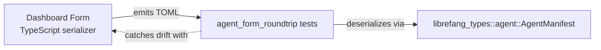

# Other — librefang-types-tests

# Agent Form Roundtrip Tests

## Purpose

This module validates that TOML output produced by the dashboard's visual agent editor can be correctly parsed by the Rust backend's `AgentManifest` deserializer. It serves as a **cross-language contract test** — catching drift between the TypeScript serializer in `crates/librefang-api/dashboard/src/lib/agentManifest.ts` and the Rust deserialization logic in `librefang_types::agent::AgentManifest`.

Without these tests, a renamed field or changed enum variant in either codebase would silently break the agent creation flow at runtime.

## How It Works

Each test constructs a TOML string that mirrors the exact output of the dashboard form serializer, deserializes it into an `AgentManifest` struct using `toml::from_str`, and asserts on the resulting fields. This approach tests the real serde-derived deserialization path — no mocks, no intermediate representations.

## Test Coverage

### `parses_form_minimum_viable_output`

Validates the smallest valid manifest the form can emit: `name`, `version`, `module`, and a `[model]` section with `provider` and `model`. Confirms the kernel does not require any optional sections to deserialize successfully.

### `parses_form_full_output_with_capabilities_and_resources`

Tests a manifest with all standard sections populated:

- Metadata: `description`, `tags`, `skills`
- Model tuning: `system_prompt`, `temperature`, `max_tokens`
- Resource quotas: `max_tool_calls_per_minute`, `max_cost_per_hour_usd`
- Capabilities: `network` (host allowances), `shell` (allowed commands), `agent_spawn` (boolean flag)

### `parses_form_with_advanced_sections`

The broadest test. Covers every advanced panel the form exposes:

| Section | Fields validated |
|---|---|
| Top-level enums | `priority`, `session_mode`, `web_search_augmentation`, `exec_policy` |
| Scheduling | `schedule = { periodic = { cron = "..." } }` inline table syntax |
| `[thinking]` | `budget_tokens`, `stream_thinking` |
| `[autonomous]` | `max_iterations`, `heartbeat_channel` |
| `[routing]` | `simple_model`, `medium_model`, `complex_model`, thresholds |
| `[[fallback_models]]` | Array-of-tables with `provider` and `model` |
| `[[context_injection]]` | Array-of-tables with `name`, `content`, `position` |
| Extended capabilities | `memory_read`, `memory_write`, `agent_message`, `ofp_connect` (glob patterns) |

### `parses_form_response_format_json_schema`

Verifies that `response_format`, serialized as an inline TOML table, deserializes into the `ResponseFormat::JsonSchema` variant with correct `name` and `strict` fields. This catches issues where the form emits a structure the kernel's enum doesn't expect.

### `omitting_optional_sections_uses_defaults`

Confirms that when the form omits `[resources]` and `[capabilities]` entirely, the parsed struct uses sensible defaults: empty collections for capability lists, `false` for `agent_spawn`, and `None` for optional resource limits. This matters because the form suppresses empty sections rather than emitting empty tables.

## Architecture

The dependency chain:

- **Producer**: `crates/librefang-api/dashboard/src/lib/agentManifest.ts` — TypeScript serializer generating TOML from form state
- **Consumer**: `librefang_types::agent::AgentManifest` — Rust struct with serde/toml derive macros defining the canonical schema
- **Guard**: This test module — ensures both sides agree on field names, types, enum variants, structural conventions, and default behavior

## Contributing

When adding a new field to `AgentManifest`:

1. Add the field to the Rust struct with appropriate serde attributes
2. Update the dashboard serializer to emit the new field
3. Extend the relevant test here — or add a new one — covering both the populated and omitted cases

If you rename or remove a field, expect these tests to fail. That failure is intentional: it signals that the dashboard serializer needs a matching update.