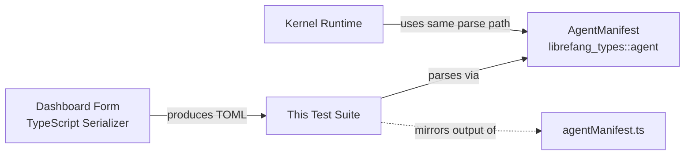

# Other — librefang-types-tests

# librefang-types-tests: Agent Form Roundtrip Tests

## Purpose

This test module validates that the TOML output produced by the dashboard's visual editor can be correctly parsed by the kernel's Rust deserializer. It serves as a **contract test** between two independent implementations written in different languages:

- **TypeScript serializer** in `crates/librefang-api/dashboard/src/lib/agentManifest.ts` — generates TOML from form state
- **Rust deserializer** in `librefang_types::agent::AgentManifest` — parses that TOML into structured types

Any drift between these implementations (renamed fields, changed enum variants, altered nesting) is caught at build time.

## Why This Exists

A user configures an agent through the visual editor, the dashboard serializes to TOML, and the kernel must deserialize identically. Mismatches cause silent data loss or parse failures in production. These tests pin down the exact TOML shapes the serializer must emit.

## Architecture



The tests do **not** call the TypeScript code. They embed the exact TOML strings the serializer is expected to produce and verify `AgentManifest` parses them. When the serializer changes, these tests must be updated in lockstep — that coupling is the drift alarm.

## Test Coverage

### `parses_form_minimum_viable_output`

The smallest valid TOML the form can emit. Only required fields: `name`, `version`, `module`, and a `[model]` table with `provider` and `model`. Confirms the kernel accepts a bare-bones agent definition without optional sections.

### `parses_form_full_output_with_capabilities_and_resources`

A complete form output including:
- Top-level optional fields: `description`, `tags`, `skills`
- Model tuning: `temperature`, `max_tokens`, `system_prompt`
- Resource quotas: `max_tool_calls_per_minute`, `max_cost_per_hour_usd`
- Capability grants: `network`, `shell`, `agent_spawn`

### `parses_form_with_advanced_sections`

The primary drift-detection test. Mirrors the serializer's output when every advanced section is populated:

| Section | Fields Validated |
|---|---|
| Top-level enums | `priority`, `session_mode`, `web_search_augmentation`, `exec_policy` |
| `schedule` | Periodic cron expression |
| `thinking` | `budget_tokens`, `stream_thinking` |
| `autonomous` | `max_iterations`, `heartbeat_channel` |
| `routing` | Tiered model selection (`simple_model`, `medium_model`, `complex_model`) with thresholds |
| `[[fallback_models]]` | Array-of-tables with `provider`, `model` |
| `[[context_injection]]` | Array-of-tables with `name`, `content`, `position` |
| Extended capabilities | `memory_read`, `memory_write`, `agent_message`, `ofp_connect` |

### `parses_form_response_format_json_schema`

Validates that the form's JSON-schema output — an inline TOML table with `type`, `name`, `schema`, and `strict` — deserializes into `ResponseFormat::JsonSchema`. Catches enum variant mismatches across the language boundary.

### `omitting_optional_sections_uses_defaults`

When the form omits `resources` and `capabilities` entirely, confirms the kernel applies correct defaults:
- `capabilities.network` → empty vec
- `capabilities.agent_spawn` → `false`
- `resources.max_llm_tokens_per_hour` → `None` (inherits global default)

Prevents the form from needing to emit empty sections.

## Running

```bash
# Full suite
cargo test -p librefang-types --test agent_form_roundtrip

# Single test
cargo test -p librefang-types --test agent_form_roundtrip parses_form_with_advanced_sections
```

## Adding a New Form Field

1. Add the field to `AgentManifest` or its sub-structs in `librefang_types::agent`
2. Update the dashboard serializer in `agentManifest.ts`
3. Add the TOML fragment to `parses_form_with_advanced_sections` (or write a focused new test)
4. Assert the field deserializes to the expected value

The embedded TOML strings must match **exactly** what the TypeScript serializer emits — do not add test-only fields or structures.