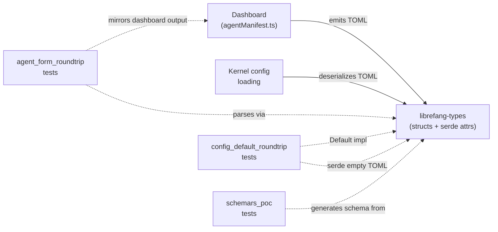

# Other — librefang-types-tests

# librefang-types Tests

Integration tests that guard the `librefang-types` crate against three categories of silent breakage: dashboard↔kernel TOML drift, `Default` impl / `#[serde(default)]` divergence, and schemars schema generation regressions.

## Test Files

| File | What it catches |
|------|-----------------|
| `agent_form_roundtrip.rs` | Drift between the dashboard visual editor's TOML serializer and the kernel's `AgentManifest` deserializer |
| `config_default_roundtrip.rs` | Fields annotated `#[serde(default)]` but missing from the manual `Default` impl (and vice versa) — the issue #3404 bug class |
| `schemars_poc.rs` | Schema generation failures for representative config types; run with `--nocapture` to eyeball output |

---

## agent_form_roundtrip.rs

### Purpose

The dashboard (TypeScript, `agentManifest.ts`) emits TOML from a visual form. The kernel (Rust) deserializes that TOML into `AgentManifest`. If either side renames a field, changes an enum variant, or alters a struct shape without updating the other, manifests silently break at runtime. These tests serialize the exact TOML strings the dashboard produces and assert that the kernel parses them back into the expected values.

### Test cases

**`parses_form_minimum_viable_output`** — The smallest valid manifest: `name`, `version`, `module`, and a `[model]` section with `provider` and `model`. Catches regressions in required-field parsing.

**`parses_form_full_output_with_capabilities_and_resources`** — Every commonly-used section: `tags`, `skills`, model tuning (`temperature`, `max_tokens`), `[resources]` quotas, and `[capabilities]` entries (`network`, `shell`, `agent_spawn`).

**`parses_form_with_advanced_sections`** — All advanced sections filled: `priority`, `session_mode`, `web_search_augmentation`, `schedule`, `exec_policy`, `[thinking]`, `[autonomous]`, `[routing]`, `[[fallback_models]]`, and `[[context_injection]]`. This is the highest-coverage test and the first to fail when a field is renamed.

**`parses_form_response_format_json_schema`** — Validates the `ResponseFormat::JsonSchema` variant, which carries an inline TOML table with `type`, `name`, `schema`, and `strict` fields.

**`omitting_optional_sections_uses_defaults`** — When the form leaves `[resources]` and `[capabilities]` out entirely, asserts that default values apply correctly (e.g. empty `network` vector, `agent_spawn = false`, `max_llm_tokens_per_hour = None`).

### When to add a test here

Whenever a field is added to `AgentManifest` or any nested struct that the dashboard form can populate, add a corresponding assertion here. Mirror the exact TOML the dashboard serializer would emit — do not construct "representative" TOML, or the test stops catching drift.

---

## config_default_roundtrip.rs

### The problem it solves (issue #3404)

Many config structs have both:
- A manual `impl Default` (because derive would produce wrong values for some fields), and
- `#[serde(default)]` on individual fields (so partial TOML files still deserialize).

If a developer adds a field with `#[serde(default)]` but forgets to add it to the manual `Default` impl, the two code paths produce different values. Empty TOML round-trips fine (serde fills the field with `T::default()`), but `ConfigStruct::default()` returns something else. This divergence is invisible to schemars-based golden tests because schemars reads the serde attribute, not the `Default` impl body.

### How the assertions work

Each test calls one of two helpers:

- **`assert_default_roundtrip::<T>(label)`** — For types where `T::default()` and empty-TOML deserialization should agree on every field. Asserts two properties:
  1. Serializing `T::default()` to TOML produces the same string as deserializing an empty TOML document and re-serializing.
  2. `T::default()` round-trips losslessly: serialize → deserialize → serialize produces the same output.

- **`assert_default_roundtrip_with::<T>(label, normalize)`** — For types with a known legitimate divergence. The `normalize` closure patches specific fields on the deserialized values before comparison, so the test still asserts exact equality on every other field. Currently only `KernelConfig` uses this, for the `config_version` field (see below).

Equality is checked by comparing TOML string representations rather than deriving `PartialEq` on every config type — deriving `PartialEq` would cascade through the entire nested config tree and add maintenance burden.

### The `config_version` normalization

`KernelConfig` is the one type where `Default::default()` and serde-empty legitimately differ on one field:

| Source | `config_version` value | Reason |
|--------|----------------------|--------|
| `KernelConfig::default()` | `CONFIG_VERSION` (currently `2`) | Fresh in-memory config needs no migration |
| Empty TOML via serde | `1` (from `default_config_version()`) | Legacy on-disk TOML missing `config_version` is pre-versioning; `run_migrations` lifts it to `CONFIG_VERSION` |

The `normalize` closure copies the canonical version into the deserialized value so every other field is still compared exactly.

### Pinned-value regression test

`channels_config_default_has_50mb_max` is independent of the round-trip machinery. It asserts `ChannelsConfig::default().file_download_max_bytes == 50 MiB`. This catches the case where a future change zeroes both the `Default` impl and the serde helper simultaneously (keeping them "consistent" but wrong), which the round-trip test alone would not catch.

### When to add a test here

Whenever a new config struct is added to `librefang-types/src/config/` that has both `#[serde(default)]` fields and a manual `Default` impl (or reaches one transitively), add:

```rust
#[test]
fn my_config_default_roundtrips_through_toml() {
    assert_default_roundtrip::<MyConfig>("MyConfig");
}
```

If the new type has a field where `Default` and serde intentionally diverge (like `config_version`), use `assert_default_roundtrip_with` and document why.

---

## schemars_poc.rs

### Purpose

Proof-of-concept that dumps schemars-generated JSON Schema (draft-07) for a handful of representative types. Not a correctness assertion — the `assert!` checks only verify the schema generates and has reasonable size. The real value is in the printed output for manual inspection.

### Running

```bash
cargo test -p librefang-types --test schemars_poc -- --nocapture
```

### Types tested

| Test | Type | Why it's interesting |
|------|------|---------------------|
| `dump_budget_config_schema` | `BudgetConfig` | Representative flat config |
| `dump_vault_config_schema` | `VaultConfig` | Contains `Option<PathBuf>` — tests filesystem path rendering |
| `full_kernel_config_schema_generates` | `KernelConfig` | End-to-end sanity; asserts >50 top-level properties and >50 nested definitions |
| `dump_response_format_schema` | `ResponseFormat` | Tagged enum with a variant carrying `serde_json::Value` — major risk point for schema correctness |

---

## Relationship to the rest of the codebase


```mermaid
graph LR
    Dashboard["Dashboard<br/>(agentManifest.ts)"]
    Types["librefang-types<br/>(structs + serde attrs)"]
    Kernel["Kernel config<br/>loading"]

    Dashboard -- "emits TOML" --> Types
    Kernel -- "deserializes TOML" --> Types

    AFRT["agent_form_roundtrip<br/>tests"] -.->|"mirrors dashboard output"| Dashboard
    AFRT -.->|"parses via"| Types

    CDRT["config_default_roundtrip<br/>tests"] -.->|"Default impl"| Types
    CDRT -.->|"serde empty TOML"| Types

    SPOC["schemars_poc<br/>tests"] -.->|"generates schema from"| Types
```

The dashboard's `agentManifest.ts` serializer and the kernel's `AgentManifest` deserializer both depend on `librefang-types`. The round-trip tests act as a contract between them — if the contract breaks, CI fails before the change ships.