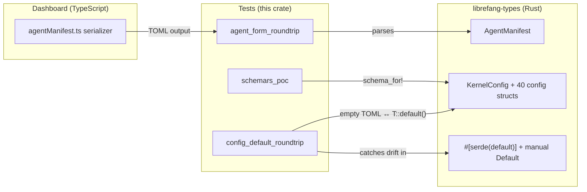

# Other — librefang-types-tests

# librefang-types Tests

Integration tests that guard the contract between TOML serialization/deserialization and the in-code `Default` implementations across all configuration and agent manifest types in `librefang-types`.

## Purpose

The kernel reads configuration from TOML files on disk, but also constructs configs programmatically via `Default::default()`. These two pathways must produce identical results. The test suite catches a specific bug class (issue #3404) where a developer adds a field with `#[serde(default)]` but forgets to update the manual `Default` impl — or vice versa. When the two diverge, the system silently operates with different defaults depending on whether the config was loaded from disk or built in memory.

A secondary concern is **dashboard–kernel drift**: the dashboard's visual agent editor emits TOML that the kernel must parse. The agent form roundtrip tests mirror the exact serializer rules in the TypeScript frontend (`agentManifest.ts`) so any field rename or type change is caught at build time.

## Test Files

### `config_default_roundtrip.rs`

The largest test file. For every config struct that has both `#[serde(default)]` annotations and a manual `impl Default`, this file asserts two properties:

1. **Empty-TOML equality**: `T::default()` produces the same struct as deserializing an empty TOML document (where serde fills each field via its `#[serde(default)]` attribute).
2. **Round-trip idempotency**: `T::default()` serializes to TOML and deserializes back to the same value.

Equality is checked by comparing the TOML string representations rather than requiring `PartialEq` on every config type — this avoids cascading derive requirements through the entire nested config tree.

#### Core helpers

```
assert_default_roundtrip::<T>(label)
assert_default_roundtrip_with::<T>(label, normalize)
```

- **`assert_default_roundtrip`** — the common case. Works for any `T: Default + Serialize + DeserializeOwned`. Serializes `T::default()` to TOML, deserializes an empty string into `T`, normalizes nothing, and asserts the two TOML outputs are identical. Then round-trips the serialized default through TOML and asserts idempotency.

- **`assert_default_roundtrip_with`** — for types with a known legitimate divergence between the two sources. The `normalize` closure is applied to both the from-empty and from-roundtrip values before comparison, so only the intentionally divergent field is excluded from the check. Every other field must still match exactly.

#### The `KernelConfig` normalization pattern

`KernelConfig` is the one struct that requires `assert_default_roundtrip_with` because of the `config_version` field:

| Source | `config_version` value | Reason |
|---|---|---|
| `KernelConfig::default()` | `CONFIG_VERSION` (currently `2`) | Fresh in-memory configs start at the latest version |
| Serde from empty TOML | `1` (via `default_config_version()`) | Legacy on-disk TOML without `config_version` is pre-versioning; the migration system (`run_migrations`) lifts it forward |

The test normalizes `config_version` to the canonical value before comparing, so the deliberate v1 sentinel doesn't mask real divergences on any other field.

#### Covered types

The file contains individual `#[test]` functions for over 40 config structs, including:

- `KernelConfig`, `QueueConfig`, `QueueConcurrencyConfig`, `BudgetConfig`, `SessionConfig`
- `CompactionTomlConfig`, `TaskBoardConfig`, `TriggersConfig`, `WebhookTriggerConfig`
- `WebConfig`, `WebFetchConfig`, `BrowserConfig`
- `BraveSearchConfig`, `TavilySearchConfig`, `PerplexitySearchConfig`, `JinaSearchConfig`
- `ReloadConfig`, `RateLimitConfig`, `SkillsConfig`, `ExtensionsConfig`, `VaultConfig`
- `AutoReplyConfig`, `InboxConfig`, `TelemetryConfig`, `PromptIntelligenceConfig`
- `CanvasConfig`, `ThinkingConfig`, `ContextEngineTomlConfig`, `ExternalAuthConfig`
- `AuditConfig`, `PrivacyConfig`, `HealthCheckConfig`, `HeartbeatTomlConfig`
- `AutoDreamConfig`, `RegistryConfig`, `MemoryConfig`, `MemoryDecayConfig`, `ChunkConfig`
- `NetworkConfig`, `TtsConfig`, `DockerSandboxConfig`, `PairingConfig`, `SanitizeConfig`
- `ParallelToolsConfig`, `TerminalConfig`
- `AgentManifest`, `ChannelsConfig`, `BroadcastConfig`

#### Adding a new config type

When a new config struct with `#[serde(default)]` fields and a manual `Default` impl is added, create a test:

```rust
#[test]
fn my_config_default_roundtrips_through_toml() {
    assert_default_roundtrip::<MyConfig>("MyConfig");
}
```

If the type has a legitimate divergence (like `config_version`), use `assert_default_roundtrip_with` and normalize only that field.

#### Pinned-value regression: `ChannelsConfig`

Issue #4436 exposed a case where `ChannelsConfig` derived `Default`, causing `file_download_max_bytes` to default to `0` (the `u64` default) while `#[serde(default = "default_file_download_max_bytes")]` returned 50 MiB. The channel bridge then rejected every attachment when the config was built programmatically. Beyond the round-trip test, there is a pinned-value assertion:

```rust
#[test]
fn channels_config_default_has_50mb_max() {
    assert_eq!(ChannelsConfig::default().file_download_max_bytes, 50 * 1024 * 1024);
}
```

This catches the scenario where a future change zeroes both the `Default` impl and the serde helper (keeping them "consistent" but wrong).

### `agent_form_roundtrip.rs`

Tests that the kernel's TOML deserializer can parse the exact output produced by the dashboard's visual agent editor. Each test constructs a TOML string matching what the frontend serializer emits and asserts field-by-field that `AgentManifest` deserializes correctly.

| Test | Scope |
|---|---|
| `parses_form_minimum_viable_output` | Name, version, module, model — the bare minimum the form always emits |
| `parses_form_full_output_with_capabilities_and_resources` | Tags, skills, model tuning, resource quotas, network/shell capabilities, agent_spawn |
| `parses_form_with_advanced_sections` | Priority, session_mode, schedule, thinking, autonomous, routing, fallback_models, context_injection, memory access, ofp_connect |
| `parses_form_response_format_json_schema` | The `ResponseFormat::JsonSchema` variant emitted as an inline TOML table |
| `omitting_optional_sections_uses_defaults` | Empty resources/capabilities sections fall back to struct defaults |

These tests are the CI safety net for frontend–backend contract drift. If a field is renamed in `AgentManifest` or a serde attribute changes, the corresponding test fails immediately.

### `schemars_poc.rs`

Diagnostic utility, not a correctness gate. Dumps `schemars`-generated JSON Schema (draft-07) for representative config types so developers can inspect edge-case rendering without spinning up a dashboard endpoint.

Run with output enabled:

```bash
cargo test -p librefang-types --test schemars_poc -- --nocapture
```

| Test | What it checks |
|---|---|
| `dump_budget_config_schema` | Baseline struct rendering |
| `dump_vault_config_schema` | `Option<PathBuf>` — how filesystem paths appear in the schema |
| `full_kernel_config_schema_generates` | End-to-end sanity: schema generates, is valid JSON, has >50 top-level properties and >50 nested definitions |
| `dump_response_format_schema` | Tagged enum with `serde_json::Value` — high-risk rendering edge case |

## Architecture


```mermaid
flowchart LR
    subgraph "Dashboard (TypeScript)"
        A[agentManifest.ts serializer]
    end
    subgraph "librefang-types (Rust)"
        B[AgentManifest]
        C[KernelConfig + 40 config structs]
        D["#[serde(default)] + manual Default"]
    end
    subgraph "Tests (this crate)"
        E[agent_form_roundtrip]
        F[config_default_roundtrip]
        G[schemars_poc]
    end
    A -- "TOML output" --> E
    E -- parses --> B
    F -- "empty TOML ↔ T::default()" --> C
    F -- catches drift in --> D
    G -- "schema_for!" --> C
```

## Relationship to the rest of the codebase

- **`librefang-types`** — the crate under test. Defines all config structs, `AgentManifest`, serde attributes, and `Default` impls.
- **Dashboard (`librefang-api/dashboard`)** — the TypeScript frontend whose `agentManifest.ts` serializer output is mirrored in `agent_form_roundtrip.rs`. Any change to field names, types, or serialization format in either location must be reflected in the other.
- **Migration system** — `run_migrations` in the types crate consumes the `config_version` field. The v1 sentinel from `default_config_version()` is the trigger that runs migrations on legacy configs.
- **Channel bridge** — consumes `ChannelsConfig`. The #4436 pinned-value test ensures attachments are not silently rejected when the config is built without a `[channels]` TOML section.