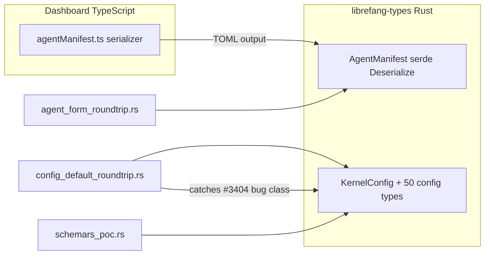

# Other — librefang-types-tests

# librefang-types Tests

Integration tests that guard the contract between the dashboard's TypeScript serializer and the kernel's Rust deserializer, and ensure config struct defaults remain consistent across `Default` impls and serde deserialization.

## Test Files

### `agent_form_roundtrip.rs`

Mirrors the exact TOML output produced by the dashboard's visual editor (implemented in `crates/librefang-api/dashboard/src/lib/agentManifest.ts`). Any drift between the TypeScript serializer and the Rust deserializer is caught at build time.

**Tests:**

| Test | What it validates |
|---|---|
| `parses_form_minimum_viable_output` | Minimal manifest with only required fields (`name`, `version`, `module`, `[model]`). |
| `parses_form_full_output_with_capabilities_and_resources` | Full manifest including `tags`, `skills`, `[resources]`, `[capabilities]`, and model tuning (`temperature`, `max_tokens`). |
| `parses_form_with_advanced_sections` | Every advanced section filled: `priority`, `session_mode`, `web_search_augmentation`, `schedule`, `exec_policy`, `[thinking]`, `[autonomous]`, `[routing]`, `[[fallback_models]]`, `[[context_injection]]`. This is the highest-risk test for field renames or enum variant changes. |
| `parses_form_response_format_json_schema` | The `response_format` inline TOML table deserializes into `ResponseFormat::JsonSchema` with correct `name` and `strict` fields. |
| `omitting_optional_sections_uses_defaults` | When the form leaves out `[resources]` and `[capabilities]`, the kernel falls back to `ResourceQuota` / `ManifestCapabilities` defaults (e.g. empty `network` list, `agent_spawn = false`, `max_llm_tokens_per_hour = None`). |

### `config_default_roundtrip.rs`

Regression suite for [issue #3404](https://github.com/librefang/librefang/issues/3404). The bug class: a developer adds a field with `#[serde(default)]` but forgets to update the manual `Default` impl. Deserialization from empty TOML fills the field with `T::default()` via serde, while `T::default()` in-process returns whatever the manual impl produces. The two silently diverge.

**How it works:**

Every test asserts two properties for a config type `T`:

1. `T::default()` equals what serde produces from an empty TOML document.
2. `T::default()` round-trips losslessly through TOML serialization.

Equality is checked by comparing serialized TOML strings rather than requiring `PartialEq` on every config type — this avoids cascading derives through the entire nested config tree.

**Helper functions:**

- **`assert_default_roundtrip::<T>(label)`** — for the common case where `Default` and serde-empty must agree on every field.
- **`assert_default_roundtrip_with::<T>(label, normalize)`** — for types with a known legitimate divergence. The `normalize` closure patches the divergent field before comparison. Every other field is still checked exactly.

**Special case — `KernelConfig`:**

`config_version` intentionally differs between the two sources:

- `KernelConfig::default()` sets `config_version = CONFIG_VERSION` (currently `2`) — fresh in-memory configs need no migration.
- `default_config_version()` (called by serde for missing fields) returns `1` — a migration tripwire so `run_migrations` lifts legacy configs forward.

The test normalizes only `config_version`, preserving the comparison on every other field.

**Covered types (50+ tests):**

`QueueConfig`, `QueueConcurrencyConfig`, `BudgetConfig`, `SessionConfig`, `CompactionTomlConfig`, `TaskBoardConfig`, `TriggersConfig`, `WebhookTriggerConfig`, `WebConfig`, `WebFetchConfig`, `BrowserConfig`, `BraveSearchConfig`, `TavilySearchConfig`, `PerplexitySearchConfig`, `JinaSearchConfig`, `ReloadConfig`, `RateLimitConfig`, `SkillsConfig`, `ExtensionsConfig`, `VaultConfig`, `AutoReplyConfig`, `InboxConfig`, `TelemetryConfig`, `PromptIntelligenceConfig`, `CanvasConfig`, `ThinkingConfig`, `ContextEngineTomlConfig`, `ExternalAuthConfig`, `AuditConfig`, `PrivacyConfig`, `HealthCheckConfig`, `HeartbeatTomlConfig`, `AutoDreamConfig`, `RegistryConfig`, `MemoryConfig`, `MemoryDecayConfig`, `ChunkConfig`, `NetworkConfig`, `TtsConfig`, `DockerSandboxConfig`, `PairingConfig`, `SanitizeConfig`, `ParallelToolsConfig`, `TerminalConfig`, `AgentManifest`, `ChannelsConfig`, `BroadcastConfig`.

**Pinned-value test — `channels_config_default_has_50mb_max`:**

Independent regression test for [issue #4436](https://github.com/librefang/librefang/issues/4436). Even if a future change zeroes both `Default` and the serde helper (keeping them "consistent" in the roundtrip test), this test still catches the regression by asserting `file_download_max_bytes == 50 * 1024 * 1024`.

### `schemars_poc.rs`

Proof-of-concept diagnostics that dump `schemars`-generated JSON Schema (draft-07) for representative config types. Not a pass/fail gate for schema correctness — intended for developer inspection.

Run with visible output:

```bash
cargo test -p librefang-types --test schemars_poc -- --nocapture
```

**Tests:**

| Test | Purpose |
|---|---|
| `dump_budget_config_schema` | Baseline struct schema. |
| `dump_vault_config_schema` | Contains `Option<PathBuf>` — tests filesystem path rendering. |
| `full_kernel_config_schema_generates` | End-to-end sanity: asserts `KernelConfig` generates valid JSON with >50 top-level properties and >50 nested definitions. |
| `dump_response_format_schema` | Tagged enum with a variant carrying `serde_json::Value` — major risk point for schema correctness. |

## Adding a New Config Type Test

If you add a config struct `FooConfig` with both `#[serde(default)]` and a manual `impl Default`:

1. In `config_default_roundtrip.rs`, add:
   ```rust
   #[test]
   fn foo_config_default_roundtrips_through_toml() {
       assert_default_roundtrip::<FooConfig>("FooConfig");
   }
   ```

2. If `FooConfig` has a field that legitimately differs between `Default` and serde-empty (like `KernelConfig::config_version`), use `assert_default_roundtrip_with` and pass a normalizer closure.

3. If the field carries a pinned default value critical for runtime correctness (like `ChannelsConfig::file_download_max_bytes`), add an independent pinned-value assertion so a "consistent but wrong" change still fails CI.

## Architecture


```mermaid
graph LR
    subgraph Dashboard TypeScript
        A[agentManifest.ts serializer]
    end
    subgraph librefang-types Rust
        B[AgentManifest serde Deserialize]
        C[KernelConfig + 50 config types]
    end
    A -- "TOML output" --> B
    agent_form_roundtrip_rs["agent_form_roundtrip.rs"] --> B
    config_default_roundtrip_rs["config_default_roundtrip.rs"] --> C
    schemars_poc_rs["schemars_poc.rs"] --> C
    config_default_roundtrip_rs["config_default_roundtrip.rs"] -- "catches #3404 bug class" --> C
```