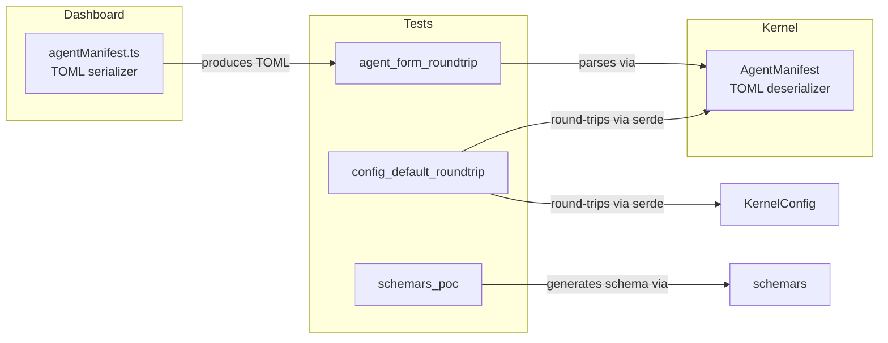

# Other — librefang-types-tests

# librefang-types Tests

Integration tests that guard the `librefang-types` crate against two classes of silent breakage: dashboard/kernel TOML format drift, and divergence between manual `Default` implementations and `#[serde(default)]` attributes.

## Test Files

| File | Purpose | Origin |
|---|---|---|
| `agent_form_roundtrip.rs` | Validates that TOML emitted by the dashboard's visual editor parses correctly through the kernel's deserializer | Mirrors `crates/librefang-api/dashboard/src/lib/agentManifest.ts` |
| `config_default_roundtrip.rs` | Catches `#[serde(default)]` vs `impl Default` field-level drift | Issue #3404 |
| `schemars_poc.rs` | Eyeball/validate schemars-generated JSON Schema output | Development utility |

---

## Agent Form Round-trip Tests

The dashboard's agent manifest editor serializes form state to TOML before sending it to the kernel. These tests embed the exact TOML strings the form serializer produces and assert that `AgentManifest` deserializes them into the expected field values.

**Running them:**
```sh
cargo test -p librefang-types --test agent_form_roundtrip
```

### Test cases

| Test | What it covers |
|---|---|
| `parses_form_minimum_viable_output` | Bare manifest with `name`, `version`, `module`, and a `[model]` table. No optional sections. |
| `parses_form_full_output_with_capabilities_and_resources` | All "basic" sections: `tags`, `skills`, `[model]` with temperature/max_tokens, `[resources]`, `[capabilities]` with `network`, `shell`, `agent_spawn`. |
| `parses_form_with_advanced_sections` | Every advanced section filled: `priority`, `session_mode`, `web_search_augmentation`, `schedule` (cron), `exec_policy`, `[thinking]`, `[autonomous]`, `[routing]`, `[[fallback_models]]`, `[[context_injection]]`, `capabilities.memory_read`/`memory_write`/`agent_message`/`ofp_connect`. |
| `parses_form_response_format_json_schema` | Inline `ResponseFormat::JsonSchema` variant — the form emits this as a single-line TOML inline table. |
| `omitting_optional_sections_uses_defaults` | Sections omitted entirely (no `[resources]`, no `[capabilities]`); asserts defaults like empty network list, `agent_spawn = false`, `max_llm_tokens_per_hour = None`. |

### When to update these tests

Any change to the following should trigger a review:

- `crates/librefang-api/dashboard/src/lib/agentManifest.ts` — the TypeScript serializer
- Field renames or type changes on `AgentManifest` or its nested structs in `librefang-types`
- Addition of new required fields to `AgentManifest` (the minimum-viable test will break)

---

## Config Default Round-trip Tests

### The bug class (Issue #3404)

When a struct uses both `#[serde(default)]` on its fields and a hand-written `impl Default`, adding a new field requires updating **two** places:

1. The struct definition (serde fills the field with `Field::default()` on deserialization)
2. The manual `Default` impl body

If step 2 is missed, `T::default()` and `toml::from_str::<T>("")` silently produce different values. The schemars golden test does not catch this because schemars reads the `#[serde(default)]` attribute, not the `Default` impl body.

### How the tests work

Each test calls one of two helpers:

```
assert_default_roundtrip::<T>("T")
assert_default_roundtrip_with::<T>("T", |t| /* normalize */)
```

Both helpers perform two assertions:

1. **Empty-TOML equivalence:** Serialize `T::default()` → TOML. Deserialize `""` → `T` → TOML. Assert the two TOML strings are identical.
2. **Round-trip idempotency:** Deserialize the serialized default back into `T`, re-serialize, and assert the output is unchanged.

Equality is checked by comparing serialized TOML strings rather than requiring `PartialEq` on every config type — this avoids cascading `PartialEq` derives through the entire nested config tree.

`assert_default_roundtrip_with` accepts a normalizer closure for types with a known legitimate divergence. Currently only `KernelConfig` uses this, to handle the `config_version` field:

- `KernelConfig::default()` sets `config_version = CONFIG_VERSION` (the current version, e.g. `2`)
- Serde-empty deserialization calls `default_config_version()` which returns `1` (a migration tripwire for legacy configs)

The normalizer copies the canonical version into the serde-produced value before comparison, so every *other* field is still checked exactly.

### Covered types

The tests cover 40+ config structs. Each `#[test]` function maps 1:1 to a type:

```
QueueConfig, QueueConcurrencyConfig, BudgetConfig, SessionConfig,
CompactionTomlConfig, TaskBoardConfig, TriggersConfig, WebhookTriggerConfig,
WebConfig, WebFetchConfig, BrowserConfig, BraveSearchConfig, TavilySearchConfig,
PerplexitySearchConfig, JinaSearchConfig, ReloadConfig, RateLimitConfig,
SkillsConfig, ExtensionsConfig, VaultConfig, AutoReplyConfig, InboxConfig,
TelemetryConfig, PromptIntelligenceConfig, CanvasConfig, ThinkingConfig,
ContextEngineTomlConfig, ExternalAuthConfig, AuditConfig, PrivacyConfig,
HealthCheckConfig, HeartbeatTomlConfig, AutoDreamConfig, RegistryConfig,
MemoryConfig, MemoryDecayConfig, ChunkConfig, NetworkConfig, TtsConfig,
DockerSandboxConfig, PairingConfig, SanitizeConfig, ParallelToolsConfig,
TerminalConfig, AgentManifest, ChannelsConfig, BroadcastConfig
```

### Adding a new config struct

If you add a new config type with `#[serde(default)]` and a manual `Default` impl:

1. Add a `#[test]` that calls `assert_default_roundtrip::<YourType>("YourType")`.
2. If the type has a field where `Default` and serde-empty legitimately differ (like `config_version`), use `assert_default_roundtrip_with` with a normalizer.

### Pinned-value regression: `channels_config_default_has_50mb_max`

A standalone test independent of the round-trip framework, added for issue #4436. Asserts that `ChannelsConfig::default().file_download_max_bytes == 50 * 1024 * 1024`. This catches the specific failure mode where both `Default` and the serde helper are silently zeroed in tandem (which would pass the round-trip test but still break the channel bridge at runtime).

---

## Schemars PoC Tests

Diagnostic tests that generate and print schemars-produced JSON Schema (draft-07) for representative config types. These are not assertion-heavy; they exist for developer inspection.

**Running them (output to stdout):**
```sh
cargo test -p librefang-types --test schemars_poc -- --nocapture
```

| Test | Type | Why it's interesting |
|---|---|---|
| `dump_budget_config_schema` | `BudgetConfig` | Representative simple config |
| `dump_vault_config_schema` | `VaultConfig` | Contains `Option<PathBuf>` — tests filesystem path rendering |
| `full_kernel_config_schema_generates` | `KernelConfig` | End-to-end sanity: asserts >50 top-level properties and >50 nested definitions, confirming the full schema generates without error |
| `dump_response_format_schema` | `ResponseFormat` | Tagged enum carrying `serde_json::Value` — high-risk edge case for schema generation |

---

## Architecture Context


```mermaid
graph LR
    subgraph Dashboard
        TS[agentManifest.ts<br/>TOML serializer]
    end
    subgraph Kernel
        AM[AgentManifest<br/>TOML deserializer]
    end
    subgraph Tests
        AF[agent_form_roundtrip]
        CD[config_default_roundtrip]
        SC[schemars_poc]
    end
    TS -- "produces TOML" --> AF
    AF -- "parses via" --> AM
    CD -- "round-trips via serde" --> AM
    CD -- "round-trips via serde" --> KC[KernelConfig]
    SC -- "generates schema via" --> schemars
```

The tests form a drift-detection mesh between three sources of truth:

1. **TypeScript serializer** (`agentManifest.ts`) — the dashboard's TOML output
2. **Rust types** (`AgentManifest`, `KernelConfig`, etc.) — the kernel's schema
3. **Manual `Default` impls** — programmatic construction of default configs

Any pairwise divergence between these three is caught before it reaches production.