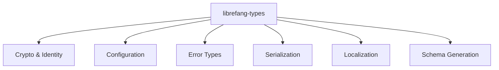

# Other — librefang-types

# librefang-types

Core type definitions, traits, and shared data structures for the LibreFang Agent OS.

## Purpose

`librefang-types` is the foundational crate that every other LibreFang module depends on. It defines the canonical data types, error enums, configuration shapes, cryptographic primitives, and trait interfaces that make up the domain model of the agent operating system. No business logic or I/O lives here — only type definitions and lightweight helper methods.

## Architecture



Every other crate in the workspace imports `librefang-types` to share a common vocabulary. This keeps serialization formats, wire protocols, and validation rules consistent across the system.

## Key Areas

### Crypto and Identity

Dependencies: `ed25519-dalek`, `sha2`, `hex`, `zeroize`

Defines the agent identity model built on Ed25519 key pairs. Types in this area likely include:

- **Agent key material** — public/private key wrappers with `Zeroize` derives so secrets are cleared from memory on drop.
- **Signature types** — for verifying message authenticity between agents and the control plane.
- **Fingerprint/digest types** — SHA-256 hashes used for content-addressing and integrity checks.

The `zeroize` dependency signals that secret keys implement `Zeroize` to reduce the window of exposure in memory.

### Configuration

Dependencies: `toml`, `dirs`

Defines the structure of agent configuration files loaded at startup. Types here are typically `Deserialize` + `Serialize` structs with field-level defaults, pointing to paths resolved via the `dirs` crate (config dir, data dir, cache dir).

### Error Types

Dependency: `thiserror`

All crate-local error enums derive from `thiserror::Error`. This gives ergonomic `From` conversions and human-readable error messages without depending on a specific error framework. Other crates re-export these error types or wrap them in their own.

### Serialization and Schema

Dependencies: `serde`, `serde_json`, `schemars`

All public data types derive `Serialize` and `Deserialize`. The `schemars` dependency (with `chrono` and `uuid1` features enabled) means JSON Schemas can be auto-generated for every type — useful for API documentation, validation on the control plane, and interop with external tooling.

Dev-dependencies include `rmp-serde`, confirming that types are also tested against MessagePack serialization for binary wire formats.

### Localization

Dependencies: `fluent`, `unic-langid`, `regex-lite`

Provides the i18n infrastructure for agent-facing messages, logs, and error descriptions. `unic-langid` parses and compares language tags, while `fluent` loads and resolves translation strings at runtime. `regex-lite` supports message interpolation or validation patterns within localized strings.

## Integration Points

### Depending on This Crate

Add to your `Cargo.toml`:

```toml
[dependencies]
librefang-types = { path = "../librefang-types" }
```

Then import the types you need:

```rust
use librefang_types::{AgentId, AgentConfig, Signature, AgentError};
```

### Re-exports

Other workspace crates should re-export types from this crate when they appear in their own public API, rather than duplicating definitions. This keeps the type identity stable across the dependency graph.

## Testing

The dev-dependencies (`rmp-serde`, `tempfile`) indicate that unit tests cover:

- **Round-trip serialization** — types are serialized to JSON, TOML, and MessagePack, then deserialized back and compared.
- **File-based config loading** — temporary TOML files are written and parsed to validate configuration structs.

Run tests with:

```bash
cargo test -p librefang-types
```

## Design Conventions

| Convention | Rationale |
|---|---|
| All public types derive `Serialize` / `Deserialize` | Ensures any type can cross a process or network boundary |
| `schemars` annotations on non-obvious fields | Auto-generated schemas stay accurate for downstream consumers |
| `zeroize::Zeroize` on secret-holding types | Secrets are wiped from memory when dropped |
| `thiserror` for error enums | Consistent error formatting with minimal boilerplate |
| `async_trait` for trait definitions | Traits that require async methods use `#[async_trait]` for compatibility |
| No I/O or side effects in this crate | Types remain testable and portable across runtimes |