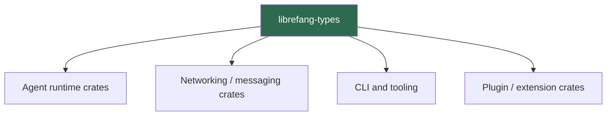

# Other — librefang-types

# librefang-types

Core type definitions, traits, and shared data structures for the LibreFang Agent OS.

## Purpose

This crate serves as the foundational type library for the entire LibreFang ecosystem. It defines the canonical data models, error types, configuration structures, cryptographic primitives, and trait contracts that all other crates depend on. It contains no business logic or I/O — only declarations and trait definitions.

Because every other crate in the workspace references `librefang-types`, this module must remain lightweight, stable, and free of heavy side-effect dependencies.

## Architectural Role

All crates import from `librefang-types` but this crate imports nothing from other workspace members. This unidirectional dependency keeps the type layer free of circular references and compilation coupling.

## Key Dependency Domains

The crate's responsibilities can be inferred from its dependency set. Each dependency group maps to a distinct domain of type definitions:

### Serialization (`serde`, `serde_json`, `toml`)

All public data structures derive `Serialize` and `Deserialize`, enabling wire-format agnostic serialization. The `toml` dependency indicates configuration types are deserialized from TOML files. The `serde_json` dependency supports JSON as an interchange format, likely for agent-to-server communication and API boundaries.

### Identity and Integrity (`uuid`, `ed25519-dalek`, `sha2`, `hex`, `rand`)

Agent identity, message signing, and payload integrity verification are core to LibreFang. The `ed25519-dalek` crate provides Ed25519 public/private key types and signature operations. Combined with `sha2` for hashing and `uuid` for unique identifiers, this crate defines types for:

- Agent identity keys and key fingerprints
- Signed messages and envelopes
- Payload digests and verification metadata
- Cryptographic randomness for key generation

### Temporal Types (`chrono`)

Timestamps on events, messages, log entries, and configuration artifacts use `chrono` types. All timestamp-bearing structs use `chrono::DateTime<Utc>` (or similar) to ensure consistent timezone handling across the system.

### Error Handling (`thiserror`)

Custom error enums for the domain are defined here using `thiserror` derives. These error types are re-exported so that downstream crates can return unified `Result<T, librefang_types::Error>` variants without defining their own error hierarchies for cross-cutting concerns.

### Asynchronous Contracts (`async-trait`)

Trait definitions for async operations — such as message handlers, transport layers, or storage backends — use the `#[async_trait]` macro. Concrete implementations live in other crates; only the trait signatures live here.

### Localization (`fluent`, `unic-langid`)

The Fluent i18n system and Unicode language identifiers support multi-language agent responses and log messages. This crate defines locale-aware types and possibly the trait for resolving localized strings, keeping internationalization concerns centralized.

### Pattern Matching (`regex-lite`)

Lightweight regex types for input validation, identifier parsing, or configuration matching. The `regex-lite` choice over full `regex` signals that only basic pattern matching is needed without full Unicode word boundary support.

### Filesystem Paths (`dirs`)

Standard platform directory resolution (`dirs`) is used to define default path constants — such as configuration directories, data directories, and key storage locations — as part of the configuration type layer.

## Design Principles

1. **Zero business logic.** Structs, enums, traits, and constants only. Any function that performs I/O, network calls, or state mutation belongs in a different crate.

2. **Serde-first modeling.** Every serializable type is designed with `serde` in mind. Field names use `#[serde(rename = "...")]` where needed for stable wire formats.

3. **Trait-driven extensibility.** Core behaviors (messaging, signing, storage) are expressed as traits with `async_trait`, allowing concrete implementations to be swapped or mocked in downstream crates.

4. **Dev dependency isolation.** The `rmp-serde` dev dependency (`MessagePack` serialization) is used only in tests to verify that types round-trip correctly through non-JSON formats, confirming format-agnostic serde correctness.

## Testing Conventions

Tests in this crate focus on:

- **Serialization round-trips.** Every struct serializes to JSON, TOML, and MessagePack (via `rmp-serde`) and deserializes back to an equal value.
- **Default and builder patterns.** Types with `Default` implementations are verified for sensible values.
- **Validation logic.** Any inherent validation methods on types (e.g., key length checks, identifier format) are tested here.

## Adding New Types

When adding types to this crate:

- Ensure all structs and enums derive `Serialize`, `Deserialize`, `Debug`, `Clone` at minimum.
- Add `#[cfg(test)]` round-trip tests for any new serializable type.
- Avoid adding runtime dependencies. If a new dependency is needed, evaluate whether the type truly belongs in this foundational crate or in a higher-level crate.
- Re-export new types from the crate root (`lib.rs`) so consumers can import with `use librefang_types::MyType` without navigating internal module paths.