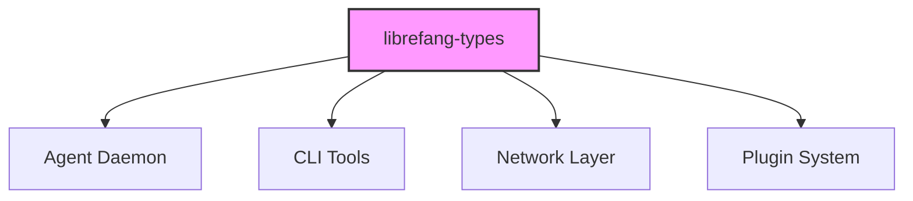

# Other — librefang-types

# librefang-types

Core type definitions, traits, and shared data structures for the LibreFang Agent OS.

## Purpose

This crate serves as the foundational type layer for the entire LibreFang system. It defines the canonical data structures, error types, configuration models, trait interfaces, and cryptographic primitives that all other crates in the workspace depend on. It contains no business logic or I/O — only definitions that establish contracts between modules.

## Role in the Architecture



Every other crate in the workspace depends on `librefang-types`. It sits at the bottom of the dependency graph, which means changes here have broad impact. The crate intentionally avoids depending on anything with a runtime or external service connection.

## Key Dependency Domains

The crate's `Cargo.toml` dependencies reveal the major areas it covers:

### Serialization & Configuration
- **serde**, **serde_json**, **toml** — All core types implement `Serialize` and `Deserialize`. Configuration files use TOML, while network payloads and persistent storage use JSON or other serde-compatible formats.

### Identity & Identification
- **uuid** — Unique identifiers for agents, tasks, sessions, and other entities throughout the system.
- **ed25519-dalek**, **sha2**, **hex**, **rand** — Cryptographic signing and verification. Ed25519 keypairs identify agents, and SHA-256 hashing supports integrity checks. These are the building blocks for agent authentication and message authenticity.

### Time Handling
- **chrono** — Timestamps on events, log entries, task scheduling, and certificate validity periods.

### Error Handling
- **thiserror** — Derive-based error types that compose cleanly across crate boundaries. All domain-specific errors are defined here so that consuming crates can match on them without creating circular dependencies.

### Async Traits
- **async-trait** — Trait definitions for async operations (agent backends, transport layers, storage drivers). Consumers provide the implementations; this crate only defines the interfaces.

### Localization
- **fluent**, **unic-langid** — User-facing message strings and locale identifiers. The type system here supports loading and selecting localized messages at runtime.

### Pattern Matching
- **regex-lite** — Lightweight regex support, likely used in configuration validation or event filtering rule definitions.

### Filesystem Paths
- **dirs** — Resolution of standard OS directories (config home, data home, etc.) for default path construction in configuration types.

## Design Conventions

### No Runtime Behavior

This crate exports types, traits, constants, and pure functions only. It does not spawn tasks, open sockets, or perform I/O. This keeps compile times manageable for downstream crates that only need type information.

### Owned Types Over Lifetimes

Structures prefer owned data (`String`, `Vec<T>`, `DateTime<Utc>`) over borrowed references. This simplifies serialization, cross-task transmission, and async boundaries at the cost of occasional allocations.

### Trait-Driven Abstraction

Major subsystem interactions are defined as traits with `async-trait`:

```rust
// Example pattern (actual trait names may differ)
#[async_trait]
pub trait AgentBackend: Send + Sync {
    async fn register(&self, keypair: &Keypair) -> Result<AgentId, AgentError>;
    async fn heartbeat(&self, id: &AgentId) -> Result<(), AgentError>;
}
```

Implementations live in their own crates. This crate owns the trait definition and the error type.

### Error Hierarchy

Errors use `thiserror` derives and are organized by domain:

| Error Type | Purpose |
|---|---|
| `AgentError` | Agent lifecycle, registration, heartbeat failures |
| `ConfigError` | Configuration parsing, validation, missing fields |
| `CryptoError` | Key generation, signing, verification failures |
| `NetworkError` | Connection, timeout, and protocol-level issues |

Each error type wraps underlying causes (IO, serde, cryptographic) while presenting a domain-specific surface to callers.

## Testing

The dev-dependency on `rmp-serde` (MessagePack) indicates that serialization round-trip tests verify types can cross format boundaries. This is particularly relevant for scenarios where types are serialized to JSON for the API layer but encoded as MessagePack for compact storage or wire transfer.

## When to Modify This Crate

- **Adding a new domain concept** — If a new entity (e.g., `Policy`, `Certificate`, `Deployment`) needs to be shared across multiple crates, define it here.
- **Changing a trait signature** — Any change to a trait in this crate requires updating all implementations across the workspace.
- **Adding a new error variant** — Error enums live here. Add variants with `#[from]` where a new underlying error type needs automatic conversion.

## When Not to Modify This Crate

- **Adding logic** — If you're writing functions that perform I/O, transform data, or make decisions, that code belongs in a higher crate.
- **Adding a dependency with a runtime** — Avoid pulling in async runtimes, database drivers, or HTTP clients. This crate must remain lightweight to import.