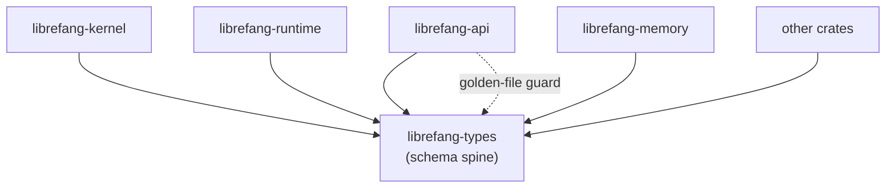

# Other — librefang-types

# librefang-types

Core type definitions for the LibreFang Agent OS. Pure data structures — no business logic, no async runtime, no network calls. Every other workspace crate depends on this one.

## Architecture



`librefang-types` sits at the bottom of the dependency DAG. It imports **no** other `librefang-*` crate. All dependencies point inward: `serde`, `serde_json`, `chrono`, `uuid`, `thiserror`, `dirs`, `toml`, `schemars`, and related foundational libraries.

## Public modules

| Module | Domain |
|---|---|
| `agent` | Agent identity and descriptor types |
| `approval` | Human-in-the-loop approval workflows |
| `capability` | Permission and capability tokens |
| `comms` | Inter-agent communication primitives |
| `config` | Kernel and runtime configuration structs |
| `error` | `LibreFangError` and related error enums |
| `event` | Event types emitted by the kernel |
| `goal` | Goal and objective definitions |
| `i18n` | Internationalization types |
| `manifest_signing` | Manifest signing and verification types |
| `media` | Media and attachment types |
| `memory` | Memory substrate data structures |
| `message` | Chat and system message types |
| `model_catalog` | LLM model catalog entries |
| `oauth` | OAuth credential types |
| `registry_schema` | Agent registry schema definitions |
| `scheduler` | Task scheduling types |
| `serde_compat` | Serde helper types and compat shims |
| `subagent` | Sub-agent spawning and management types |
| `taint` | Taint tracking for untrusted data |
| `tool` | Tool definition types |
| `tool_class` | Tool classification and metadata |

## Constants

- **`VERSION: &str`** — workspace version injected at compile time from `CARGO_PKG_VERSION`.

## How to use this crate

Add to `Cargo.toml`:

```toml
[dependencies]
librefang-types = { path = "../librefang-types" }
```

Import the types you need:

```rust
use librefang_types::config::KernelConfig;
use librefang_types::error::LibreFangError;
use librefang_types::agent::AgentDescriptor;
```

## Adding a new type

### 1. Choose the right module

Place the type under the matching submodule. If no existing module fits, create a new one — but first confirm the type is genuinely cross-crate. Types used by only one consumer belong in that consumer's crate, not here.

### 2. Derive the standard quartet

Every struct and enum must derive at minimum:

```rust
#[derive(Debug, Clone, Serialize, Deserialize)]
pub struct MyType {
    // ...
}
```

Add `PartialEq`, `Eq`, `Hash` only when a downstream consumer actually needs them. Don't derive them speculatively.

### 3. Add OpenAPI or JSON Schema derives when applicable

- Types exposed in the HTTP API: add `#[derive(utoipa::ToSchema)]`
- Types used in kernel configuration: add `#[derive(schemars::JsonSchema)]`

### 4. Use ordered collections for prompt-bound data

Any field that ends up in an LLM prompt must use `BTreeMap` / `BTreeSet` instead of `HashMap` / `HashSet`. This ensures deterministic serialization and reproducible prompts (refs #3298).

## Configuration field ritual

`KernelConfig` and related config structs are validated against a golden-file fixture in `librefang-api`. When adding or modifying a configuration field, follow these steps in order:

### 1. Add the field with `#[serde(default)]`

```rust
#[serde(default)]
pub my_new_field: bool,
```

This preserves forward-compatibility with existing TOML config files that don't include the new field.

### 2. Update the `Default` impl

The build will break if you skip this. Add the field's default value to the manual `Default` implementation for the struct.

### 3. Add a doc comment

```rust
/// Controls whether frobulation is enabled at startup.
/// Defaults to `false`.
#[serde(default)]
pub my_new_field: bool,
```

`schemars` surfaces doc comments as the `description` field in the generated JSON Schema, which flows into the golden fixture.

### 4. Regenerate the golden fixture

Run the kernel-config golden test in `librefang-api`. CI will fail until this is done. A `librefang-types`-only PR automatically pulls `librefang-api` into the affected test set via the changed-lanes rule — this is intentional and should not be circumvented.

The canonical OpenAPI and TOML example baselines are tracked under `xtask/baselines/`.

## Error types

This crate defines `LibreFangError` and related error enums. The project is actively migrating away from `Result<_, String>` and `anyhow::Error` in trait boundaries (refs #3541, #3711). New error variants belong here.

### Adding a new error variant

Preserve the `source()` chain using `#[from]`:

```rust
#[derive(Debug, thiserror::Error)]
pub enum LibreFangError {
    // ...existing variants...

    #[error("scheduler failed to enqueue task")]
    ScheduleEnqueue(#[from] ScheduleError),
}
```

Do not wrap errors in `String` or use ad-hoc error messages in consumer crates. Define the variant here and let `#[from]` handle the conversion.

## Constraints (taboos)

These are hard rules, not suggestions:

- **No `tokio`** — sync types only. This crate must be usable from synchronous contexts.
- **No `reqwest`** — wire types are data-only. HTTP client code belongs in consumer crates.
- **No `librefang-*` imports** — this crate is the bottom of the DAG. If you need a type from another workspace crate, the dependency is inverted: move the type here instead.
- **No business logic** — if a function body exceeds ~5 lines, it almost certainly belongs in a consumer crate. The exception is small derive-only helpers and trivial constructors.
- **No `HashMap`/`HashSet` in prompt-bound types** — use `BTreeMap`/`BTreeSet` for deterministic serialization (refs #3298).
- **No silently dropped serde fields** — use `#[serde(default)]` explicitly, or let unknown fields cause a compile-time/test failure. Never rely on serde's implicit ignore behavior.

## Schema drift prevention

The golden-file guard (`kernel_config_schema_matches_golden_fixture`) lives in `librefang-api`, not here. This is by design — the consumer validates the producer. The CI changed-lanes rule ensures that any PR touching `librefang-types` schema types automatically runs the `librefang-api` test suite, catching drift before merge.

The flow:

1. Developer modifies a type in `librefang-types`
2. CI detects the change in `librefang-types`
3. CI expands the affected-lanes set to include `librefang-api`
4. The golden-file test in `librefang-api` compares the regenerated schema against the committed fixture
5. Test fails if schemas diverge — developer must regenerate the fixture

Do not attempt to narrow the affected-lanes set to bypass this check.

## Key dependencies

| Crate | Purpose |
|---|---|
| `serde` / `serde_json` | Serialization framework |
| `chrono` | Timestamp types |
| `uuid` | Unique identifiers |
| `thiserror` | Error enum derives |
| `dirs` | Platform directory paths (for config defaults) |
| `toml` | TOML parsing for config types |
| `schemars` | JSON Schema generation from Rust types |
| `ed25519-dalek` | Manifest signing key types |
| `sha2` | Hash types for signing |
| `hex` / `zeroize` | Secure key material handling |
| `fluent` / `unic-langid` | i18n message types |
| `regex-lite` | Pattern types for validation |
| `tracing` | Structured logging types |