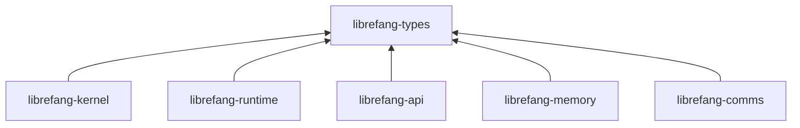

# Other — librefang-types

# librefang-types

Shared data structures for the LibreFang Agent OS. Every other workspace crate depends on this one. **Contains no business logic** — pure types, derives, and small serialization helpers.

## Position in the dependency graph



`librefang-types` sits at the bottom. It imports **zero** workspace crates. All dependencies are external: `serde`, `serde_json`, `chrono`, `uuid`, `thiserror`, `dirs`, `toml`, `schemars`, `url`, `ed25519-dalek`, `sha2`, `hex`, `zeroize`, `fluent`, `unic-langid`, `regex-lite`, `tracing`.

## Public modules

Each submodule is a domain-oriented collection of structs and enums:

| Module | Domain |
|---|---|
| `agent` | Agent identity and descriptor types |
| `approval` | Human-approval workflow types |
| `capability` | Capability tokens and permission models |
| `comms` | Inter-agent communication primitives |
| `config` | `KernelConfig` and all configuration structs |
| `error` | `LibreFangError` and error enumerations |
| `event` | System event types |
| `goal` | Goal and objective types |
| `i18n` | Internationalization types (backed by `fluent`) |
| `manifest_signing` | Manifest signing and verification types (ed25519) |
| `media` | Media attachment types |
| `memory` | Memory substrate types |
| `message` | Message envelope and payload types |
| `model_catalog` | LLM model catalog entries |
| `oauth` | OAuth credential types |
| `registry_schema` | Registry schema definitions |
| `scheduler` | Task scheduler types |
| `serde_compat` | Serde helper types and compatibility shims |
| `subagent` | Sub-agent spawn and lifecycle types |
| `taint` | Data taint-tracking types |
| `tool` | Tool invocation types |
| `tool_class` | Tool classification and taxonomy |

## Public constants

- **`VERSION: &str`** — workspace version injected at compile time from `CARGO_PKG_VERSION`.

## Adding a new type

### 1. Choose the right submodule

Place the type under the matching domain module. If no module fits, decide whether it is genuinely cross-crate or belongs in the single consuming crate instead. New submodules are rare and require justification.

### 2. Derive the standard quartet

```rust
#[derive(Debug, Clone, Serialize, Deserialize)]
pub struct MyType {
    // ...
}
```

Add `PartialEq`, `Eq`, or `Hash` only when a downstream consumer requires them. Do not derive them speculatively.

### 3. OpenAPI surface types

Types that appear in the HTTP API must also derive:

```rust
#[derive(Debug, Clone, Serialize, Deserialize, utoipa::ToSchema)]
```

### 4. Configuration types

Types that form part of `KernelConfig` (or any TOML-loaded config) must also derive:

```rust
#[derive(Debug, Clone, Serialize, Deserialize, schemars::JsonSchema)]
```

The JSON Schema output feeds the golden-file fixture in `librefang-api`.

### 5. Deterministic ordering for LLM-bound data

Any field whose serialized form may end up in an LLM prompt **must** use `BTreeMap` / `BTreeSet` instead of `HashMap` / `HashSet`. Deterministic serialization produces stable prompts and reproducible outputs (refs #3298).

## Configuration field ritual

When adding a field to a config struct, follow all four steps:

```rust
/// Maximum concurrent tool invocations per agent.
#[serde(default = "default_max_concurrent_tools")]
pub max_concurrent_tools: usize,
```

1. **`#[serde(default)]`** (or `default = "..."`) — ensures forward-compatibility with existing TOML files that lack the new field.
2. **Update the `Default` impl** — the build breaks silently if you forget.
3. **Write a doc comment** — `schemars` surfaces it as the field's `description` in the generated JSON Schema.
4. **Regenerate the golden fixture** — run the `kernel_config_schema_matches_golden_fixture` test in `librefang-api`. CI will fail until you do.

## Error types

The crate exports `LibreFangError` and related error enums. The project is migrating away from `Result<_, String>` and `anyhow::Error` in trait boundaries (refs #3541, #3711). New error variants belong here.

### Adding an error variant

Preserve the `source()` chain so that downstream callers can inspect causes (refs #3745):

```rust
#[derive(Debug, thiserror::Error)]
pub enum LibreFangError {
    // ...existing variants...

    #[error("tool execution failed")]
    ToolExecution(#[from] ToolError),
}
```

Use `#[from]` on the wrapped type. Do not flatten error information into a `String`.

## Schema-mirror invariant

`librefang-types` defines the schema. `librefang-api` owns the golden-file guard (`kernel_config_schema_matches_golden_fixture`). Any change to a `KernelConfig` field — addition, rename, or type change — requires regenerating the golden fixture under `api/tests`.

CI enforces this via the changed-lanes rule: a `librefang-types`-only PR automatically pulls `librefang-api` into the affected test set. The canonical OpenAPI and TOML baselines are tracked under `xtask/baselines/`.

## Constraints (taboos)

| Rule | Reason |
|---|---|
| No `tokio` | This crate is synchronous. Async runtime belongs in consumers. |
| No `reqwest` | HTTP client code belongs in consuming crates. Wire types here are data-only. |
| No `librefang-*` imports | This crate is the bottom of the DAG. Reverse the dependency instead. |
| No function bodies longer than ~5 lines | Business logic belongs in consumer crates. Types only. |
| No `HashMap`/`HashSet` for prompt-bound fields | Use `BTreeMap`/`BTreeSet` for deterministic serialization (#3298). |
| No silently dropping serde fields | Use `#[serde(default)]` for optional fields, or let deserialization fail explicitly. |