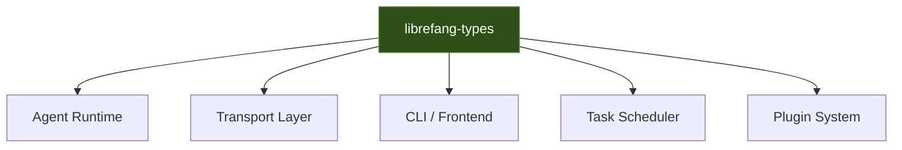

# Other — librefang-types

# librefang-types

Core type definitions, traits, and shared data structures for the LibreFang Agent OS.

## Purpose

This crate serves as the foundational type layer for the LibreFang system. It defines the shared vocabulary — data structures, enums, traits, error types, and configuration models — that all other crates in the workspace consume. By isolating types into their own crate, the system avoids circular dependencies and ensures that multiple components can communicate through a common type contract without coupling to implementation details.

The crate is **pure data and trait definitions**. It contains no business logic, no I/O, and no side effects. No execution flows originate from or pass through this module.

## Dependency Rationale

The dependencies chosen signal the specific domains this crate covers:

| Dependency | Role in this crate |
|---|---|
| `serde`, `serde_json` | Derive `Serialize`/`Deserialize` on all wire types for JSON and generic serialization |
| `chrono` | Timestamp types for events, logs, and scheduling |
| `uuid` | Unique identifiers for agents, tasks, sessions |
| `thiserror` | Ergonomic error type derivation for domain-specific error enums |
| `toml` | Deserialization of configuration files into typed config structs |
| `dirs` | Resolution of standard platform directories for default config/data paths |
| `async-trait` | Async-capable trait definitions for agent backends and transport layers |
| `ed25519-dalek`, `sha2`, `hex`, `rand` | Cryptographic types — key pairs, signatures, digests — for agent identity and message authentication |
| `fluent`, `unic-langid` | Internationalization types for localizable user-facing messages |
| `regex-lite` | Pattern types for validation rules and input matching |

The `rmp-serde` dev-dependency indicates that types are tested for MessagePack round-trip serialization in addition to JSON, suggesting the system supports multiple wire formats.

## Architectural Role



Every other crate in the workspace depends on `librefang-types`. No crate in the workspace depends on it transitively through another crate — it is always a direct dependency, keeping the type layer flat and explicit.

## Type Categories

### Identity and Cryptography

Types derived from `ed25519-dalek` and `sha2` define the agent identity model. Ed25519 key pairs represent agent identities. SHA-256 digests provide content-addressable references for tasks, configurations, and artifacts. The `hex` crate handles human-readable encoding of keys and hashes. The `rand` crate supports key generation and nonce creation.

These types implement `Serialize`/`Deserialize` so they can be transmitted over the wire and persisted to disk.

### Messaging and Wire Protocol

All message types — requests, responses, events, and acknowledgements — are defined here with serde support. The dual testing against both JSON and MessagePack (via `rmp-serde` in dev-dependencies) ensures the types remain format-agnostic.

### Configuration

Typed configuration structs deserialized from TOML files. The `dirs` crate provides default path resolution so that configuration structs can express platform-appropriate fallback values (e.g., `~/.config/librefang/` on Linux, `%APPDATA%` on Windows).

### Error Types

Domain error enums derived with `thiserror`. These encode all failure modes that cross crate boundaries — transport errors, validation errors, crypto errors, and configuration errors. Each variant carries context appropriate to its category.

### Async Traits

Traits annotated with `#[async_trait]` define the async interfaces that implementing crates must satisfy — agent backends, message transports, storage adapters, and similar pluggable components.

### Localization

Types integrating `fluent` and `unic-langid` support localizable message strings. This allows the system to present logs, errors, and user-facing text in the agent's configured language.

## Usage Patterns

Other crates depend on this library by adding it to their `Cargo.toml`:

```toml
[dependencies]
librefang-types = { path = "../librefang-types" }
```

All public types are re-exported from the crate root. Consumers import them directly:

```rust
use librefang_types::{AgentId, TaskRequest, Config, Error};
```

## Adding New Types

When adding types to this crate, follow these constraints:

1. **No logic.** Types should be data carriers. Methods should be limited to constructors, accessors, and pure conversions. If you find yourself writing business logic, it belongs in a different crate.
2. **Derive serde.** All serializable types should derive `Serialize` and `Deserialize` unless there is a specific security reason not to.
3. **Test round-trips.** Verify serialization round-trips in both JSON and MessagePack, following the pattern established by the existing `rmp-serde` dev-dependency.
4. **Keep it leaf-free.** This crate must not depend on any other workspace crate. It sits at the bottom of the dependency graph. External crate additions require justification — each one increases compile times for every consumer.