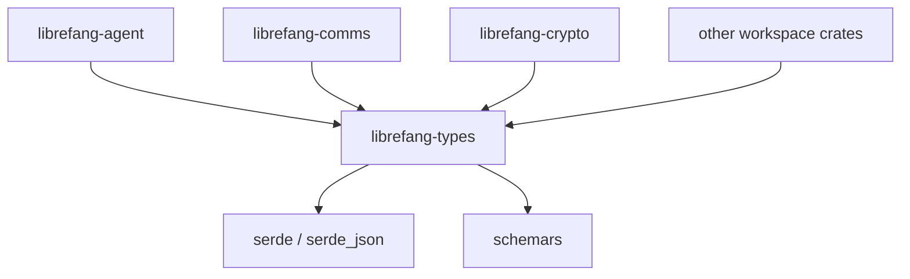

# Other — librefang-types

# librefang-types

Core type definitions, traits, and shared data structures for the LibreFang Agent OS.

## Purpose

This crate acts as the shared vocabulary of the entire LibreFang system. It defines the data structures, enums, traits, error types, and configuration schemas that all other crates consume. It contains **no business logic, no I/O, and no side effects** — purely type definitions and their serialization/deserialization support.

Because every other crate in the workspace depends on `librefang-types`, changes here have wide-reaching impact. Treat it as a stable contract layer.

## Position in the Architecture



All workspace crates import from this module. It depends only on external libraries, never on sibling crates.

## Domain Areas

The types in this crate are organized around several domains, each informed by its dependencies.

### Identity and Cryptography

Dependencies: `ed25519-dalek`, `sha2`, `hex`, `zeroize`

Defines types related to agent identity, key material, and signature verification. Key types likely include agent IDs, public/private key wrappers, and signature structs. The `zeroize` dependency indicates that secret key material is securely cleared from memory when dropped.

### Configuration

Dependencies: `toml`, `dirs`, `serde`

Configuration structs that deserialize from TOML files. These define the agent's runtime settings, connection parameters, and feature flags. The `dirs` crate provides platform-standard config directory paths.

### Messaging and Protocol

Dependencies: `serde`, `serde_json`, `chrono`, `uuid`

Message envelopes, request/response types, and protocol headers shared between agents and the control plane. Timestamps (`chrono`) and correlation IDs (`uuid`) are first-class citizens in these types.

### Internationalization

Dependencies: `fluent`, `unic-langid`

Language identifiers and localized string types. The agent supports multiple languages for status messages, error descriptions, and user-facing output.

### Error Types

Dependencies: `thiserror`

Domain-specific error enums with `std::error::Error` implementations. These are the canonical error types returned across crate boundaries, enabling consistent error handling without coupling crates to each other's internals.

### Trait Definitions

Dependencies: `async-trait`

Shared async traits that define the interfaces components must implement. These enable dependency injection and testability across crates — for example, a transport trait, a storage trait, or a key provider trait.

### Schema Generation

Dependency: `schemars` (with `chrono` and `uuid1` features)

All serializable types derive `JsonSchema`, enabling automatic JSON Schema generation. This supports configuration validation, API documentation, and external tooling integration.

## Usage

Add to your crate's `Cargo.toml`:

```toml
[dependencies]
librefang-types = { path = "../librefang-types" }
```

Import types as needed:

```rust
use librefang_types::config::AgentConfig;
use librefang_types::error::AgentError;
use librefang_types::identity::AgentId;
```

## Conventions

| Convention | Reason |
|---|---|
| All serializable types derive `Serialize`, `Deserialize`, and `JsonSchema` | Consistency across wire formats and schema generation |
| Error types use `thiserror` derive macros | Ergonomic, zero-cost error definitions |
| Secret-bearing types implement `Zeroize` | Prevent key material from lingering in memory |
| Enums use `#[serde(rename_all = "snake_case")]` | Stable, consistent JSON/TOML representation |

## Testing

Dev-dependencies include `rmp-serde` (MessagePack serialization) and `tempfile`, suggesting tests verify that types round-trip correctly through multiple serialization formats and that file-based config loading behaves as expected.

Run tests from the workspace root:

```bash
cargo test -p librefang-types
```

## When to Modify This Crate

**Add to this crate when:**
- A new data structure is shared between two or more workspace crates
- A new trait defines a cross-crate interface
- A new error variant needs to be propagated across crate boundaries

**Do not add to this crate:**
- Business logic or stateful operations
- I/O, networking, or filesystem access (beyond type definitions)
- Crate-specific helpers that only one consumer needs