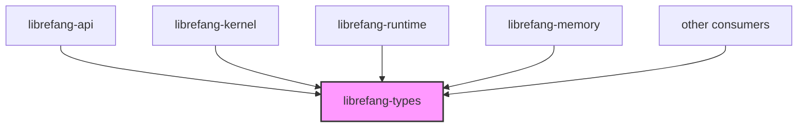

# Other — librefang-types

# librefang-types

Shared data structures for the LibreFang Agent OS. This crate sits at the bottom of the dependency graph — every other workspace crate depends on it, and it depends on no workspace crate. It contains **no business logic**. Only type definitions, serde derives, and small helper functions that are purely derivable or trivial.

## Architecture



Every type that crosses a crate boundary is defined here. Consumer crates import and use these types; they do not define their own cross-crate structs or enums.

## Public Modules

| Module | Domain |
|---|---|
| `agent` | Agent identity and descriptor types |
| `approval` | Human-in-the-loop approval workflows |
| `capability` | Capability tokens and permissions |
| `comms` | Inter-agent communication envelopes |
| `config` | Kernel and runtime configuration structs |
| `error` | `LibreFangError` and domain-specific error enums |
| `event` | Event types emitted by the kernel and runtime |
| `goal` | Goal and objective tracking |
| `i18n` | Internationalization types (backed by `fluent`) |
| `manifest_signing` | Ed25519 manifest signing and verification types |
| `media` | Media attachment and content types |
| `memory` | Memory substrate records and indexes |
| `message` | Chat message and conversation types |
| `model_catalog` | LLM model registry entries |
| `oauth` | OAuth2 token and flow types |
| `registry_schema` | Agent/tool registry schema definitions |
| `scheduler` | Task scheduling and cron types |
| `serde_compat` | Serde helpers for backward-compatible deserialization |
| `subagent` | Sub-agent spawning and lifecycle types |
| `taint` | Taint tracking for untrusted data |
| `tool` | Tool invocation request/response types |
| `tool_class` | Tool classification and metadata |

## Constants

- **`VERSION: &str`** — Workspace version injected at compile time from `CARGO_PKG_VERSION`.

## Key Dependencies

`serde`, `serde_json`, `chrono`, `uuid`, `thiserror`, `dirs`, `toml`, `schemars`, `utoipa`, `ed25519-dalek`, `sha2`, `fluent`, `url`.

No `tokio`. No `reqwest`. No workspace crate. Everything is synchronous and data-only.

## Adding a New Type

1. **Pick the right module.** Place the type under an existing submodule that matches its domain. If no submodule fits, create a new one — but first confirm the type is genuinely cross-crate. If only one crate uses it, define it there instead.
2. **Derive the standard quartet:** `Debug`, `Clone`, `Serialize`, `Deserialize`. Add `PartialEq`, `Eq`, or `Hash` only when a consumer needs them.
3. **For OpenAPI surface types:** also derive `utoipa::ToSchema`.
4. **For configuration types:** also derive `schemars::JsonSchema`. This feeds the kernel-config golden fixture (see below).
5. **For prompt-bound fields:** use `BTreeMap` / `BTreeSet`, never `HashMap` / `HashSet`. Deterministic serialization matters for LLM prompts.

Example minimal struct:

```rust
#[derive(Debug, Clone, Serialize, Deserialize)]
pub struct AgentDescriptor {
    pub name: String,
    pub version: String,
}
```

## Configuration Field Ritual

When adding a field to a config struct (anything under `config::`):

1. **Annotate with `#[serde(default)]`** — old TOML files must still parse.
2. **Update the `Default` impl** — the build breaks otherwise.
3. **Add a doc comment** — `schemars` surfaces it as the field's `description` in the generated JSON Schema.
4. **Regenerate the golden fixture** in `librefang-api` tests. CI will fail until you do.

```rust
#[derive(Debug, Clone, Serialize, Deserialize, JsonSchema)]
pub struct KernelConfig {
    /// Maximum concurrent agent executions.
    #[serde(default = "default_max_concurrent")]
    pub max_concurrent: usize,
}
```

## Schema Drift and the Golden Fixture

`librefang-types` defines configuration schemas. The golden-file guard — `kernel_config_schema_matches_golden_fixture` — lives in `librefang-api`. Any change to a `KernelConfig` field (addition, rename, type change) requires regenerating the golden fixture at `librefang-api/tests/`.

CI enforces this through the changed-lanes rule: a PR that touches only `librefang-types` automatically pulls `librefang-api` into the affected test set. The canonical OpenAPI and TOML example baselines live under `xtask/baselines/`.

## Error Types

The crate exports `LibreFangError` and related domain-specific error enums. The project is migrating away from `Result<_, String>` and `anyhow::Error` in trait boundaries (refs #3541, #3711). New error variants belong here.

When adding a variant, preserve the `source()` chain (ref #3745). Use `#[from]` on wrapped enums:

```rust
#[derive(Debug, thiserror::Error)]
pub enum LibreFangError {
    #[error("configuration error: {0}")]
    Config(#[from] ConfigError),

    #[error("agent not found: {id}")]
    AgentNotFound { id: Uuid },
}
```

## Constraints

| Rule | Reason |
|---|---|
| No `tokio` | This crate is synchronous. Async runtime belongs in consumers. |
| No `reqwest` | HTTP client code belongs in the crate that makes HTTP calls. |
| No `librefang-*` imports | This crate is the bottom of the DAG. Reverse the dependency. |
| No function bodies > 5 lines | Business logic belongs in consumer crates. |
| No `HashMap` in prompt-bound types | Non-deterministic iteration breaks LLM prompt reproducibility (#3298). |
| No silently dropped serde fields | Use `#[serde(default)]` explicitly, or let deserialization fail at compile time. |