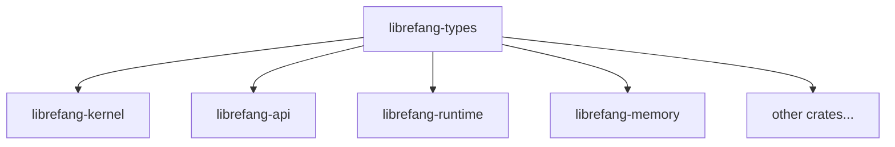

# Other — librefang-types

# librefang-types

Shared data structures for the LibreFang Agent OS. Pure types, zero business logic. Every other workspace crate depends on this one; it depends on nothing in the workspace.

## Position in the workspace



`librefang-types` sits at the bottom of the dependency DAG. It imports **no** other `librefang-*` crate. If you need a type shared across two or more crates, it belongs here or you reverse the dependency.

## What goes here

Cross-crate data structures only: structs, enums, type aliases, and small derive-only helpers. If a function body exceeds five lines, it belongs in a consumer crate.

### Public modules

| Module | Domain |
|---|---|
| `agent` | Agent identity and descriptor types |
| `approval` | Approval / human-in-the-gate flow types |
| `capability` | Permission and capability tokens |
| `comms` | Inter-agent communication primitives |
| `config` | `KernelConfig` and related configuration structs |
| `error` | `LibreFangError` and error enums (see below) |
| `event` | Event types emitted by the kernel |
| `goal` | Goal and objective types |
| `i18n` | Internationalization types (backed by `fluent`) |
| `manifest_signing` | Ed25519 manifest signing types |
| `media` | Media content types |
| `memory` | Memory substrate types |
| `message` | Message envelope types |
| `model_catalog` | Model registry / catalog types |
| `oauth` | OAuth flow types |
| `registry_schema` | Registry schema types |
| `scheduler` | Scheduling types |
| `serde_compat` | Serde helpers and compat shims |
| `subagent` | Sub-agent spawn / management types |
| `taint` | Taint tracking types |
| `tool` | Tool descriptor types |
| `tool_class` | Tool classification types |

### Public constants

- **`VERSION: &str`** — workspace version, compiled from `CARGO_PKG_VERSION`.

## Dependencies

External only. No workspace crate imports.

`serde`, `serde_json`, `chrono`, `uuid`, `thiserror`, `dirs`, `toml`, `schemars`, `async-trait`, `ed25519-dalek`, `sha2`, `hex`, `zeroize`, `fluent`, `unic-langid`, `regex-lite`, `tracing`, `url`.

## Adding a new type

1. **Choose the module.** Place the type in the matching submodule above. If no module fits, create a new one — but first verify the type is truly cross-crate and doesn't belong in the single crate that consumes it.
2. **Derive the standard quartet:** `Debug`, `Clone`, `Serialize`, `Deserialize`.
3. **Add `PartialEq` / `Eq` / `Hash`** only when a downstream consumer needs them.
4. **OpenAPI surface types:** also derive `utoipa::ToSchema`.
5. **Configuration types:** also derive `schemars::JsonSchema` (required for the kernel-config golden fixture — see below).

## Adding a field to a config struct

Every config field must follow this ritual:

1. Add the field with `#[serde(default)]` for forward-compatibility with existing TOML files.
2. Add the corresponding entry in the manual `Default` impl. The build will fail otherwise.
3. Write a doc comment. `schemars` surfaces doc comments as the field's `description` in the generated JSON Schema.
4. Regenerate the golden fixture in `librefang-api` tests. CI enforces this.

### Schema-mirror invariant

`librefang-types` defines the schema. The golden-file guard (`kernel_config_schema_matches_golden_fixture`) lives in `librefang-api`'s test suite. The canonical OpenAPI and TOML baselines are tracked under `xtask/baselines/`.

CI uses a changed-lanes rule: any PR touching `librefang-types` automatically pulls `librefang-api` into the affected test set. A schema change without a regenerated golden will fail CI.

## Error types

This crate exports `LibreFangError` and related error enums. The workspace is migrating away from `Result<_, String>` and `anyhow::Error` in trait boundaries (#3541, #3711). New error variants belong here.

When adding a variant:

- Preserve the `source()` chain (#3745).
- Use `#[from]` on a wrapped enum — this is the standard idiom for automatic `From` conversion while keeping the error chain intact.

```rust
#[derive(Debug, thiserror::Error)]
pub enum LibreFangError {
    #[error("configuration error")]
    Config(#[from] ConfigError),
    // ...
}
```

## Hard rules (taboos)

| Rule | Reason |
|---|---|
| No `tokio` | Sync types only. Async runtime belongs in consumers. |
| No `reqwest` | HTTP code lives in consumer crates. Wire types are data-only. |
| No `librefang-*` imports | This crate is the bottom of the DAG. Reverse the dependency instead. |
| No functions > 5 lines | Business logic belongs in the crate that uses the type. |
| No `HashMap` in prompt-bound types | Use `BTreeMap` / `BTreeSet` for deterministic serialization (#3298). |
| No silently dropped serde fields | Use `#[serde(default)]` explicitly, or let it fail at compile time. |