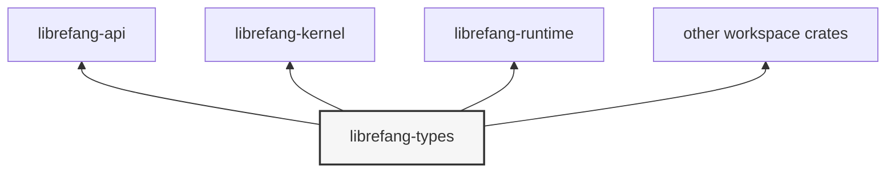

# Other — librefang-types

# librefang-types

Core type definitions for the LibreFang Agent OS. This crate is the **schema spine** — every other workspace crate depends on it, and it depends on nothing else in the workspace. It contains pure data structures, error enums, and derive-only helpers. No business logic lives here.

## Position in the dependency graph


```mermaid
graph BT
    types["librefang-types"]
    api["librefang-api"]
    kernel["librefang-kernel"]
    runtime["librefang-runtime"]
    other["other workspace crates"]

    types --> api
    types --> kernel
    types --> runtime
    types --> other

    style types fill:#f6f6f6,stroke:#333,stroke-width:2px
```

`librefang-types` is the leaf node. It has **zero** workspace crate dependencies. All arrows point away from it. This is enforced as a hard rule — importing any `librefang-*` crate here is a dependency inversion and will be rejected.

## What this crate owns

Every cross-crate type definition. The public modules are:

| Module | Domain |
|---|---|
| `agent` | Agent identity and descriptor types |
| `approval` | Human-in-the-loop approval workflows |
| `capability` | Permission and capability tokens |
| `comms` | Inter-agent communication primitives |
| `config` | Kernel and runtime configuration structs (TOML-backed) |
| `error` | `LibreFangError` and variant-specific error enums |
| `event` | Event types emitted by the kernel and runtime |
| `goal` | Goal and objective representations |
| `i18n` | Internationalization types (backed by `fluent`) |
| `manifest_signing` | Ed25519 manifest signing and verification types |
| `media` | Media attachment and content types |
| `memory` | Memory substrate records and indices |
| `message` | Chat message and conversation types |
| `model_catalog` | LLM model registry entries |
| `oauth` | OAuth credential and token types |
| `registry_schema` | Agent/tool registry schema definitions |
| `scheduler` | Task scheduling and cron types |
| `serde_compat` | Serde helpers and compatibility shims |
| `subagent` | Sub-agent spawn and delegation types |
| `taint` | Taint tracking for untrusted data |
| `tool` | Tool invocation request/response types |
| `tool_class` | Tool classification and metadata |

### What this crate does NOT own

Implementation. If a function *does* something — makes a network call, reads a file, spawns a task — it belongs in the consuming crate. The five-line rule applies: if you're writing a function body longer than five lines, it almost certainly doesn't belong here.

## External dependencies

The crate depends on foundational serialization and utility libraries only:

- **`serde` / `serde_json`** — serialization framework
- **`chrono`** — timestamps and durations
- **`uuid`** — unique identifiers
- **`thiserror`** — error enum derives
- **`dirs`** — standard directory paths (used in config defaults)
- **`toml`** — TOML parsing for configuration types
- **`schemars`** — JSON Schema generation (with `chrono` and `uuid1` features)
- **`ed25519-dalek` / `sha2` / `hex` / `zeroize`** — manifest signing cryptography
- **`fluent` / `unic-langid`** — i18n message resolution
- **`regex-lite`** — lightweight pattern matching in validators
- **`url`** — URL parsing for config fields
- **`tracing`** — instrumentation (span attributes on types)

Notably absent: `tokio`, `reqwest`, `utoipa`, or any async runtime. This crate is fully synchronous.

## Public constants

**`VERSION: &str`** — the workspace version string, embedded at compile time from `CARGO_PKG_VERSION`. Available to all downstream crates for protocol negotiation and diagnostics.

## Derive conventions

### Standard quartet

Every data structure must derive:

```rust
#[derive(Debug, Clone, Serialize, Deserialize)]
```

Add `PartialEq`, `Eq`, and `Hash` only when a downstream consumer actually needs them — not preemptively.

### OpenAPI surface types

Types that appear in the HTTP API surface must also derive:

```rust
#[derive(utoipa::ToSchema)]
```

### Configuration types

Types that back TOML configuration files must also derive:

```rust
#[derive(schemars::JsonSchema)]
```

This drives the JSON Schema golden fixture in `librefang-api`.

## Adding a configuration field

Configuration structs are the highest-ceremony types in this crate because they have a serialized backward-compatibility contract. When adding a field to any config struct (e.g., `KernelConfig`):

1. **Add the field with `#[serde(default)]`** — old TOML files that lack the field must still deserialize without error.
2. **Update the `Default` impl** — the build will fail if you don't.
3. **Write a doc comment** — `schemars` surfaces doc comments as the `description` property in the generated JSON Schema.
4. **Regenerate the kernel-config golden fixture** in `librefang-api/tests` — CI will fail if the schema drifts from the fixture.

Example:

```rust
/// Maximum number of concurrent tool invocations per agent.
/// Defaults to 8.
#[serde(default = "default_max_concurrent_tools")]
pub max_concurrent_tools: usize,
```

## Schema-mirror invariant

The golden-file test `kernel_config_schema_matches_golden_fixture` lives in `librefang-api`, not here. This is intentional — `librefang-types` defines the schema, and `librefang-api` validates that the serialized output matches a committed fixture.

CI enforces this via the **changed-lanes rule**: a PR that modifies `librefang-types` automatically includes `librefang-api` in the affected test set. You cannot bypass this. If you change a config field, you must update the golden fixture in the same PR or CI will reject it.

The canonical OpenAPI and TOML example baselines are tracked under `xtask/baselines/` at the repository root.

## Error types

The crate exports `LibreFangError` and related error enums. The project is actively migrating away from `Result<_, String>` and `anyhow::Error` in trait boundaries (refs #3541, #3711). New error variants must be defined here.

When adding a variant, preserve the error chain with `#[from]`:

```rust
#[derive(Debug, thiserror::Error)]
pub enum LibreFangError {
    #[error("configuration error: {0}")]
    Config(#[from] ConfigError),

    #[error("manifest verification failed: {0}")]
    ManifestSigning(#[from] ManifestSigningError),
}
```

This ensures `std::error::Error::source()` returns the underlying cause, preserving traceability across crate boundaries (#3745).

## Collection type rules

Use **`BTreeMap` / `BTreeSet`** for any field that may be serialized into an LLM prompt. `HashMap` / `HashSet` have nondeterministic iteration order, which causes prompt instability across runs (refs #3298). Deterministic ordering is required for reproducible model interactions.

This rule applies to all types in the `message`, `memory`, `tool`, `agent`, and `tool_class` modules at minimum. When in doubt, use `BTreeMap`.

## Adding a new submodule

Before creating a new module, answer: **is this truly a cross-crate type?** If only one crate uses it, define it there. If the kernel, runtime, API, or memory substrate all need it, it belongs here.

Steps:

1. Create the module file under `src/`.
2. Declare it in `src/lib.rs` with `pub mod`.
3. Apply the standard quartet derives.
4. Add `utoipa::ToSchema` if it appears in the HTTP API.
5. Add `schemars::JsonSchema` if it backs configuration.
6. Use `BTreeMap`/`BTreeSet` for any prompt-bound collections.

## Hard taboos

| Prohibition | Reason |
|---|---|
| No `tokio` | Sync types only. Async runtimes belong in consumers. |
| No `reqwest` | Wire types are data-only. HTTP lives in consumers. |
| No `librefang-*` imports | We are the DAG leaf. Reverse the dependency. |
| No implementation logic | Function bodies > 5 lines belong elsewhere. |
| No `HashMap` in prompt-bound types | Nondeterministic ordering (#3298). |
| No silently dropped serde fields | Use `#[serde(default)]` or let it fail at compile time. |