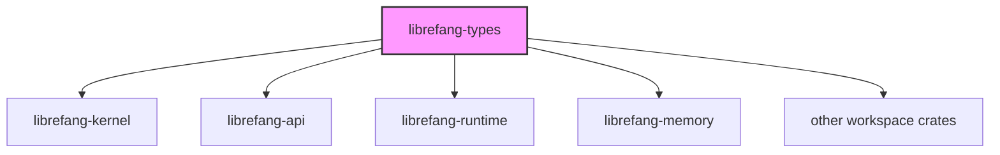

# Other — librefang-types

# librefang-types

Shared data structures for the LibreFang Agent OS. Pure types and derive-only helpers — no business logic, no async runtime, no network calls. Every workspace crate that needs a common vocabulary depends on this one; nothing here depends on another workspace crate.

## Position in the dependency graph

```mermaid
graph TD
    A[librefang-types] --> B[librefang-kernel]
    A --> C[librefang-api]
    A --> D[librefang-runtime]
    A --> E[librefang-memory]
    A --> F[other workspace crates]
    style A fill:#f9f,stroke:#333,stroke-width:2px
```

This crate is the **bottom of the DAG**. It must never import another `librefang-*` crate. If you find yourself wanting to reverse that dependency, the code you're writing probably belongs in the consumer instead.

## External dependencies

| Crate | Purpose |
|-------|---------|
| `serde` / `serde_json` | Serialization of all cross-crate types |
| `chrono` | Timestamps in events, logs, scheduler types |
| `uuid` | Identifiers for agents, goals, messages, memory entries |
| `thiserror` | Error enum derives with `#[source]` chains |
| `dirs` | Default path resolution in config types |
| `toml` | TOML deserialization for `KernelConfig` |
| `schemars` | `JsonSchema` derives driving the kernel-config golden fixture |
| `fluent` / `unic-langid` | i18n message types |
| `ed25519-dalek` / `sha2` / `hex` / `zeroize` | `manifest_signing` types |
| `regex-lite` | Pattern types in taint and tool classes |
| `url` | Parsed URL fields in oauth, registry, model catalog |
| `tracing` | Type-level span data (no macros that emit logs) |

**Notably absent:** `tokio`, `reqwest`, `anyhow`. This crate is synchronous and fully deterministic.

## Module catalog

| Module | Domain |
|--------|--------|
| `agent` | Agent identity, descriptors, lifecycle states |
| `approval` | Human-in-the-loop approval requests and decisions |
| `capability` | Capability tokens and permission grants |
| `comms` | Inter-agent communication envelopes |
| `config` | `KernelConfig` and all TOML-loadable configuration structs |
| `error` | `LibreFangError` and domain-specific error enums |
| `event` | Event types emitted by the kernel and runtime |
| `goal` | Goal specification and decomposition structures |
| `i18n` | Locale descriptors, translation-key types |
| `manifest_signing` | Signed manifest types (Ed25519 verification data) |
| `media` | Media attachment metadata |
| `memory` | Memory substrate records, episodic/semantic entries |
| `message` | Chat/message payloads between user and agents |
| `model_catalog` | LLM model descriptors and routing configuration |
| `oauth` | OAuth2 flow types, token structures |
| `registry_schema` | Agent registry entry schemas |
| `scheduler` | Task scheduling, recurrence rules |
| `serde_compat` | Serde helpers, custom `Serialize`/`Deserialize` wrappers |
| `subagent` | Sub-agent spawn requests and status |
| `taint` | Taint-tracking annotations for untrusted data |
| `tool` | Tool invocation requests, results, schemas |
| `tool_class` | Tool classification and metadata |

## Public constants

- **`VERSION: &str`** — Compiled from `CARGO_PKG_VERSION`. Other crates re-export this to report their version in diagnostics and the wire protocol.

## Adding a new type

1. **Choose the right submodule.** If the type is only used by one consumer crate, it may not belong here. When in doubt, keep it local to the consumer.
2. **Derive the standard quartet:** `Debug`, `Clone`, `Serialize`, `Deserialize`. Add `PartialEq`, `Eq`, `Hash` only when a downstream consumer needs them for comparison or map keys.
3. **OpenAPI surface types** — also derive `utoipa::ToSchema`.
4. **Configuration types** — also derive `schemars::JsonSchema`. This drives the JSON Schema that the golden-file fixture checks.
5. **Prompt-bound collections** — use `BTreeMap`/`BTreeSet`, never `HashMap`/`HashSet`. Deterministic ordering matters when the value is serialized into an LLM prompt.

## Configuration field ritual

Every field added to a config struct requires four coordinated steps:

1. **`#[serde(default)]`** on the new field. Without this, existing TOML files fail to parse (forward-compatibility break).
2. **Update the `Default` impl.** The build breaks at link time if you forget.
3. **Add a doc comment.** `schemars` surfaces it as the field's `description` in the generated JSON Schema, which flows into the golden fixture and API docs.
4. **Regenerate the golden fixture** in `librefang-api` tests. CI enforces this via the changed-lanes rule: any PR touching `librefang-types` automatically pulls `librefang-api` into the affected test set. The test `kernel_config_schema_matches_golden_fixture` will fail if schemas drift.

## Error types

This crate exports `LibreFangError` and domain-specific error enums. The project is migrating away from `Result<_, String>` and `anyhow::Error` in trait boundaries (refs #3541, #3711). All new error variants should be added here.

When adding a variant:

- Preserve the `source()` chain so callers can inspect root causes. Use `#[from]` on wrapped enums — this is the standard idiom.
- Derive `thiserror::Error` with a meaningful `#[error(...)]` message.
- Do not embed `String` as an opaque error description; use a structured variant instead.

## Hard rules

| Rule | Reason |
|------|--------|
| No `tokio` | Sync types only. Async boundaries belong in consumers. |
| No `reqwest` | HTTP implementation lives in the crate that makes the call. |
| No `librefang-*` imports | This crate is the bottom of the DAG. Reverse the dependency. |
| No function bodies > 5 lines | Business logic belongs in consumers. `From`/`Default` impls and small helpers are fine. |
| No `HashMap` for prompt-bound types | Non-deterministic iteration order corrupts LLM prompts. Use `BTreeMap`/`BTreeSet` (ref #3298). |
| No silently dropped serde fields | Use `#[serde(default)]` for optional fields or let deserialization fail explicitly. |