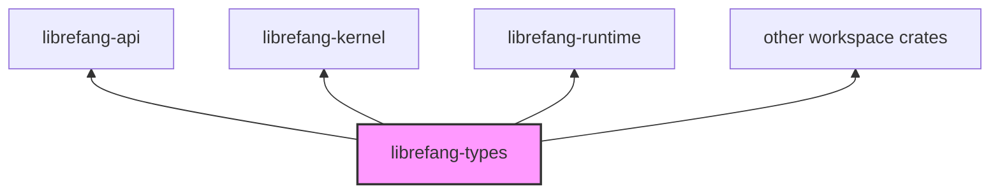

# Other — librefang-types

# librefang-types

Core type definitions for the LibreFang Agent OS. Every other workspace crate depends on this one. It defines the shared data structures used across the kernel, runtime, memory substrate, and wire protocol. It contains **no business logic** — only pure types, serde derives, and small helper functions (under five lines).

## Position in the Dependency Graph

```mermaid
graph BT
    types["librefang-types"]
    api["librefang-api"]
    kernel["librefang-kernel"]
    runtime["librefang-runtime"]
    other["other workspace crates"]

    types --> api
    types --> kernel
    types --> runtime
    types --> other

    style types fill:#f9f,stroke:#333,stroke-width:2px
```

`librefang-types` sits at the **bottom** of the workspace dependency DAG. It imports no other `librefang-*` crate. If you need a type to be visible across two or more crates, it belongs here. If it's only used in one consumer, it belongs in that consumer.

## Public Modules

| Module | Domain |
|---|---|
| `agent` | Agent identity and descriptor types |
| `approval` | Human-in-the-loop approval workflows |
| `capability` | Agent permission and capability tokens |
| `comms` | Inter-agent communication types |
| `config` | Kernel and runtime configuration (`KernelConfig` and friends) |
| `error` | `LibreFangError` and domain-specific error enums |
| `event` | Event types emitted by the kernel and runtime |
| `goal` | Goal and objective tracking |
| `i18n` | Internationalization types |
| `manifest_signing` | Manifest signing and verification types |
| `media` | Media content types |
| `memory` | Memory substrate types |
| `message` | Message types for the wire protocol |
| `model_catalog` | Model catalog and registry types |
| `oauth` | OAuth credential and flow types |
| `registry_schema` | Registry schema definitions |
| `scheduler` | Task scheduler types |
| `serde_compat` | Serde compatibility helpers |
| `subagent` | Sub-agent spawning and management types |
| `taint` | Taint tracking types |
| `tool` | Tool definition and invocation types |
| `tool_class` | Tool classification types |

## Constants

- **`VERSION: &str`** — The workspace version string, set at compile time from `CARGO_PKG_VERSION`.

## Dependencies

External only. No workspace crate dependencies.

`serde`, `serde_json`, `chrono`, `uuid`, `thiserror`, `dirs`, `toml`, `schemars`, `async-trait`, `ed25519-dalek`, `sha2`, `hex`, `zeroize`, `fluent`, `unic-langid`, `regex-lite`, `tracing`, `url`.

Dev dependencies: `rmp-serde`, `tempfile`.

## Adding a New Type

1. **Pick the right module.** Place the type under the matching submodule listed above. If no module fits, ask: is this truly a cross-crate type? If not, put it in the consuming crate instead.
2. **Derive the standard quartet:** `Debug`, `Clone`, `Serialize`, `Deserialize`. Add `PartialEq`, `Eq`, or `Hash` only when a downstream consumer requires them.
3. **OpenAPI surface types:** also derive `utoipa::ToSchema`.
4. **Configuration types:** also derive `schemars::JsonSchema`. This drives the kernel-config golden fixture.
5. **Prompt-bound collections:** use `BTreeMap` / `BTreeSet`, never `HashMap` / `HashSet`. Deterministic ordering matters for LLM prompts (ref #3298).

## Adding a Configuration Field

Every field added to a config struct (e.g. `KernelConfig`) must follow all four steps:

1. **Add the field** with `#[serde(default)]` for forward-compatibility with existing TOML files.
2. **Update the `Default` impl.** The build will break if you forget.
3. **Add a doc comment.** `schemars` surfaces doc comments as the field's `description` in the generated JSON Schema.
4. **Regenerate the golden fixture** in `librefang-api`. CI will fail otherwise — see the schema-mirror invariant below.

## Schema-Mirror Invariant

`librefang-types` defines the schema, but the golden-file guard (`kernel_config_schema_matches_golden_fixture`) lives in `librefang-api`'s test suite. The canonical OpenAPI and TOML example baselines are tracked under `xtask/baselines/`.

Any change to a `KernelConfig` field — addition, rename, or type change — requires regenerating the golden fixture in `api/tests`.

CI enforces this via the **changed-lanes rule**: a `librefang-types`-only PR automatically pulls `librefang-api` into the affected test set. The test suite detects schema drift and fails the build. Do not try to bypass this.

## Error Types

This crate exports `LibreFangError` and related error enums. The project is migrating away from `Result<_, String>` and `anyhow::Error` in trait boundaries (refs #3541, #3711). New error variants belong in this crate, not as ad-hoc `String` values in consumer code.

When adding a new variant:
- **Preserve the `source()` chain** (ref #3745).
- Use `#[from]` on a wrapped enum — this is the standard idiom for automatic `From` impls that maintain the error chain.
- Derive `thiserror::Error` with appropriate `#[error(...)]` attributes.

## Hard Rules (Taboos)

| Rule | Reason |
|---|---|
| No `tokio` | Sync types only. Async runtime belongs in consumers. |
| No `reqwest` | HTTP client code belongs in consumers. Types are data-only. |
| No `librefang-*` imports | This crate is the bottom of the DAG. Reverse the dependency instead. |
| No function bodies longer than ~5 lines | If you're writing logic, it belongs in a consumer crate. |
| No `HashMap`/`HashSet` for prompt-bound fields | Use `BTreeMap`/`BTreeSet` for deterministic ordering (#3298). |
| No silently dropping serde fields | Use `#[serde(default)]` or let it fail at deserialization time. |