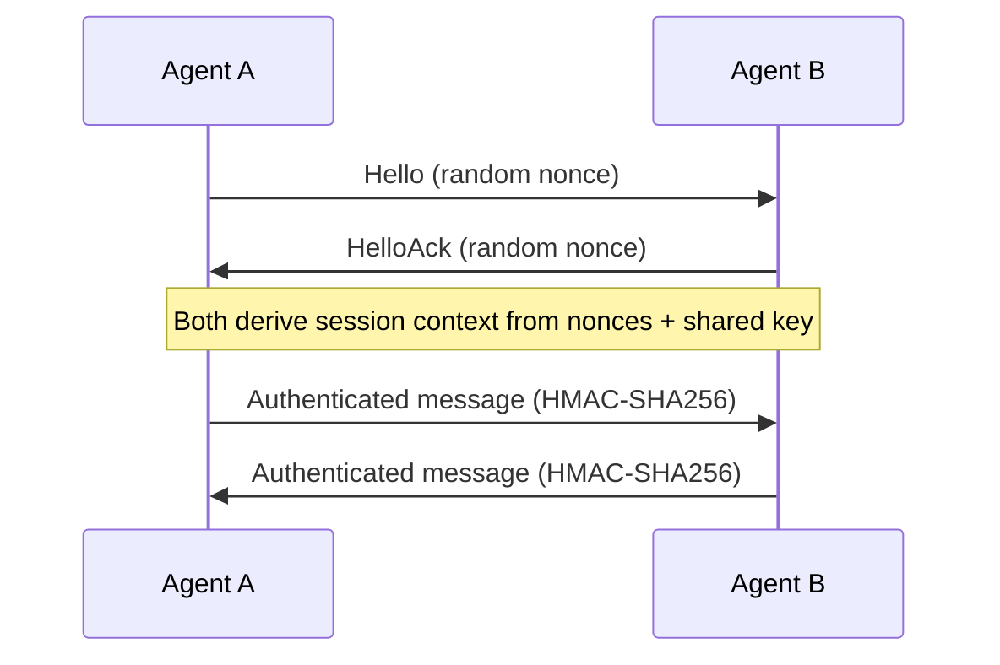

# Other — librefang-wire

# librefang-wire

Agent-to-agent networking layer for the LibreFang Protocol (OFP).

## Purpose

`librefang-wire` implements the wire protocol that allows LibreFang agents to communicate with each other over the network. It handles message serialization, framing, cryptographic authentication, and connection lifecycle management. This crate sits between the high-level agent logic and the raw TCP/Tokio transport, providing a typed, authenticated, and async-ready messaging layer.

## Role in the System

```
┌─────────────────┐
│  Agent Logic     │
│  (application)   │
└────────┬────────┘
         │  calls
┌────────▼────────┐
│ librefang-wire  │  ← this crate
│ (OFP messaging) │
└────────┬────────┘
         │  uses
┌────────▼────────┐
│ librefang-types │  shared message & error types
└─────────────────┘
```

Other crates in the workspace depend on `librefang-wire` to send and receive OFP messages. The crate itself depends on `librefang-types` for shared type definitions (message envelopes, error codes, identifiers) and on Tokio for async I/O.

## Key Capabilities

The dependency list reveals the core concerns of this module:

### Message Authentication (HMAC-SHA256)

Every message on the wire is authenticated using HMAC with SHA-256. The `hmac`, `sha2`, and `subtle` crates work together for this:

- **`hmac` + `sha2`**: Compute HMAC-SHA256 digests over serialized message payloads.
- **`subtle`**: Constant-time comparison of MAC tags to prevent timing side-channel attacks during verification.
- **`hex`**: Encode/decode MAC tags for wire transmission.

Agents share a pre-shared key. The sender computes a MAC over the message body and attaches it; the receiver recomputes and verifies in constant time before accepting the message.

### Concurrent Connection Tracking

The `dashmap` dependency indicates that the module maintains a concurrent map of active connections or pending handshakes. This allows multiple agents to connect simultaneously without contention, as `DashMap` provides sharded internal locking.

### Serialization

Messages are serialized to JSON via `serde` and `serde_json`. This keeps the protocol human-readable during development and simplifies interop, at the cost of some bandwidth efficiency.

### Unique Identification

- **`uuid`**: Generates unique message IDs for request-response correlation and deduplication.
- **`chrono`**: Timestamps for message expiry, replay protection, and logging.

### Error Handling

`thiserror` provides typed, ergonomic error enums for protocol-level failures — malformed frames, authentication failures, timeouts, and unexpected message types.

### Observability

`tracing` spans are embedded throughout the networking code so that every message send, receive, and authentication event can be correlated in structured logs.

## Protocol Handshake

Based on the dependencies, the expected connection flow is:



1. **Hello exchange** — Each agent generates a random nonce (`rand`) and sends it to the peer. This ensures freshness and prevents replay.
2. **Session derivation** — Both agents use the exchanged nonces along with the pre-shared key to compute a session-specific HMAC key.
3. **Steady-state messaging** — All subsequent messages carry an HMAC computed with the session key. The receiver verifies in constant time (`subtle`) before processing.

## Usage from Other Crates

Other workspace members bring in `librefang-wire` as a dependency and use it to establish authenticated channels between agents. The `async-trait` dependency suggests that the crate exposes trait-based interfaces for transport abstraction, allowing tests or alternative transports to be swapped in.

The typical integration pattern is:

1. Create a transport (likely a Tokio TCP stream wrapper).
2. Perform the OFP handshake to establish a session.
3. Send and receive typed messages from `librefang-types`, with authentication handled transparently by this crate.
4. The concurrent connection map (`dashmap`) tracks active sessions internally.

## Testing

The `tokio-test` dev-dependency is used for writing async tests that exercise the handshake, message round-tripping, and authentication failure paths without requiring a live network.