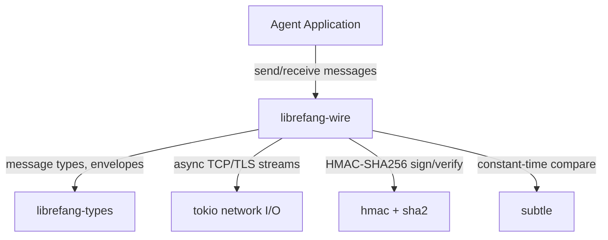

# Other — librefang-wire

# librefang-wire

LibreFang Protocol (OFP) — agent-to-agent networking.

## Purpose

`librefang-wire` is the networking layer responsible for establishing, authenticating, and maintaining communication channels between LibreFang agents. It implements the LibreFang Protocol (OFP), handling message framing, serialization, cryptographic authentication, and connection lifecycle management.

This crate sits between the high-level agent logic and the raw transport layer, providing a secure and structured way for distributed agents to exchange data.

## Architecture



## Key Responsibilities

### Message Authentication

The module uses **HMAC-SHA256** to sign and verify every message exchanged between agents. This ensures:

- **Integrity** — messages cannot be tampered with in transit without detection
- **Authenticity** — only agents sharing the pre-shared key can produce valid signatures
- **Replay protection** — message identifiers (`uuid`) and timestamps (`chrono`) support replay-attack mitigation

The `subtle` crate is used for constant-time comparisons during signature verification, preventing timing side-channel attacks.

### Serialization

Messages are serialized to **JSON** via `serde` and `serde_json`. This choice prioritizes debuggability and interoperability over wire efficiency, consistent with OFP's design as an agent protocol where messages are relatively infrequent and human-readability is valued.

### Async I/O

All networking is built on **tokio**, making the module fully non-blocking. Connection handling, reading, and writing all operate within tokio's async runtime.

### Concurrent State

The `dashmap` dependency indicates that the module maintains shared, concurrent state — likely tracking active connections, session identifiers, or peer registries — accessible safely from multiple tokio tasks without requiring a dedicated actor or mutex.

## Dependencies — What They Tell Us

| Dependency | Role |
|---|---|
| `librefang-types` | Shared message types, protocol enums, and data structures used across all LibreFang crates |
| `tokio` | Async runtime for non-blocking network I/O |
| `serde` / `serde_json` | Message serialization and deserialization |
| `uuid` | Unique message and session identifiers |
| `chrono` | Timestamps for message freshness and logging |
| `thiserror` | Ergonomic error type definitions |
| `tracing` | Structured logging and span-based diagnostics |
| `async-trait` | Async trait definitions for transport abstractions |
| `hmac` / `sha2` | HMAC-SHA256 message signing and verification |
| `hex` | Hex encoding for signature representation |
| `subtle` | Constant-time cryptographic comparisons |
| `rand` | Random number generation for nonces or challenge-response handshakes |
| `dashmap` | Lock-free concurrent hashmap for shared connection state |

## Relationship to Other Crates

```
librefang-types  ←  librefang-wire  ←  [agent crates]
```

- **Depends on `librefang-types`**: Wire reuses the shared protocol types (message envelopes, status codes, agent identifiers) defined in the types crate rather than defining its own.
- **Consumed by agent crates**: Higher-level agent implementations depend on `librefang-wire` to handle all networking concerns, keeping agent logic focused on game state and behavior.

## Testing

The `tokio-test` dev-dependency enables writing async tests that exercise connection establishment, message exchange, and authentication flows without requiring a live network, using tokio's test utilities for time control and task spawning.

## Security Considerations

- All signature comparisons use constant-time operations via `subtle` to prevent timing attacks.
- HMAC keys should be provisioned out-of-band and never transmitted over the wire.
- UUIDs provide per-message uniqueness; combined with timestamps, they enable recipients to detect and reject replayed messages.