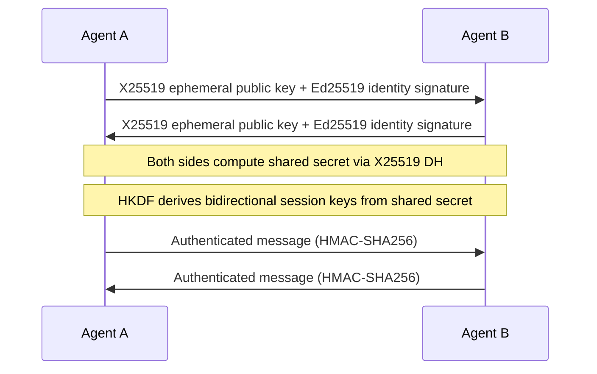

# Other — librefang-wire

# librefang-wire

LibreFang Protocol (OFP) — agent-to-agent networking over encrypted, authenticated connections.

## Purpose

`librefang-wire` implements the wire protocol that LibreFang agents use to communicate with each other. It handles the full lifecycle of an agent-to-agent session: cryptographic handshake, session key derivation, message framing, serialization, and authenticated encryption of payloads.

Every message sent between agents flows through this crate.

## Cryptographic Protocol

The crate implements a Noise-like pattern built from well-known primitives:

| Stage | Primitive | Crate |
|---|---|---|
| Key exchange | X25519 ECDH | `x25519-dalek` |
| Identity signatures | Ed25519 | `ed25519-dalek` |
| Session key derivation | HKDF-SHA256 | `hkdf` |
| Message authentication | HMAC-SHA256 | `hmac` + `sha2` |
| Constant-time MAC comparison | `subtle::ConstantTimeEq` | `subtle` |

### Handshake Flow



Each side generates an ephemeral X25519 keypair for forward secrecy. Ed25519 signatures bind the ephemeral keys to long-term agent identities. The resulting shared secret feeds into HKDF to produce two session keys (one per direction), which are then used to HMAC every framed message.

## Key Dependencies and Their Roles

### Concurrency and I/O

- **`tokio`** — All I/O is async. The crate provides `async trait` interfaces for reading and writing framed messages over any `AsyncRead`/`AsyncWrite` transport.
- **`dashmap`** — Manages concurrent session state (active handshakes, established sessions, key material) without requiring a dedicated mutex.

### Serialization

- **`serde` / `serde_json`** — Message payloads are JSON-encoded before framing. This keeps the wire format debuggable and language-agnostic while relying on serde for typed deserialization on the receiving end.
- **`base64` / `hex`** — Binary data (public keys, signatures, MACs) is encoded in headers or payload fields using one of these encodings.

### Identification and Timing

- **`uuid`** — Every session and every message carries a unique identifier for correlation and deduplication.
- **`chrono`** — Timestamps in handshake messages for replay-window enforcement.

### Observability

- **`tracing`** — Structured logging of handshake progress, session creation, and error conditions. Use `RUST_LOG=librefang_wire=debug` to follow protocol events.

### Error Handling

- **`thiserror`** — Typed errors for handshake failures, MAC verification failures, deserialization errors, and session-not-found conditions. Consumers can match on specific variants without parsing strings.

## Relationship to Other Crates

```
librefang-types
       │
       ▼
 librefang-wire
       │
       ▼
  (agent crates)
```

- **`librefang-types`** — Provides shared domain types (agent IDs, role definitions, policy objects) that appear as message payloads. `librefang-wire` serializes and deserializes these types but does not define them.
- **Agent crates** — Consume `librefang-wire` to establish sessions and exchange typed messages with peer agents. They are responsible for transport-layer concerns (TCP, TLS, Unix sockets) and pass a byte stream into this crate's framing layer.

## Error Model

All fallible operations return typed errors via `thiserror`. The main error categories are:

- **Handshake errors** — Invalid signature, expired timestamp, unsupported protocol version.
- **MAC errors** — HMAC verification failed (tampering, wrong key, replay). Constant-time comparison via `subtle` prevents timing side-channels.
- **Serialization errors** — Malformed JSON or unexpected payload structure.
- **Session errors** — Unknown session ID, expired session, handshake not completed.

## Security Considerations

- **Forward secrecy** — Ephemeral X25519 keys are discarded after the handshake. Compromising a long-term identity key does not reveal past session keys.
- **Replay protection** — Message UUIDs and timestamps allow receivers to detect and reject duplicated or stale messages.
- **Constant-time MAC comparison** — The `subtle` crate ensures HMAC verification does not leak timing information.
- **Random generation** — All key material is generated using `rand_core` with the `getrandom` feature, pulling from the OS CSPRNG.