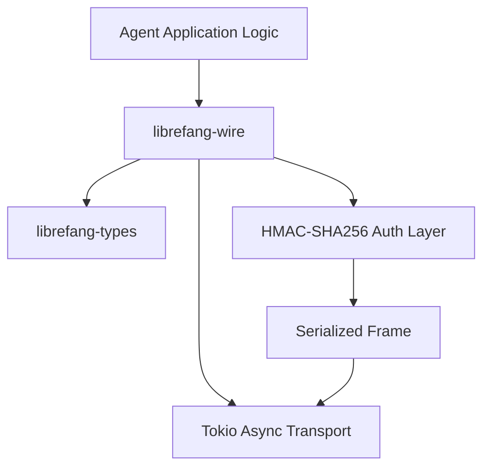

# Other — librefang-wire

# librefang-wire

Agent-to-agent networking layer for the LibreFang Protocol (OFP). Handles authenticated message framing, serialization, and transport over asynchronous connections.

## Purpose

This crate implements the wire protocol that LibreFang agents use to communicate with each other. It is responsible for:

- **Message framing** — delineating discrete protocol messages on a byte stream
- **Authentication** — HMAC-SHA256 message authentication with constant-time verification
- **Serialization** — encoding and decoding structured messages via JSON
- **Connection management** — tracking active peer connections with concurrent state

Every agent-to-agent exchange in LibreFang flows through this module.

## Architecture



Messages originate from application logic, pass through serialization and HMAC signing, and are transmitted over a Tokio-backed transport. Incoming messages follow the reverse path: read from transport, verify HMAC, deserialize, and dispatch.

## Key Dependencies and Their Roles

| Dependency | Role |
|---|---|
| `librefang-types` | Shared type definitions — message enums, error types, and protocol constants used across all LibreFang crates |
| `tokio` | Async runtime for non-blocking I/O on TCP or similar transports |
| `serde` / `serde_json` | Message serialization to JSON for wire encoding |
| `hmac` / `sha2` / `subtle` | HMAC-SHA256 computation for message authentication; `subtle` provides constant-time comparison to prevent timing attacks during verification |
| `hex` | Hex encoding/decoding of HMAC digests and keys |
| `rand` | Cryptographically secure random number generation, used for nonces or session challenges |
| `uuid` | Unique identifiers for messages and agent sessions |
| `chrono` | Timestamp generation for message headers |
| `dashmap` | Lock-free concurrent hashmap for tracking active peer connections and session state |
| `async-trait` | Async trait definitions for transport abstraction |
| `thiserror` | Ergonomic error type derivation |
| `tracing` | Structured logging and diagnostic spans |

## Security Model

Authentication uses **HMAC-SHA256**. Each message carries a keyed hash that the recipient verifies before processing. The `subtle` crate ensures that HMAC comparison runs in constant time, preventing timing side-channels that could leak information about valid digests.

Key material and random values are generated via `rand`, which should be configured to use a secure RNG backend at the application level.

## Relationship to Other Crates

- **`librefang-types`** — this crate consumes the shared types but does not define protocol-level data structures itself. Any new message kind or error variant belongs in `librefang-types`.
- **Application crates** — consume `librefang-wire` to open authenticated channels to peers. They register handlers for deserialized messages and provide the HMAC key material.

## Testing

Tests use `tokio-test` (declared in `[dev-dependencies]`) for async test scaffolding. Run the test suite with:

```bash
cargo test -p librefang-wire
```