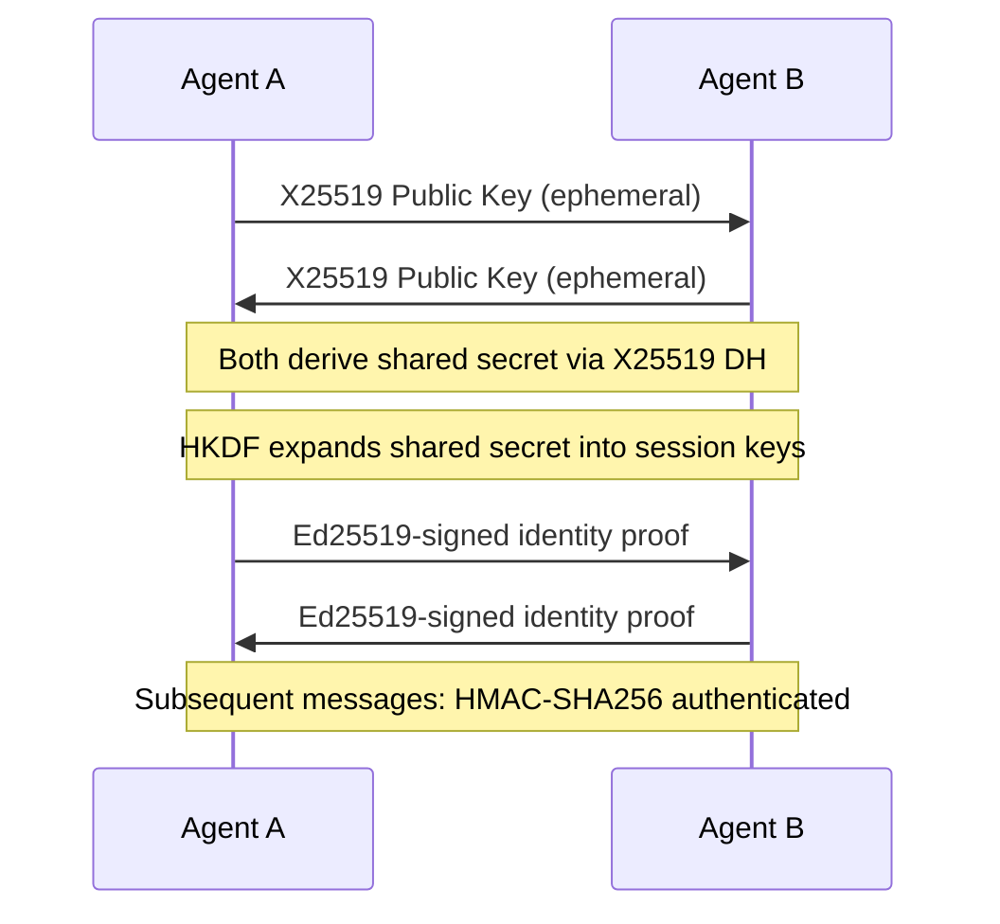
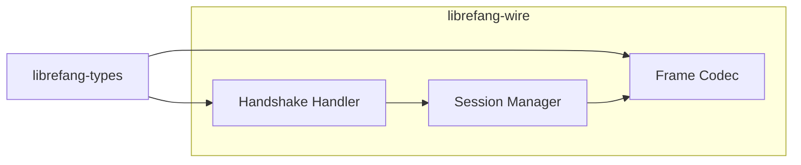

# Other — librefang-wire

# librefang-wire

Agent-to-agent networking layer for the LibreFang Protocol (OFP). This crate handles authenticated, encrypted communication between LibreFang agents over the wire.

## Purpose

`librefang-wire` is the transport security and message framing layer of the LibreFang system. It provides:

- **Authenticated key exchange** between agents using X25519 (Elliptic Curve Diffie-Hellman)
- **Identity verification** via Ed25519 digital signatures
- **Session key derivation** through HKDF
- **Message authentication** using HMAC-SHA256
- **Constant-time comparison** (via `subtle`) to prevent timing attacks

Every message that crosses the network between agents passes through this crate's serialization, signing, and verification pipeline.

## Cryptographic Protocol

The dependency chain reveals a clear cryptographic handshake and messaging pattern:

### Handshake Phase

1. **Key Exchange** — Each agent generates an ephemeral X25519 keypair (`x25519-dalek`). Public keys are exchanged to compute a shared secret on both sides.
2. **Key Derivation** — The raw shared secret is fed through HKDF (`hkdf` + `sha2`) to produce symmetric session keys for encryption and MAC operations.
3. **Identity Binding** — Each agent signs the handshake transcript with its long-lived Ed25519 identity key (`ed25519-dalek`), proving ownership of the static identity claimed during the exchange.
4. **Timing-Safe Verification** — All signature and MAC comparisons use `subtle` for constant-time evaluation, preventing timing side-channels.

### Message Phase

After handshake completion, all messages are authenticated with HMAC-SHA256 (`hmac` + `sha2`). Message integrity is verified before any application-level processing occurs.

## Serialization and Framing

Messages are serialized with `serde` and `serde_json` before transmission. The crate defines the wire format for all OFP message types, relying on `librefang-types` for shared data structures.

- **`uuid`** — Correlation IDs for request/response matching across agents
- **`chrono`** — Timestamps for message ordering, expiry, and replay protection
- **`base64`** / **`hex`** — Encoding helpers for binary payloads in JSON-safe representations

## Runtime Model

Built entirely on `tokio` with `async-trait` for trait-based async interfaces. Connection state, session tracking, and key material are held in concurrent data structures provided by `dashmap`, supporting multiple simultaneous agent connections without global locks.

## Error Handling

Uses `thiserror` to define a structured error type hierarchy covering:

- Handshake failures (key exchange errors, signature verification failures)
- Framing errors (malformed messages, deserialization failures)
- Session errors (expired sessions, unknown peers)
- Cryptographic errors (HMAC mismatch, invalid key material)

All errors implement `std::error::Error` and carry enough context for callers to distinguish transient from fatal failures.

## Observability

Instrumented with `tracing` spans and events at key points:

- Connection establishment and teardown
- Handshake progress and completion
- Message send/receive with size and timing metadata
- Error conditions with diagnostic context

Consumers should initialize a `tracing` subscriber to capture this output.

## Relationship to Other Crates

| Crate | Relationship |
|---|---|
| `librefang-types` | Consumes shared types (message enums, agent IDs, configuration structs). This is the only direct dependency within the workspace. |
| Downstream consumers | Higher-level crates (e.g., agent runtimes, orchestrators) depend on `librefang-wire` for secure channels without handling crypto primitives directly. |

## Security Considerations

- **Ephemeral keys** — X25519 keypairs are generated per-session via `rand_core`/`getrandom`, providing forward secrecy.
- **No custom crypto** — All cryptographic operations delegate to well-audited crates (`ed25519-dalek`, `x25519-dalek`, `hmac`, `sha2`, `hkdf`).
- **Constant-time operations** — The `subtle` crate ensures secret comparisons do not leak information through timing.
- **Session key isolation** — HKDF domain-separates derived keys so session keys cannot be confused across different handshake instances.