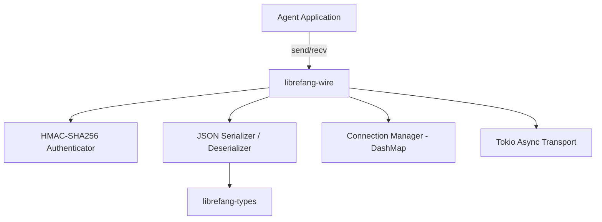

# Other — librefang-wire

# librefang-wire

Agent-to-agent networking layer implementing the **LibreFang Protocol (OFP)** — responsible for authenticating, serializing, transporting, and dispatching messages between LibreFang agents.

## Purpose

`librefang-wire` is the networking backbone of the LibreFang distributed system. Every agent communicates exclusively through this crate. It provides:

- **Authenticated message framing** — every message is HMAC-signed and verified, preventing tampering and impersonation on the wire.
- **Async transport** — built on Tokio, the crate exposes non-blocking read/write interfaces suitable for high-concurrency agent deployments.
- **Concurrent connection management** — uses `DashMap` for lock-free tracking of peer connections and session state across Tokio tasks.
- **Structured serialization** — all payloads are JSON-encoded via `serde_json`, enabling interoperability and human-readable debugging.

## Architecture

The crate sits between the agent application logic and the raw async I/O layer. Messages flow downward through authentication and serialization before hitting the network, and arrive upward through deserialization and verification before being dispatched to the application.

## Key Dependency Roles

| Dependency | Role in `librefang-wire` |
|---|---|
| `librefang-types` | Shared domain types (messages, commands, responses) serialized on the wire |
| `tokio` | Async runtime — TCP streams, I/O drivers, task spawning for concurrent peer handling |
| `serde` / `serde_json` | Derive-based serialization of `librefang-types` to/from JSON frames |
| `uuid` | Correlation IDs for request/response matching and session identifiers |
| `chrono` | Timestamps for message headers, replay-protection windows, and logging |
| `hmac` / `sha2` / `subtle` | HMAC-SHA256 message authentication with constant-time comparison to prevent timing attacks |
| `hex` | Encoding/decoding of HMAC digests for header transport |
| `thiserror` | Typed error enums for wire-level failures (authentication, framing, I/O) |
| `tracing` | Structured diagnostic spans for connection lifecycle and message processing |
| `async-trait` | Trait definitions for transport abstraction and handler interfaces |
| `dashmap` | Lock-free concurrent map for tracking active peer connections and routing tables |

## Security Model

Message authentication is the core security guarantee. The `hmac`, `sha2`, and `subtle` crates work together:

1. **Signing** — An HMAC-SHA256 digest is computed over the serialized message body using a pre-shared key.
2. **Transport** — The digest is attached (via `hex` encoding) as a header or wrapper around the payload.
3. **Verification** — The receiver recomputes the digest and compares it in **constant time** using `subtle`, preventing timing side-channel attacks.
4. **Rejection** — Mismatched digests result in an immediate authentication error (defined via `thiserror`) and connection termination.

This ensures that only agents possessing the correct shared secret can inject or modify messages on the wire.

## Relationship to the Wider Codebase

`librefang-wire` is a **leaf library** in the dependency graph — it depends on `librefang-types` but is consumed by higher-level agent and server binaries. No other crate calls into it; instead, the runtime agent executable wires it into its event loop.

The contract is:

- **Input**: `librefang-types` message structs.
- **Output**: Authenticated, serialized byte frames over async TCP (or equivalent Tokio transport).
- **Inbound**: Raw bytes from peers, deserialized and verified into typed `librefang-types` messages delivered to the application.

## Error Handling

All fallible operations produce typed errors via `thiserror` derive macros. Expected error categories include:

- **Authentication failures** — invalid or missing HMAC digests.
- **Framing errors** — malformed message boundaries or incomplete reads.
- **Serialization errors** — JSON decode failures from malformed payloads.
- **I/O errors** — wrapped `tokio` / `std::io` errors from the transport layer.

Consumers should match on these variants to decide between retry, reconnect, or shutdown behavior.

## Logging and Observability

The crate uses `tracing` spans and events throughout the connection lifecycle. Key instrumentation points include:

- Peer connection established / dropped.
- Message sent / received with correlation IDs (`uuid`).
- Authentication successes and failures.
- Serialization errors with malformed data summaries.

Integrate with the agent's `tracing` subscriber to capture wire-level diagnostics.