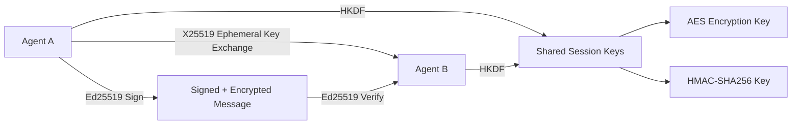

# Other — librefang-wire

# librefang-wire

Agent-to-agent networking layer for the LibreFang Protocol (OFP). This crate implements the secure wire protocol that LibreFang agents use to communicate with each other, providing authenticated and encrypted messaging built on modern cryptographic primitives.

## Purpose

LibreFang is an agent-based system where nodes need to exchange messages over untrusted networks. `librefang-wire` defines how those messages are framed, encrypted, authenticated, and delivered. It is the transport-level protocol crate—higher-level coordination logic lives elsewhere, while this module handles the raw mechanics of getting bytes securely from one agent to another.

## Cryptographic Architecture

The protocol combines several well-established primitives into a cohesive secure channel:



| Primitive | Library | Role |
|---|---|---|
| X25519 | `x25519-dalek` | Ephemeral Diffie-Hellman key exchange to establish shared secrets |
| Ed25519 | `ed25519-dalek` | Long-term identity signing and message authentication |
| HKDF | `hkdf` | Key derivation from shared secrets into session encryption/MAC keys |
| HMAC-SHA256 | `hmac` + `sha2` | Message authentication codes for encrypted payloads |
| Constant-time compare | `subtle` | Timing-safe comparison to prevent side-channel attacks on MACs |

## Key Dependencies

### Internal

- **`librefang-types`** — Shared type definitions (message envelopes, agent identifiers, protocol constants) used across all LibreFang crates.

### External (notable)

| Dependency | Why it's here |
|---|---|
| `tokio` | Async I/O for non-blocking network operations |
| `serde` / `serde_json` | Message serialization for the wire format |
| `dashmap` | Lock-free concurrent map, used for tracking active sessions/connections |
| `thiserror` | Ergonomic error types for protocol failures |
| `tracing` | Structured logging of protocol events (handshakes, failures, etc.) |
| `rand_core` | Cryptographically secure randomness for key generation |
| `uuid` / `chrono` | Message IDs and timestamps |
| `base64` / `hex` | Encoding utilities for key fingerprints and debug output |

## Protocol Lifecycle

### 1. Handshake

Two agents perform an authenticated key exchange:

1. Each agent generates an **ephemeral X25519** keypair for forward secrecy.
2. Agents exchange ephemeral public keys, along with their **long-term Ed25519** public keys and a signature binding the ephemeral key to their identity.
3. Both sides compute a shared secret via X25519 and derive session keys using **HKDF-SHA256**.
4. Derived keys include separate keys for encryption and MAC operations.

### 2. Secure Messaging

Once a session is established:

- Outgoing messages are serialized (JSON), encrypted, and tagged with an HMAC.
- Incoming messages are MAC-verified (constant-time comparison), decrypted, and deserialized.
- Each message carries a UUID and timestamp for replay protection and ordering.

### 3. Session Management

Active sessions are tracked in a `DashMap`-backed structure, allowing concurrent access from multiple Tokio tasks without global locking.

## Integration with LibreFang

This crate sits between the raw transport layer (TCP/TLS handled elsewhere) and the application logic:

```
┌──────────────────────┐
│  Application Logic   │  (coordination, tasking, reporting)
├──────────────────────┤
│  librefang-wire      │  ← YOU ARE HERE
├──────────────────────┤
│  librefang-types     │  (shared types and definitions)
├──────────────────────┤
│  Transport (TCP/TLS) │  (system-level networking)
└──────────────────────┘
```

Other LibreFang components depend on `librefang-wire` to handle the details of secure agent communication without needing to understand the underlying cryptography.

## Error Handling

Protocol errors are defined using `thiserror` and cover:

- **Handshake failures** — invalid signatures, unsupported protocol versions, key exchange errors
- **Message integrity failures** — HMAC mismatches, replay detection
- **Serialization errors** — malformed messages that fail JSON deserialization
- **Session errors** — unknown session IDs, expired sessions

All errors implement `std::error::Error` and carry context about what went wrong.

## Security Considerations

- **Forward secrecy** is achieved through ephemeral X25519 keypairs that are discarded after session establishment.
- **Identity binding** ensures an attacker cannot substitute their own ephemeral key without detection, since it is signed by the long-term Ed25519 identity key.
- **Timing-safe MAC comparison** via the `subtle` crate prevents timing side-channel attacks on authentication tags.
- **Key separation** through HKDF ensures encryption keys and MAC keys are independently derived, preventing cross-protocol attacks.

## Development

To run tests:

```bash
cargo test -p librefang-wire
```

The `tempfile` dev-dependency is used for test fixtures involving disk-backed session state or key material.