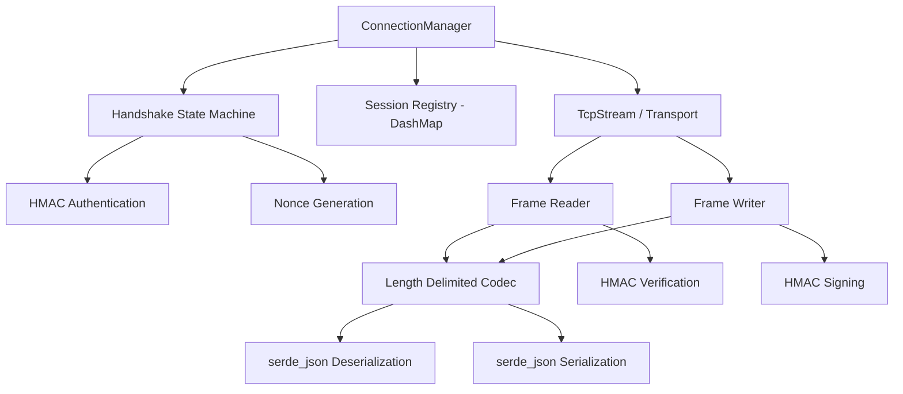

# Other — librefang-wire

# librefang-wire

Agent-to-agent networking layer for the LibreFang Protocol (OFP).

## Purpose

`librefang-wire` implements the network transport and message-framing layer that allows LibreFang agents to communicate with each other. It owns the wire format — how messages are serialized, framed, authenticated, and delivered over async TCP connections. Every packet that crosses the network between two agents passes through this crate.

## Position in the Codebase

```
┌──────────────────┐      ┌──────────────────┐
│  librefang-types │      │   higher-level   │
│  (shared types)  │◄─────┤  agent crates    │
└────────┬─────────┘      └────────▲─────────┘
         │                         │
         ▼                         │
┌──────────────────┐               │
│ librefang-wire   │◄──────────────┘
│ (this crate)     │
└──────────────────┘
```

`librefang-types` supplies shared data structures (message enums, error types, configuration structs). `librefang-wire` consumes those types and adds the transport mechanics — connection lifecycle, framing, HMAC authentication, and message I/O. Higher-level agent crates depend on `librefang-wire` to open connections, send typed messages, and receive inbound traffic without dealing with raw byte streams.

## Key Dependency Choices

| Dependency | Role in this crate |
|---|---|
| **tokio** | Async runtime for non-blocking TCP I/O and task spawning |
| **serde / serde_json** | Message serialization to/from the JSON-based wire format |
| **hmac / sha2 / subtle** | HMAC-SHA256 message authentication with constant-time signature comparison to prevent timing attacks |
| **uuid** | Correlation IDs and session identifiers embedded in message frames |
| **chrono** | Timestamps in message headers for replay protection and logging |
| **dashmap** | Lock-free concurrent map for tracking active connections and pending handshakes |
| **rand** | Cryptographic randomness for nonce generation during authentication |
| **thiserror** | Ergonomic error type definitions |
| **tracing** | Structured logging of connection events, message flow, and errors |
| **async-trait** | Async trait objects for abstracting the transport layer (enables mock transports in tests) |

## Wire Protocol Design

The OFP wire format is JSON-framed over TCP:

```
┌──────────────┬──────────────┬────────────────────────┬─────────────┐
│ length (u32) │  HMAC (hex)  │     JSON payload       │  newline    │
│  4 bytes     │  64 bytes    │     N bytes             │  1 byte     │
└──────────────┴──────────────┴────────────────────────┴─────────────┘
```

- **Length header** — big-endian `u32` indicating total bytes of the HMAC + payload + newline that follow. Allows the receiver to read an exact frame without buffering ambiguity.
- **HMAC-SHA256** — hex-encoded 32-byte MAC computed over the JSON payload using a pre-shared key. Verified with `subtle::ConstantTimeEq` to avoid timing side-channels.
- **JSON payload** — a `serde_json::Value` (or a typed OFP message struct from `librefang-types`) carrying the actual message content.
- **Newline** — trailing `\n` delimiter as a secondary frame boundary for line-based debugging tools.

## Authentication Handshake

Agents authenticate each other before exchanging operational messages. The handshake uses HMAC to prove possession of a shared secret without transmitting it:

```
Agent A                          Agent B
  │                                │
  │──── HELLO (nonce_A) ─────────►│
  │                                │
  │◄─── HELLO (nonce_B) ──────────│
  │                                │
  │──── AUTH(hmac(key, nonce_B)) ─►│
  │                                │
  │◄─── AUTH(hmac(key, nonce_A)) ──│
  │                                │
  │──── READY ────────────────────►│
  │                                │
  │◄─── READY ─────────────────────│
  │                                │
  ╵        (normal messaging)      ╵
```

Nonces are generated with `rand`. Each side computes `HMAC-SHA256(key, peer_nonce)` and sends the result. The peer independently computes the same HMAC and compares in constant time. A mismatch closes the connection.

## Architecture



### Core components

- **ConnectionManager** — Top-level entry point. Accepts inbound connections and initiates outbound ones. Owns the `DashMap` of active sessions keyed by `Uuid`.

- **Transport trait** (async) — Abstracts read/write operations over a byte stream. Production implementation wraps `tokio::net::TcpStream`. The trait boundary exists so tests can inject a mock transport without opening real sockets.

- **Frame reader / writer** — Handles the length-delimited encoding/decoding. Reads exactly `length` bytes from the stream, extracts the HMAC and payload, then deserializes. Writes construct the HMAC, prepend the length header, and flush.

- **Handshake state machine** — Drives the HELLO → AUTH → READY exchange. Tracks per-connection state (local nonce, remote nonce, whether the peer has authenticated) and rejects out-of-order or unexpected messages.

## Error Handling

Errors are consolidated into a single `WireError` enum (derived via `thiserror`), covering:

- I/O failures from the underlying TCP stream
- Frame-level errors (truncated reads, invalid length header)
- HMAC verification failures
- JSON deserialization errors
- Handshake protocol violations (unexpected message type, timeout)
- Connection-closed during read

All errors implement `std::error::Error` and carry enough context (peer address, session ID) for meaningful `tracing` spans.

## Usage from External Crates

```rust
use librefang_wire::ConnectionManager;
use librefang_types::OfpMessage;

// Start a listener
let manager = ConnectionManager::new(shared_secret);
let listener = manager.bind("0.0.0.0:9000").await?;

// Accept incoming connections (each gets its own task)
loop {
    let session = listener.accept().await?;
    let msg: OfpMessage = session.recv().await?;
    session.send(&response).await?;
}

// Connect outbound
let session = manager.connect("10.0.0.5:9000").await?;
session.send(&command).await?;
```

The `ConnectionManager` is constructed with a pre-shared secret key (`&[u8]`). All sessions spawned from that manager inherit the key for HMAC operations.

## Testing

The `tokio-test` dev-dependency enables synchronous-style tests for async code. The `Transport` trait allows tests to substitute an in-memory channel pair in place of a real TCP connection, making handshake logic, frame encoding, and HMAC verification fully testable without network infrastructure.