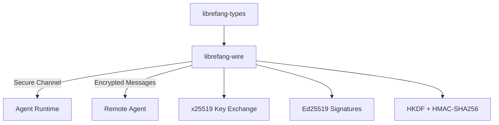

# Other — librefang-wire

# librefang-wire

LibreFang Protocol (OFP) — agent-to-agent secure networking layer.

## Purpose

`librefang-wire` implements the LibreFang Protocol, the wire-level communication framework that allows LibreFang agents to discover, authenticate, and communicate with each other over untrusted networks. It handles the full lifecycle of agent-to-agent connections: cryptographic handshake, session establishment, message framing, and authenticated transport.

This crate sits between `librefang-types` (which defines shared data structures) and the higher-level agent runtime, providing the secure channel that all inter-agent traffic flows through.

## Architecture

## Cryptographic Protocol

The module combines several well-established cryptographic primitives to establish authenticated, confidential channels between agents. Each dependency maps to a specific role in the protocol stack:

| Dependency | Role |
|---|---|
| `x25519-dalek` | Elliptic-curve Diffie-Hellman key agreement for session establishment |
| `ed25519-dalek` | Digital signatures for agent identity verification |
| `hkdf` | HMAC-based key derivation function to expand shared secrets into session keys |
| `hmac` + `sha2` | HMAC-SHA256 for message authentication and integrity |
| `subtle` | Constant-time comparison operations to prevent timing side-channel attacks |
| `rand_core` | Secure random number generation for key material and nonces |

### Handshake Flow

The cryptographic handshake follows an authenticated key exchange pattern:

1. **Identity Exchange** — Each agent presents an Ed25519 public key as its long-term identity.
2. **Key Agreement** — Both agents generate ephemeral X25519 keypairs and perform a Diffie-Hellman exchange to produce a shared secret.
3. **Key Derivation** — The shared secret is fed through HKDF to derive symmetric encryption keys and HMAC keys for the session.
4. **Signature Verification** — Each agent signs the handshake transcript with its Ed25519 private key, binding the ephemeral session to the long-term identity.
5. **Authenticated Transport** — All subsequent messages use the derived session keys with HMAC for authentication.

## Key Dependencies

### Async Runtime (`tokio`, `async-trait`)

All I/O operations are async. Connection handling, message reading, and writes are designed to run on the Tokio runtime without blocking. The `async-trait` crate enables trait definitions for async connection handlers and transport layers.

### Serialization (`serde`, `serde_json`, `base64`)

Wire messages are serialized as JSON for interoperability and debuggability. Base64 encoding is used where binary data (keys, signatures, ciphertext) needs to be embedded in JSON payloads.

### Concurrency (`dashmap`)

Active sessions and connection state are managed in concurrent data structures. `DashMap` provides a lock-free concurrent hashmap for tracking peer connections and routing messages without becoming a bottleneck under load.

### Error Handling (`thiserror`)

All fallible operations return structured error types. The crate defines domain-specific error enums covering handshake failures, authentication errors, serialization issues, and protocol violations.

### Observability (`tracing`)

Structured logging via `tracing` spans is used throughout — particularly around connection lifecycle events, handshake progress, and authentication outcomes. This enables production debugging without exposing sensitive key material.

## Relationship to librefang-types

`librefang-wire` depends on `librefang-types` for shared data structures — message envelopes, agent identifiers, and protocol constants. The wire crate adds the transport and security layer on top of those types, handling the mechanics of getting typed messages between agents safely.

## Relationship to the Workspace

As a library crate, `librefang-wire` is consumed by the agent executable or higher-level crates in the workspace. It exposes APIs for:

- Initiating outbound connections to peer agents
- Accepting and authenticating inbound connections
- Sending and receiving protocol messages over established sessions
- Managing the lifecycle of secure sessions

It does not depend on any other workspace crates besides `librefang-types`, keeping the networking layer cleanly separated from agent logic.