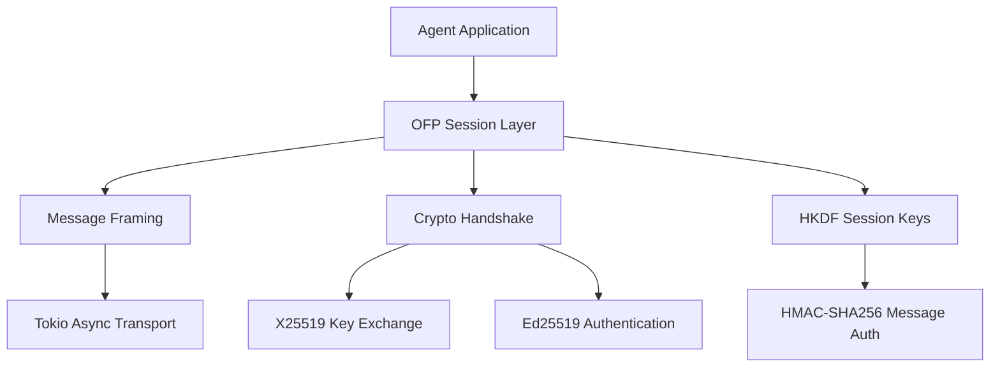

# Other — librefang-wire

# librefang-wire

LibreFang Protocol (OFP) — agent-to-agent networking.

## Overview

`librefang-wire` implements the LibreFang Protocol (OFP), the wire-level protocol used for secure communication between LibreFang agents. It provides message framing, serialization, cryptographic handshake, and authenticated channel management on top of async I/O.

Every agent-to-agent interaction in LibreFang flows through this crate: peer discovery handshakes, authenticated message exchange, session management, and encrypted payload transport.

## Architecture

## Cryptographic Protocol

The handshake and message authentication rely on a layered set of cryptographic primitives, all sourced from well-audited Rust crates:

| Primitive | Crate | Purpose |
|---|---|---|
| Ed25519 | `ed25519-dalek` | Agent identity signing and verification |
| X25519 | `x25519-dalek` | Ephemeral Diffie-Hellman key exchange |
| HKDF-SHA256 | `hkdf` + `sha2` | Deriving session keys from shared secrets |
| HMAC-SHA256 | `hmac` + `sha2` | Per-message authentication codes |
| Constant-time comparison | `subtle` | Timing-safe MAC/tag verification |

The handshake flow establishes a shared secret via X25519, authenticates both peers with Ed25519 signatures over the handshake transcript, and derives per-session symmetric keys via HKDF. All subsequent messages carry an HMAC tag verified in constant time.

## Key Dependencies and Their Roles

### Networking

- **`tokio`** — All I/O is async. Read and write operations on the transport are `tokio`-driven, allowing many concurrent agent sessions without blocking.
- **`async-trait`** — Trait definitions for transport abstractions and session handlers use `async fn` in trait methods.

### Serialization

- **`serde`** / **`serde_json`** — Message structures are serde-derived. JSON is used as the on-wire format for OFP control messages, making debugging straightforward while remaining interoperable.
- **`base64`** — Binary data (keys, signatures, ciphertext) is base64-encoded within JSON payloads.

### Concurrency

- **`dashmap`** — The session registry uses `DashMap` to manage active peer sessions across multiple Tokio tasks without a global mutex.

### Identity and Metadata

- **`uuid`** — Each session and message carries a unique identifier.
- **`chrono`** — Timestamps for message expiry, handshake freshness, and logging.
- **`librefang-types`** — Shared type definitions (agent IDs, protocol enums, error codes) that keep wire types consistent with the rest of the codebase.

## Error Handling

Errors are defined using `thiserror` and cover:

- Handshake failures (signature verification, unexpected message order)
- Transport errors (unexpected EOF, framing corruption)
- Cryptographic errors (invalid key material, MAC mismatch)
- Serialization errors (malformed JSON, invalid base64)

All errors implement `std::error::Error` and integrate with the `tracing` subsystem for structured logging.

## Relationship to Other Crates

- **`librefang-types`** — This crate consumes shared types but does not depend on higher-level crates. It is a leaf dependency in the protocol stack, ensuring that changes to application logic cannot break the wire protocol.

## Testing

The `tempfile` dev-dependency is used for integration tests that exercise session persistence and key storage against real filesystem paths, ensuring handshake material and session state survive across process restarts.