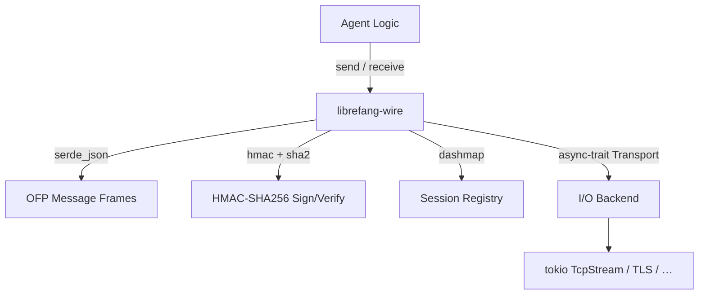

# Other — librefang-wire

# librefang-wire

Agent-to-agent networking layer for the LibreFang Protocol (OFP). Handles message framing, authenticated transport, and session management between LibreFang agents over the network.

## Overview

`librefang-wire` sits between the raw async I/O provided by `tokio` and the higher-level agent logic. It is responsible for:

- **Message framing** — serializing outbound messages and deserializing inbound bytes into typed OFP messages using `serde_json`.
- **HMAC-based authentication** — every message carries an HMAC-SHA256 signature; verification uses constant-time comparison (`subtle`) to prevent timing attacks.
- **Session tracking** — concurrent session state is maintained in a `DashMap`, keyed by `Uuid`.
- **Transport abstraction** — an async trait (via `async-trait`) defines the transport contract, allowing different I/O backends (TCP, TLS, WebSocket, etc.) to plug in without changing protocol logic.

## Architecture



## Key Dependencies and Their Roles

| Dependency | Role in `librefang-wire` |
|---|---|
| `librefang-types` | Shared message enums, structs, and protocol constants that define the OFP wire format. |
| `tokio` | Async runtime backing all I/O and timer operations. |
| `serde` / `serde_json` | Serialization of OFP messages to JSON frames and deserialization of incoming frames. |
| `uuid` | Unique session and message identifiers. |
| `chrono` | Timestamps embedded in protocol messages for replay-protection and logging. |
| `hmac` / `sha2` / `hex` | HMAC-SHA256 computation for message authentication; `hex` for encoding MACs in the wire format. |
| `subtle` | Constant-time comparison during HMAC verification. |
| `rand` | Generation of nonces, challenges, and random session tokens. |
| `dashmap` | Lock-free concurrent map for tracking active sessions across tasks. |
| `thiserror` | Ergonomic error types for protocol and transport failures. |
| `tracing` | Structured logging of connection lifecycle and protocol events. |
| `async-trait` | Trait definition for the pluggable transport layer. |

## Core Concepts

### Wire Format

Messages are framed as length-prefixed JSON. Each frame consists of:

1. A 4-byte big-endian length header.
2. A JSON payload containing the OFP message body and an HMAC field.

The exact message types are defined in `librefang-types`. This crate consumes those types and handles the mechanics of getting them onto and off of the network.

### Authentication

Every outbound message is signed with a pre-shared key using HMAC-SHA256. On the receiving side, the HMAC is recomputed and compared using `subtle::ConstantTimeEq`, ensuring that timing side-channels cannot be used to forge messages.

**Shared secrets** are expected to be provided by the caller (typically loaded from agent configuration). This crate does not manage key storage or rotation.

### Session Management

`DashMap` provides a sharded, concurrent hashmap for storing session state. Each session is identified by a `Uuid` and tracks:

- The remote agent identity.
- The transport handle for sending replies.
- Session-level metadata (creation time via `chrono`, negotiated parameters, etc.).

Because multiple `tokio` tasks may read and write session data simultaneously, `DashMap` avoids lock contention that a standard `Mutex<HashMap>` would introduce.

### Transport Abstraction

The `Transport` trait (annotated with `#[async_trait]`) defines the I/O boundary:

```rust
#[async_trait]
pub trait Transport: Send + Sync {
    async fn send(&self, data: &[u8]) -> Result<(), WireError>;
    async fn recv(&self, buf: &mut [u8]) -> Result<usize, WireError>;
    async fn close(&self) -> Result<(), WireError>;
}
```

This allows the protocol logic to remain transport-agnostic. Concrete implementations wrap `tokio::net::TcpStream`, TLS streams, or any other byte-oriented async source.

## Error Handling

Errors are consolidated into a `WireError` enum (derived via `thiserror`) covering:

- **Framing errors** — malformed length headers, truncated frames.
- **Serialization errors** — invalid JSON payloads.
- **Authentication errors** — missing or invalid HMAC.
- **Transport errors** — I/O failures from the underlying transport.
- **Session errors** — unknown session IDs, expired sessions.

All errors implement `std::error::Error` and integrate with `tracing` for structured diagnostic output.

## Testing

Tests use `tokio-test` for deterministic async test harnesses. When adding tests:

- Use random keys from `rand` for HMAC test vectors—do not hard-code production secrets.
- Verify both the happy path and authentication failure cases (tampered messages, wrong keys).
- Test concurrent session insertions and lookups to exercise `DashMap` under contention.

## Relationship to Other Crates

```
librefang-types  ← defines the message types this crate serializes
librefang-wire   ← you are here
(agent crates)   ← consume this crate to communicate over OFP
```

`librefang-wire` depends only on `librefang-types` from the workspace. Higher-level agent binaries depend on `librefang-wire` to obtain a ready-to-use networking stack without touching raw sockets or framing logic.