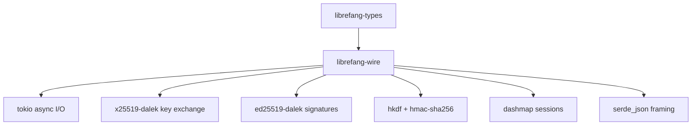

# Other — librefang-wire

# librefang-wire

Agent-to-agent networking layer for the LibreFang Protocol (OFP). Handles secure channel establishment, message framing, cryptographic authentication, and concurrent session management.

## Role in the System

`librefang-wire` sits between the application logic and the raw async I/O provided by tokio. Other modules use it to open authenticated, encrypted channels to peer agents and exchange structured messages. It depends on `librefang-types` for shared data structures and error types, but nothing depends on `librefang-wire` directly in the published call graph — higher-level modules consume it at integration time rather than through direct crate-level calls.

## Cryptographic Protocol

The module implements a modern cryptographic handshake and messaging scheme built from well-vetted primitives:

| Primitive | Crate | Purpose |
|---|---|---|
| X25519 | `x25519-dalek` | Ephemeral Diffie-Hellman key exchange |
| Ed25519 | `ed25519-dalek` | Agent identity signing and verification |
| HKDF | `hkdf` | Deriving session keys from the shared secret |
| HMAC-SHA256 | `hmac` + `sha2` | Message authentication codes on each frame |
| Constant-time compare | `subtle` | Tag verification resistant to timing side-channels |

The handshake flow follows a standard pattern: two agents exchange X25519 public keys to compute a shared secret, authenticate each other's identities with Ed25519 signatures over the transcript, and then derive symmetric session keys via HKDF. Once the channel is established, every message carries an HMAC tag that is verified in constant time.

## Key Components

### Session Management

Concurrent sessions are tracked in a `DashMap` — a lock-free concurrent hashmap — allowing multiple tokio tasks to look up, insert, or retire sessions without serializing on a single `Mutex`. Each session entry holds the derived symmetric keys, the peer's authenticated identity, and any protocol state.

### Async Trait Interfaces

The `async-trait` dependency indicates that the networking surface is defined as async traits. This allows the module to abstract over transports (TCP, Unix domain sockets, TLS tunnels) while keeping the protocol logic transport-agnostic. Downstream consumers can mock or replace the transport for testing.

### Message Framing

Messages are serialized with `serde_json` and framed with length prefixes and HMAC tags. The framing layer is responsible for:

- Reading a length header to delimit messages on the byte stream
- Computing and appending an HMAC-SHA256 tag per frame
- Verifying the tag on receipt using `subtle::ConstantTimeEq` to reject forged or corrupted frames without leaking timing information

### Error Handling

All errors are enumerated through types derived with `thiserror`. This keeps the error surface explicit and ensures that callers can match on specific failure modes (handshake timeout, signature verification failure, MAC mismatch, etc.) without parsing strings.

## Dependency Map

```mermaid
graph TD
    A[librefang-types] --> B[librefang-wire]
    B --> C[tokio async I/O]
    B --> D[x25519-dalek key exchange]
    B --> E[ed25519-dalek signatures]
    B --> F[hkdf + hmac-sha256]
    B --> G[dashmap sessions]
    B --> H[serde_json framing]
```

## Integration Notes

- **Randomness**: The `rand_core` dependency with `getrandom` provides the entropy source for X25519 ephemeral key generation. Ensure the target platform's system RNG is available at runtime.
- **Serialization format**: Messages use JSON (`serde_json`). This is intentional for debuggability and protocol evolution, though it means frame sizes are not minimal. If binary framing is needed in the future, the serde layer can be swapped without touching the crypto or session logic.
- **No external callers detected**: The static analysis found no incoming calls, which reflects that this crate is typically consumed through dynamic dispatch or trait objects at the application boundary, not through direct function calls from other crates.
- **Testing**: The `tempfile` dev-dependency suggests integration tests that create temporary sockets or files for simulating agent pairs.