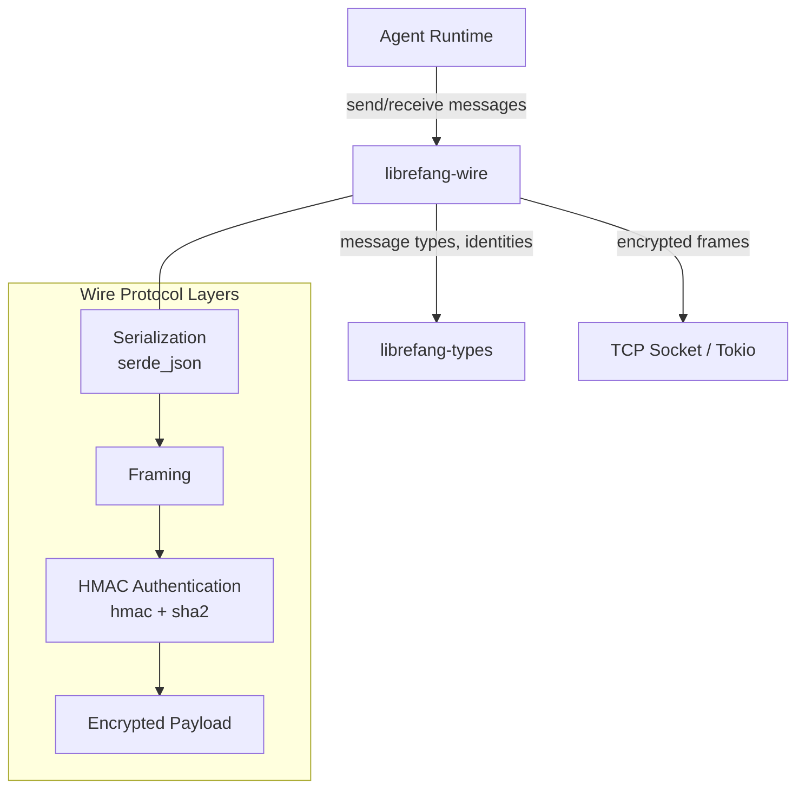

# Other — librefang-wire

# librefang-wire

OFP (LibreFang Protocol) agent-to-agent networking — the secure transport layer that handles authenticated, encrypted communication between LibreFang agents over the network.

## Overview

This crate implements the wire protocol that LibreFang agents use to talk to each other. It is responsible for everything between "bytes on a socket" and "a typed, authenticated message delivered to application logic." The protocol is built on well-vetted cryptographic primitives and is designed so that agents can communicate securely even over untrusted networks.

The crate depends on `librefang-types` for shared type definitions (message envelopes, agent identities, etc.) but is otherwise self-contained. Downstream consumers — typically the agent runtime — use this crate to establish sessions and exchange OFP messages.

## Cryptographic Foundation

The dependency list reveals the protocol's security architecture:

| Dependency | Role |
|---|---|
| `x25519-dalek` | Diffie-Hellman key exchange during handshake — two agents derive a shared secret without ever transmitting it |
| `hkdf` | Derives symmetric session keys from the shared secret, producing separate keys for encryption and MAC |
| `ed25519-dalek` | Agent identity signatures — each agent proves ownership of its long-term identity key |
| `hmac` + `sha2` | Message authentication codes on every transmitted frame, ensuring integrity and authenticity |
| `subtle` | Constant-time comparison for MAC verification, preventing timing side-channel attacks |
| `rand_core` | Cryptographically secure random number generation for ephemeral keys and nonces |

## Architecture


```mermaid
graph TD
    A[Agent Runtime] -->|send/receive messages| B[librefang-wire]
    B -->|message types, identities| C[librefang-types]
    B -->|encrypted frames| D[TCP Socket / Tokio]
    
    subgraph "Wire Protocol Layers"
        E[Serialization<br/>serde_json] --> F[Framing]
        F --> G[HMAC Authentication<br/>hmac + sha2]
        G --> H[Encrypted Payload]
    end
    
    B --- E
```

### Session Lifecycle

A typical session between two agents follows these phases:

1. **Handshake** — Each agent generates an ephemeral X25519 keypair. The ephemeral public keys are exchanged, along with each agent's long-term Ed25519 identity and a signature binding the ephemeral key to that identity. X25519 Diffie-Hellman produces a shared secret.

2. **Key Derivation** — The shared secret is fed through HKDF to produce symmetric session keys. Separate keys are derived for each direction and purpose (encryption vs. authentication), preventing key reuse.

3. **Steady-State Transport** — Messages are serialized (via `serde_json`), authenticated with HMAC, and transmitted as length-prefixed frames over the Tokio-managed TCP connection. Each inbound frame is MAC-verified in constant time before any further processing.

4. **Session Teardown** — Either side may cleanly terminate. The session keys and ephemeral key material are dropped.

## Key Design Decisions

**Async-first transport.** The crate is built on `tokio` and uses `async-trait` to define transport abstractions. All I/O is non-blocking, fitting naturally into the agent runtime's async event loop.

**Concurrent session management.** `dashmap` provides a lock-free concurrent hashmap, used internally to track multiple active sessions across agents without becoming a bottleneck under concurrent load.

**No encryption scheme re-invention.** The crate composes standard primitives (X25519 for key agreement, HKDF for derivation, HMAC-SHA256 for authentication, Ed25519 for identity) rather than implementing custom cryptography. This is deliberate — the security of the protocol rests on the correctness of widely-audited crates.

**Structured errors.** `thiserror` is used to define a typed error surface, making it straightforward for callers to distinguish between handshake failures, MAC verification errors, I/O errors, and deserialization problems.

**Observable operation.** `tracing` spans and events are emitted throughout the protocol lifecycle, allowing operators to debug connectivity issues without resorting to packet captures.

## Relationship to the Rest of the Codebase

```
librefang-types  ←  librefang-wire  ←  agent runtime / server
```

- **`librefang-types`** provides the shared vocabulary — message structs, agent ID types, protocol constants. `librefang-wire` consumes these types but does not define them.
- **Agent runtime** consumes `librefang-wire` to open listener sockets, initiate outbound connections, and route decoded messages to handlers. It is the only crate that directly depends on `librefang-wire`.

The crate intentionally has no incoming or outgoing calls in its call graph — it is a leaf dependency that communicates with the outside world exclusively through its public API and async I/O.

## Error Handling

Errors are concentrated into a typed error enum (via `thiserror`) covering:

- **Handshake failures** — key exchange errors, invalid signatures, protocol version mismatches
- **MAC verification failures** — tampered or corrupted frames
- **Serialization errors** — malformed message payloads
- **I/O errors** — unexpected disconnections, socket timeouts

Callers should match on the error variants to decide whether to retry, abort the session, or log for investigation. MAC verification failures in particular should be treated as potential attacks and logged at warning level or above.