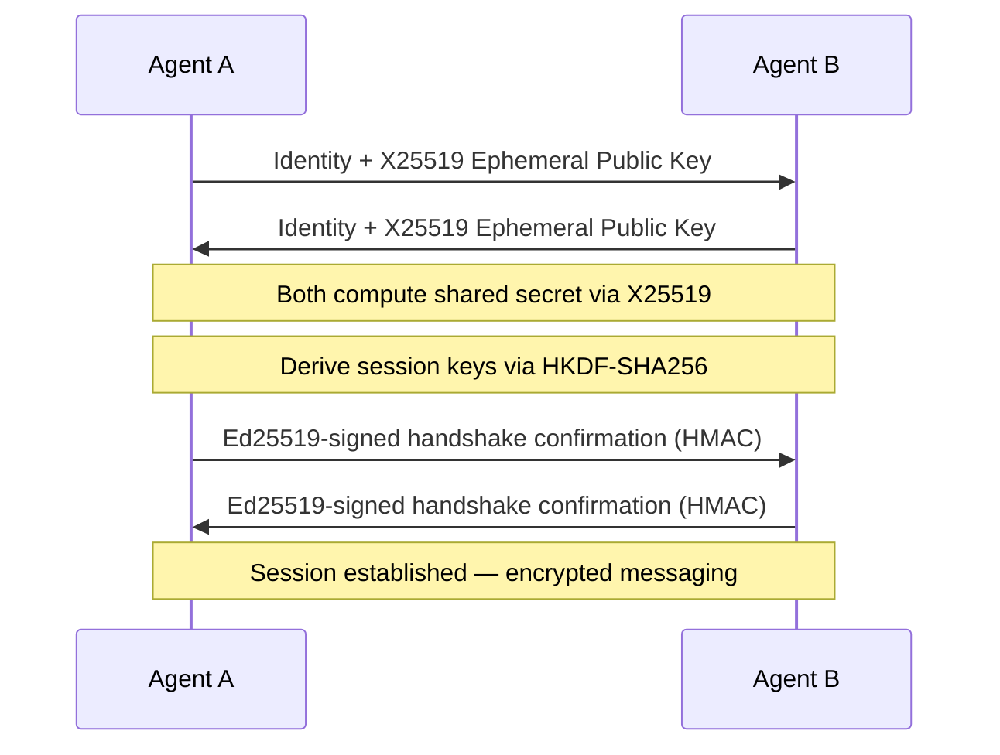

# Other — librefang-wire

# librefang-wire

LibreFang Protocol (OFP) — agent-to-agent networking. This crate implements the wire protocol that LibreFang agents use to establish authenticated, encrypted sessions and exchange messages over the network.

## Purpose

`librefang-wire` is responsible for everything that happens *between* agents at the protocol level:

- **Session establishment** — agents perform an authenticated key exchange to derive shared session keys.
- **Message framing** — structured messages are serialized, optionally authenticated, and transmitted over async TCP streams.
- **Connection management** — concurrent connection state is tracked safely across tokio tasks.

It sits on top of `librefang-types` (shared domain types) and is consumed by higher-level crates that orchestrate agent behavior.

## Cryptographic Protocol

The dependency selection reveals a clear cryptographic design:

| Concern | Dependency | Role |
|---|---|---|
| Key exchange | `x25519-dalek` | Curve25519 Diffie-Hellman for forward-secret shared secrets |
| Key derivation | `hkdf` + `sha2` | HKDF-SHA256 to derive session keys from the shared secret |
| Signing | `ed25519-dalek` | Ed25519 signatures for agent identity authentication |
| Message authentication | `hmac` + `sha2` | HMAC-SHA256 for message integrity |
| Constant-time comparison | `subtle` | Prevents timing attacks during MAC/tag verification |
| Random generation | `rand_core` | Secure randomness for key generation and nonces |

### Handshake Flow


```mermaid
sequenceDiagram
    participant A as Agent A
    participant B as Agent B
    A->>B: Identity + X25519 Ephemeral Public Key
    B->>A: Identity + X25519 Ephemeral Public Key
    Note over A,B: Both compute shared secret via X25519
    Note over A,B: Derive session keys via HKDF-SHA256
    A->>B: Ed25519-signed handshake confirmation (HMAC)
    B->>A: Ed25519-signed handshake confirmation (HMAC)
    Note over A,B: Session established — encrypted messaging
```

Each agent holds a long-term Ed25519 signing key for identity. During handshake, both sides generate ephemeral X25519 keypairs, exchange public keys, compute a shared secret, and derive symmetric session keys via HKDF. Ed25519 signatures over handshake transcripts prove identity, while `subtle` ensures MAC verification is constant-time.

## Architecture

### Async I/O

Built entirely on `tokio`. All network operations are non-blocking. The `async-trait` dependency suggests trait-based abstraction over transport, enabling testability and potential alternative transports.

### Serialization

Messages are framed as JSON (`serde` + `serde_json`). The `base64` dependency indicates binary payloads (keys, signatures, ciphertext) are embedded as Base64 strings within JSON structures.

### Concurrent State

`dashmap` provides a lock-free concurrent hashmap for managing multiple simultaneous connections/sessions across tokio tasks without blocking the runtime.

### Error Handling

Errors are structured via `thiserror` and categorized by the protocol layer (handshake failures, authentication failures, framing errors, I/O errors).

## Module Organization

| Area | Responsibility |
|---|---|
| **Handshake** | X25519 key exchange, HKDF key derivation, Ed25519 identity verification |
| **Framing** | Message serialization, deserialization, length-delimited reading/writing |
| **Session** | Per-connection state: session keys, sequence numbers, peer identity |
| **Transport** | Async read/write over tokio TCP streams, abstracted behind traits |
| **HMAC** | Per-message authentication using derived session keys |

## Integration with the Codebase

```
librefang-types        ← shared types (agent IDs, message envelopes, etc.)
        ▲
        │
librefang-wire         ← this crate: protocol, crypto, framing
        ▲
        │
  (higher-level crates that drive agent behavior)
```

`librefang-wire` depends on `librefang-types` for domain primitives. Upstream consumers depend on `librefang-wire` to open connections, perform handshakes, and send/receive protocol messages without dealing with the cryptographic details directly.

## Security Considerations

- **Forward secrecy** — ephemeral X25519 keys ensure that compromise of a long-term Ed25519 key does not expose past session traffic.
- **Timing safety** — the `subtle` crate is used for all MAC comparisons and sensitive equality checks, preventing timing side-channels.
- **Key separation** — HKDF with distinct info parameters ensures encryption keys, MAC keys, and any derived sub-keys are cryptographically isolated.
- **No custom crypto** — all cryptographic operations use audited, widely-adopted crates (`ed25519-dalek`, `x25519-dalek`, `hmac`, `sha2`, `hkdf`).