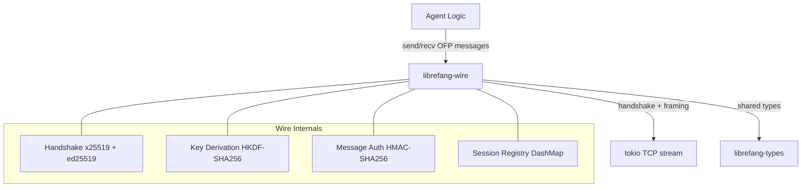

# Other — librefang-wire

# librefang-wire

Agent-to-agent networking layer for the LibreFang Protocol (OFP). This crate provides the cryptographic handshake, framed message transport, and session management that LibreFang agents use to communicate securely with one another.

## Purpose

`librefang-wire` sits between the high-level agent logic and the raw TCP stream. It is responsible for:

- **Establishing encrypted sessions** between two agents using an authenticated key exchange.
- **Framing and serializing** OFP messages over the wire.
- **Authenticating messages** to detect tampering or replay.
- **Managing active sessions** in a thread-safe registry.

Agents do not call into the OS networking stack directly for OFP traffic — they route through this crate.

## Architecture

```mermaid
flowchart TD
    A[Agent Logic] -->|send/recv OFP messages| W[librefang-wire]
    W -->|handshake + framing| T[tokio TCP stream]
    W -->|shared types| TY[librefang-types]

    subgraph Wire Internals
        HS[Handshake x25519 + ed25519]
        KD[Key Derivation HKDF-SHA256]
        MA[Message Auth HMAC-SHA256]
        SR[Session Registry DashMap]
    end

    W --- HS
    W --- KD
    W --- MA
    W --- SR
```

### Cryptographic Pipeline

Every agent-to-agent session follows this sequence:

1. **Key Exchange** — Both sides generate ephemeral X25519 keypairs and exchange public keys over the plaintext channel.
2. **Authentication** — Each side signs the shared secret (or a transcript of the handshake) with its long-term Ed25519 identity key. This binds the ephemeral session to a known agent identity.
3. **Key Derivation** — The shared secret is fed through HKDF-SHA256 to produce symmetric encryption and MAC keys.
4. **Framed Transport** — Once the handshake completes, every message on the wire carries an HMAC-SHA256 tag. The receiver verifies the tag using `subtle::ConstantTimeEq` to prevent timing side-channels.

### Session Registry

Active sessions are tracked in a `DashMap` keyed by session ID (`uuid::Uuid`). `DashMap` provides lock-free concurrent access, which is important because multiple tokio tasks may send or receive on different sessions simultaneously.

## Key Dependencies

| Dependency | Role in this crate |
|---|---|
| `x25519-dalek` | Ephemeral Diffie-Hellman key exchange during handshake |
| `ed25519-dalek` | Signing and verifying handshake messages with agent identity keys |
| `hkdf` + `sha2` | Deriving symmetric keys from the shared secret |
| `hmac` + `sha2` | Per-message authentication codes |
| `subtle` | Constant-time comparison of MAC tags |
| `dashmap` | Concurrent session registry |
| `serde` / `serde_json` | Serializing and deserializing OFP message frames |
| `tokio` | Async I/O for reading from and writing to TCP streams |
| `async-trait` | Async trait definitions for transport abstractions |
| `librefang-types` | Shared OFP message types, agent identity types, and protocol constants |
| `rand_core` | Cryptographically secure randomness for key generation |

## Relationship to the Rest of the Codebase

- **`librefang-types`** — defines the message enums, identity structs, and protocol constants that `librefang-wire` serializes and deserializes. This crate is the single source of truth for "what does an OFP message look like."
- **Agent binaries** — depend on `librefang-wire` to open a listener, accept incoming handshakes, and send/receive framed messages. The agent logic never handles raw byte streams for OFP.
- This crate is a pure library. It has no binary target and does not start its own tokio runtime.

## Error Handling

Errors are surfaced through types deriving `thiserror::Error`. The main error categories are:

- **Handshake failures** — the remote side's signature did not verify, or the handshake timed out.
- ** framing errors** — a received frame could not be deserialized into a known OFP message type.
- **Authentication failures** — the HMAC tag on a received message did not match the computed tag.
- **I/O errors** — the underlying TCP stream was closed or returned an OS-level error.

All errors are propagated to the caller; this crate does not silently swallow them.

## Logging

The crate uses `tracing` spans and events at the following levels:

- `DEBUG` — handshake progress (key exchange complete, keys derived, session established).
- `TRACE` — individual frame send/receive with byte counts.
- `WARN` — authentication failures, unexpected disconnects.
- `ERROR` — fatal protocol violations.

No sensitive key material is ever logged.