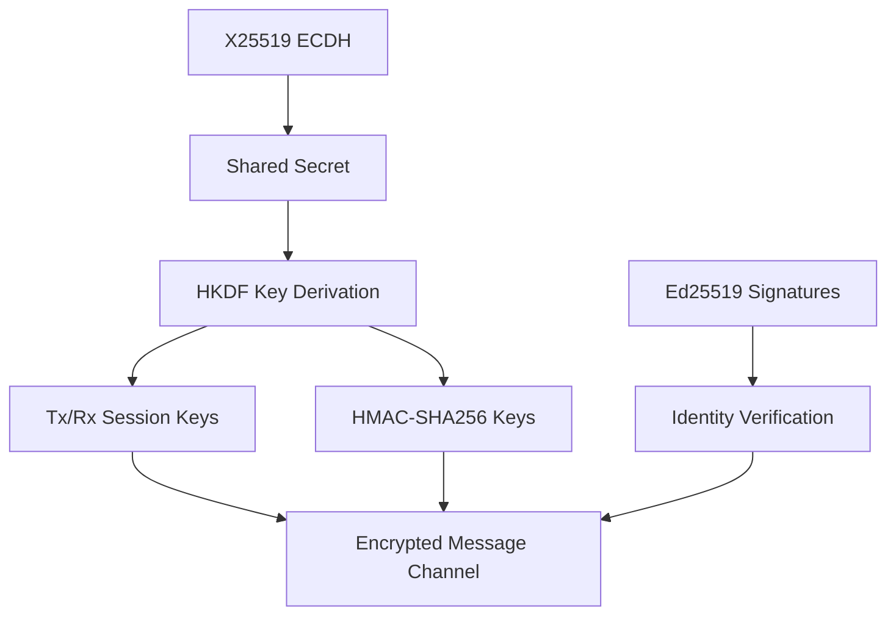

# Other — librefang-wire

# librefang-wire

LibreFang Protocol (OFP) — agent-to-agent networking and cryptographic handshake layer.

## Purpose

`librefang-wire` implements the secure communication protocol that LibreFang agents use to talk to each other. It handles the full lifecycle of an agent-to-agent session: cryptographic key exchange, message framing, authentication, and encrypted transport. This crate is purely a protocol library — it defines *how* bytes move between agents, not *what* those agents do with the information.

## Cryptographic Architecture

The dependency set reveals a clear multi-layered cryptographic design:

```mermaid
flowchart TD
    A[X25519 ECDH] --> B[Shared Secret]
    B --> C[HKDF Key Derivation]
    C --> D[Tx/Rx Session Keys]
    C --> E[HMAC-SHA256 Keys]
    F[Ed25519 Signatures] --> G[Identity Verification]
    D --> H[Encrypted Message Channel]
    E --> H
    G --> H
```

### Key Exchange — X25519

Agents perform an ephemeral Diffie-Hellman exchange using `x25519-dalek`. Each side generates an ephemeral keypair, exchanges public keys, and derives a shared secret. This provides forward secrecy — compromising a long-term key does not expose past session traffic.

### Key Derivation — HKDF

The raw X25519 shared secret is fed through HKDF (`hkdf` crate with `sha2` for the underlying hash) to produce:

- **Session encryption keys** (separate Tx and Rx keys for each direction)
- **HMAC authentication keys** for message integrity

HKDF ensures the derived keys are cryptographically independent even though they originate from the same shared secret.

### Identity — Ed25519

Long-term agent identities are backed by Ed25519 keypairs (`ed25519-dalek`). During handshake, agents sign their ephemeral public keys with their long-term identity key, allowing the peer to verify who they are talking to. This separates identity from session encryption.

### Message Authentication — HMAC-SHA256

`hmac` and `sha2` provide keyed-hash message authentication. Every message on the wire carries an HMAC, and verification uses `subtle` for constant-time comparison to prevent timing side-channel attacks.

## Role in the System

```mermaid
flowchart LR
    subgraph Agent Process
        T[librefang-types] --> W[librefang-wire]
        W --> App[Application Logic]
    end
    W <--TCP_TLS["TCP/TLS"]--> W2[Peer Agent]
```

| Dependency | Role in this crate |
|---|---|
| `librefang-types` | Shared message types, protocol enums, wire format definitions |
| `tokio` | Async I/O for reading/writing frames on TCP streams |
| `serde` / `serde_json` | Serialization of handshake payloads and message envelopes |
| `dashmap` | Concurrent map for tracking active sessions or peer state |
| `uuid` | Correlation IDs for request/response matching |
| `chrono` | Timestamps in handshake and message metadata |
| `tracing` | Structured logging of protocol events (handshake steps, errors) |
| `async-trait` | Trait definitions for transport abstraction, allowing mock or alternate transports in tests |
| `thiserror` | Typed error enums for protocol failures |

## Error Handling

Errors are defined using `thiserror` and should cover the distinct failure modes of the protocol:

- Handshake failures (invalid signature, unsupported version)
- Decryption failures (bad key, corrupted ciphertext)
- Authentication failures (HMAC mismatch, unknown peer identity)
- Framing errors (malformed messages, oversized payloads)
- I/O errors wrapping `tokio`/underlying transport failures

## Testing

The `tempfile` dev-dependency suggests tests that involve writing session state, keys, or cached peer information to temporary files, then verifying the protocol works end-to-end across clean and resuming sessions.

## Development Notes

- **No panics in crypto code.** All key operations return `Result` types. The `subtle` dependency exists specifically to avoid branching on secret data.
- **Sessions are directional.** Because HKDF produces separate Tx/Rx keys, each agent in a pair uses a different key for sending vs. receiving. Code that handles both directions must key them correctly.
- **Wire compatibility.** Changes to the handshake protocol or message framing are breaking changes. Version negotiation happens at the handshake layer using types from `librefang-types`.
- **Transport abstraction.** The use of `async-trait` means the protocol logic should not be coupled to a specific I/O type. Implementations accept a generic async read/write stream, making the protocol testable with in-memory channels.