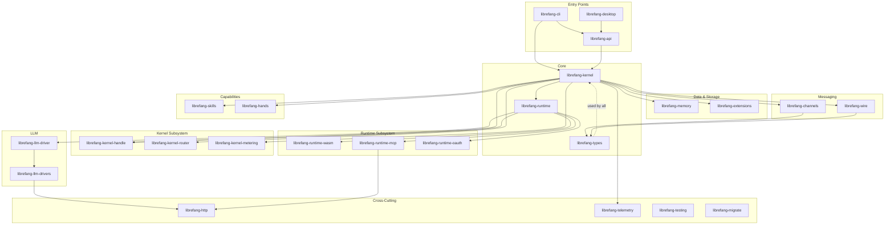

# Other

# Other — Supporting Crates & Infrastructure

Miscellaneous crates that don't belong to a dedicated top-level module grouping. Despite the name, this is where most of LibreFang's **runtime implementation** lives.

## Purpose

These crates form the functional core of LibreFang Agent OS — the kernel, runtime, API surface, CLI, desktop shell, LLM integration, memory, skill system, channel bridges, networking, and observability layer. They are grouped here because they don't fit into a more specific domain module.

## Architecture

## Sub-module Categories

### Entry Points

| Crate | Role |
|---|---|
| [librefang-cli](Other%20—%20librefang-cli.md) | `librefang` binary — CLI subcommands, TUI, config management |
| [librefang-api](Other%20—%20librefang-api.md) | Axum HTTP/WS server exposing agent lifecycle, skill invocation, terminal, dashboard |
| [librefang-desktop](Other%20—%20librefang-desktop.md) | Tauri 2.0 native desktop shell with system tray, auto-update, and single-instance enforcement |

The [API crate](Other%20—%20librefang-api.md) embeds a [React dashboard](Other%20—%20librefang-api-dashboard.md), a [zero-dependency login page](Other%20—%20librefang-api-src.md), and [i18n locale files](Other%20—%20librefang-api-static.md). The [desktop app](Other%20—%20librefang-desktop.md) declares its [capability permissions](Other%20—%20librefang-desktop-capabilities.md) and ships [auto-generated Tauri schemas](Other%20—%20librefang-desktop-gen.md).

### Kernel & Runtime

The [kernel](Other%20—%20librefang-kernel.md) orchestrates subsystems — memory, routing, metering, skill execution, LLM calls, extensions, and channels — into a coherent agent runtime. It exposes a trait-based interface via [librefang-kernel-handle](Other%20—%20librefang-kernel-handle.md) so consumers remain decoupled from the concrete implementation.

The [runtime](Other%20—%20librefang-runtime.md) is the execution environment that brings together LLM drivers, skill execution, memory, channel adapters, WASM sandboxing, and MCP integration. Specialised sub-modules handle [WASM sandboxing](Other%20—%20librefang-runtime-wasm.md), [MCP client connections](Other%20—%20librefang-runtime-mcp.md), and [OAuth2 flows](Other%20—%20librefang-runtime-oauth.md) for ChatGPT and GitHub Copilot.

Kernel internals include the [hand/template router](Other%20—%20librefang-kernel-router.md) for dispatching input events, and [metering](Other%20—%20librefang-kernel-metering.md) for cost tracking and quota enforcement.

### LLM Integration

[librefang-llm-driver](Other%20—%20librefang-llm-driver.md) defines the provider-agnostic trait. [librefang-llm-drivers](Other%20—%20librefang-llm-drivers.md) ships concrete implementations for Anthropic, OpenAI, Gemini, and others, all built on the shared [HTTP client](Other%20—%20librefang-http.md) and [OAuth layer](Other%20—%20librefang-runtime-oauth.md).

### Memory & Extensions

[librefang-memory](Other%20—%20librefang-memory.md) is the persistent storage substrate for agent state. [librefang-extensions](Other%20—%20librefang-extensions.md) manages MCP server setup, an encrypted credential vault (AES-256-GCM), and OAuth2 PKCE flows.

### Messaging & Networking

[librefang-channels](Other%20—%20librefang-channels.md) bridges LibreFang events to external platforms (Telegram, Discord, Slack, etc.) with feature-gated adapters. [librefang-wire](Other%20—%20librefang-wire.md) implements the agent-to-agent networking protocol (OFP) — message framing, authentication, and async TCP transport.

### Capabilities

[librefang-skills](Other%20—%20librefang-skills.md) manages the skill lifecycle — registry, filesystem loading, marketplace client, and OpenClaw compatibility. [librefang-hands](Other%20—%20librefang-hands.md) provides composable capability packages that define autonomous actions.

### Cross-Cutting

| Crate | Role |
|---|---|
| [librefang-types](Other%20—%20librefang-types.md) | Leaf crate — shared data structures, error types, config schemas, crypto primitives. Every other crate imports from here. |
| [librefang-http](Other%20—%20librefang-http.md) | Shared `reqwest` client builder with unified TLS and proxy configuration |
| [librefang-telemetry](Other%20—%20librefang-telemetry.md) | OpenTelemetry + Prometheus metrics via the `metrics` facade |
| [librefang-testing](Other%20—%20librefang-testing.md) | Mock kernel, LLM driver, and Axum test harness for integration tests |
| [librefang-migrate](Other%20—%20librefang-migrate.md) | Imports agent configs from other frameworks into LibreFang format |

## Key Cross-Module Workflows

**Inbound message processing:** A platform message arrives via [librefang-channels](Other%20—%20librefang-channels.md) → routed by the [kernel](Other%20—%20librefang-kernel.md) through [librefang-kernel-router](Other%20—%20librefang-kernel-router.md) → dispatched to [librefang-runtime](Other%20—%20librefang-runtime.md) which invokes an [LLM driver](Other%20—%20librefang-llm-driver.md) → context loaded from [librefang-memory](Other%20—%20librefang-memory.md) → response sent back through channels.

**Skill/tool invocation:** The kernel receives a tool call from the LLM → [librefang-skills](Other%20—%20librefang-skills.md) resolves the skill → execution happens either natively or inside the [WASM sandbox](Other%20—%20librefang-runtime-wasm.md) → external tools reached via [MCP](Other%20—%20librefang-runtime-mcp.md) → costs tracked by [metering](Other%20—%20librefang-kernel-metering.md).

**Dashboard interaction:** Browser hits [librefang-api](Other%20—%20librefang-api.md) → unauthenticated requests get the [login page](Other%20—%20librefang-api-src.md) → authenticated session accesses the [React dashboard](Other%20—%20librefang-api-dashboard.md) → API calls flow to the kernel via [KernelHandle](Other%20—%20librefang-kernel-handle.md) → [telemetry](Other%20—%20librefang-telemetry.md) emits metrics throughout.

## Testing

Integration tests live alongside their respective crates: [API tests](Other%20—%20librefang-api-tests.md) exercise the full HTTP stack, [kernel tests](Other%20—%20librefang-kernel-tests.md) validate agent lifecycle and WASM execution, [runtime tests](Other%20—%20librefang-runtime-tests.md) guard MCP OAuth flows, [channel tests](Other%20—%20librefang-channels-tests.md) verify the bridge dispatch pipeline, [memory tests](Other%20—%20librefang-memory-tests.md) enforce session-scoped privacy isolation, and [type tests](Other%20—%20librefang-types-tests.md) ensure dashboard-to-kernel TOML contract fidelity. The shared [testing crate](Other%20—%20librefang-testing.md) provides reusable mocks and harnesses.