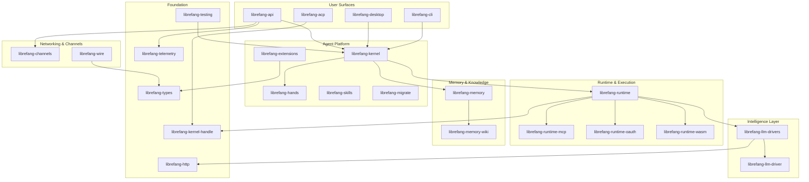

# Other

# Other — Supporting Crates

The sub-modules in this section comprise the full implementation of the **LibreFang Agent Operating System** — a platform for building, running, and managing autonomous AI agents. They span every layer from shared type definitions through to user-facing surfaces (CLI, desktop app, web dashboard) and include integration tests for each subsystem.

## Layered Architecture

## Sub-module Groups

### Foundation

| Module | Role |
|---|---|
| [librefang-types](librefang-types.md) | Shared data structures. Every other crate depends on this. No business logic. |
| [librefang-types-locales](librefang-types-locales.md) | Fluent (FTL) error message catalogs for API responses (en, de, es, fr, ja, zh-CN). |
| [librefang-http](librefang-http.md) | Shared `reqwest` client builder with TLS fallback (webpki-roots + native certs) and proxy support. |
| [librefang-telemetry](librefang-telemetry.md) | Centralized OpenTelemetry + Prometheus metric definitions consumed across the workspace. |
| [librefang-kernel-handle](librefang-kernel-handle.md) | `KernelHandle` trait — decouples "talking to the kernel" from kernel internals, enabling dependency injection and test doubles. |
| [librefang-testing](librefang-testing.md) | Test infrastructure: `MockKernelBuilder`, `MockLlmDriver`, route-level test helpers. |

### Kernel & Orchestration

[librefang-kernel](librefang-kernel.md) is the core orchestration layer managing agent lifecycles, scheduling, permissions, and message dispatch. It is supported by:

- [librefang-kernel-handle](librefang-kernel-handle.md) — the trait interface other crates depend on
- [librefang-kernel-metering](librefang-kernel-metering.md) — cost tracking and quota enforcement
- [librefang-kernel-router](librefang-kernel-router.md) — request routing to hands and templates
- [librefang-hands](librefang-hands.md) — declarative capability packages (blueprints for autonomous functionality)

### Runtime & Execution

[librefang-runtime](librefang-runtime.md) hosts the turn-by-turn agent loop, tool dispatch, context management, and audit trail. Its pluggable subsystems handle specific execution concerns:

- [librefang-runtime-mcp](librefang-runtime-mcp.md) — MCP client for discovering and invoking external tools
- [librefang-runtime-oauth](librefang-runtime-oauth.md) — OAuth 2.0 flows for ChatGPT and GitHub Copilot token acquisition
- [librefang-runtime-wasm](librefang-runtime-wasm.md) — WASM sandbox (wasmtime) for isolated skill execution with fuel metering and capability enforcement
- [librefang-llm-driver](librefang-llm-driver.md) / [librefang-llm-drivers](librefang-llm-drivers.md) — trait definition and concrete implementations (Anthropic, OpenAI, Gemini, Groq, Ollama) with credential pooling, rate limiting, and failover chains

### Memory & Knowledge

[librefang-memory](librefang-memory.md) provides a unified `Memory` trait over three storage paradigms (structured key/value, semantic search, knowledge graph). [librefang-memory-wiki](librefang-memory-wiki.md) adds a durable markdown knowledge vault with provenance-tracked frontmatter and Obsidian-compatible export.

### Communication Surfaces

| Module | Transport | Purpose |
|---|---|---|
| [librefang-api](librefang-api.md) | HTTP / WebSocket | Primary network surface — REST endpoints, WS streams, embedded React dashboard |
| [librefang-acp](librefang-acp.md) | stdio JSON-RPC | Agent Client Protocol adapter for editor integration (Zed, VS Code, JetBrains) |
| [librefang-channels](librefang-channels.md) | 40+ platform adapters | Unified `ChannelMessage` bridge for Telegram, Discord, Slack, webhooks, and more |
| [librefang-wire](librefang-wire.md) | Custom protocol | Agent-to-agent secure networking with cryptographic handshake and authenticated transport |
| [librefang-cli](librefang-cli.md) | Terminal | `librefang` binary — daemon mode or single-shot in-process execution |
| [librefang-desktop](librefang-desktop.md) | Tauri 2.0 | Native desktop (macOS/Windows/Linux) and mobile (iOS/Android) application |

### Extensions & Skills

[librefang-extensions](librefang-extensions.md) provides agent-side tooling that sits above the kernel but below the API surface: MCP server catalog, encrypted credential vault, OAuth2 PKCE client, provider health probes, and plugin management. [librefang-skills](librefang-skills.md) manages the full skill lifecycle — discovery, loading, validation, marketplace download, and OpenClaw compatibility.

### Migration

[librefang-migrate](librefang-migrate.md) imports agent configurations from foreign frameworks (JSON, YAML, TOML) into LibreFang-native types with idempotent, byte-identical re-run guarantees.

### Localization & Static Assets

- [librefang-cli-locales](librefang-cli-locales.md) — Project Fluent `.ftl` files for CLI output (en, zh-CN)
- [librefang-cli-templates](librefang-cli-templates.md) — TOML scaffolding templates for `librefang init`
- [librefang-api-static](librefang-api-static.md) — i18n translation catalogs for the web dashboard (en, ja)
- [librefang-api-src](librefang-api-src.md) — Self-contained login page (inline HTML/CSS/JS, no build step)
- [librefang-desktop-capabilities](librefang-desktop-capabilities.md) / [librefang-desktop-gen](librefang-desktop-gen.md) — Tauri security capabilities and generated platform scaffolding

## Key Workflows

**Inbound message flow:** A platform message arrives through [librefang-channels](librefang-channels.md), gets normalized to a `ChannelMessage`, and is dispatched to [librefang-kernel](librefang-kernel.md). The kernel routes it to [librefang-runtime](librefang-runtime.md), which drives the agent loop — calling [librefang-llm-drivers](librefang-llm-drivers.md) for LLM inference, [librefang-runtime-mcp](librefang-runtime-mcp.md) or [librefang-runtime-wasm](librefang-runtime-wasm.md) for tool execution, and [librefang-memory](librefang-memory.md) for context retrieval. Replies flow back out through the originating channel adapter.

**Dashboard interaction:** A browser loads the SPA embedded in [librefang-api](librefang-api.md), authenticates through the [login page](librefang-api-src.md), then communicates over REST and WebSocket endpoints that delegate to the in-process kernel.

**Editor integration:** An ACP-speaking editor connects via stdio to [librefang-acp](librefang-acp.md), which bridges JSON-RPC calls to the kernel through the `KernelHandle` trait.

**Agent-to-agent:** [librefang-wire](librefang-wire.md) handles discovery, cryptographic handshake, and authenticated transport between LibreFang agents over untrusted networks.

## Testing

Every subsystem has a companion integration test crate that exercises real I/O, trait dispatch, or wire behavior against mock implementations provided by [librefang-testing](librefang-testing.md). Performance-critical paths in channels and dispatch are covered by dedicated [Criterion benchmarks](librefang-channels-benches.md).